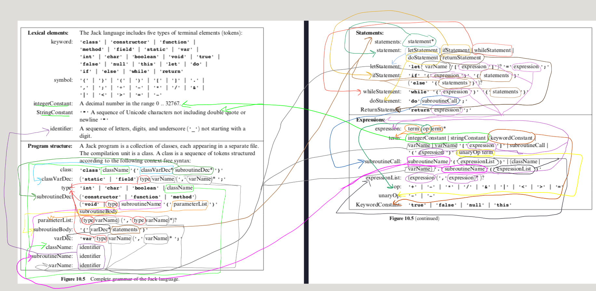
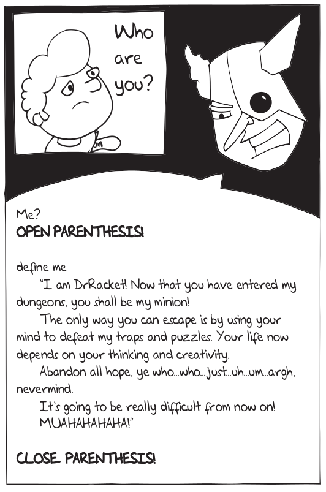

# Spam's CS Corner: Course Reviews
DISCLAIMER: These are my subjective personal opinions! Make your own judgment. Also, I will talk a lot about my feelings! You are warned.

I keep mentioning something called OSSU. [Here it is](https://github.com/ossu/computer-science/) in case you haven't heard of it.

Originally written June 2020

Updated September 2020 (Game Theory 1)

Updated November 2020 (Formal Concept Analysis)

Updated May 2021 (Fullstack Open, Intro to Logic)

Updated July 2021 (Effective Programming in Scala)

- [Learning tips](#tips)
- [Harvard's CS50 (first half)](#cs50)
- [CS50, second half, Final Project](#cs50-2)
- [How to Code 1 & 2](#how-to-code)
- [Software Construction 1, 2](#softcons)
- [Programming Languages A, B, C](#plabc)
- [Learn Prolog Now!](#lpn)
- [Design of Computer Programs](#cs212)
- [Functional Programming in Haskell](#haskell)
- [Haskell Programming from First Principles](#hpffp)
- [Nand2Tetris 1,2](#n2t)
- [Intro to Networking](#intro-to-net)
- [Operating Systems: Three Easy Pieces](#ostep)
- [Hack the Kernel](https://github.com/ossu/computer-science/issues/690)
- [Intro to CS and Programming with Python](#mit6001x)
- [Algorithms (Tim Roughgarden)](#coretheory)
- [Databases](#db)
- [Computer Graphics](#graphics)
- [Machine Learning](#ml)
- [Cryptography 1](#crypt)
- [Software Processes](#softproc)
- [Software Architecture](#softarch)
- [Compilers](#compilers)
- [Software Debugging](#debug)
- [Software Testing](#test)
- [Software Architecture & Design](#softdesg)
- [LAFF - On programming for Correctness](#laff)
- [Intro to Parallel Programming](#cs344)
- [Functional Programming in Scala (5 courses)](#scala)
- [Game Theory 1](#game)
- [Formal Concept Analysis](#concept)
- [Fullstack Open](#fsopen)
- [Introduction to Logic](#logic)
- [Effective Programming in Scala](#eff)

### <a name="tips"></a> Learning tips
- Use the REPL / interactive shell to your advantage! You can easily figure out all your basic questions by yourself if you experiment on the REPL.
- Prioritize math. Math is the root of all the thinking patterns and the concepts.
- It's all about doing what you don't want/like to do. (Just like life in general) It's very difficult and usually not all that pleasant.
- Don't worry about time.
- Avoid instant gratification.
- Understand both positive and negative reinforcement, and use them both to your advantage.
- Don't rely on search engines, go to proper resources. Accessing *information* in millions of little bits and pieces don't lead to long-term *knowledge*. The human brain needs to "chunk" bits of info by connecting them together into a meaningful whole. Relying too heavily on web searches works against this.
- Resist the urge to guess. THINK instead!
- Take your hands off the keyboard, get pencil and paper, work it out first.
- Go slowly. Completing fast is NOT an achievement.
- Exercise good judgment on what's important and what isn't. Don't get stuck on silly points.
- Recognize missing pieces and inadequacies in the resources.
- Think contextually, not literally/mechanically.
- Be self-reflective about your code. Refactor often.
- Don't rush to pass the tests. 
- Don't rush to do web searches or seek help. Stay with it, always try to answer your own questions first. Use the :duck: debugger to your advantage!
- Have faith in the courses/languages that seem "pointless" or "useless" to you initially. The point/understanding will come to you later, it takes time.
- Readability and comments are more important than optimization.
- Learn how to enjoy things you don't like, things that are too easy/hard, or things you find boring.
- Split your mind into two people: teacher and student. Assume the teacher's role and explain what you learned to the student. You can practice this anywhere, anytime (on the bus, in the shower, when you're exercising, etc.)

### <a name="cs50"></a> Harvard's CS50 (first half)

https://cs50.harvard.edu/

This was my first course. In 2018 this was the "intro/beginner" course on OSSU curriculum. For the sake of completeness I took the whole course at once, including the [second half](#cs50-2). It's pretty challenging for a beginner course, because that's how Harvard does it. In terms of college course numbering, they go with 050 but it feels more like a 200-level class.

The course uses an online IDE which was really top-notch in my opinion. IT HAS A DARK MODE! Instantly approved. They even invented their own version of the error messages of the C compiler that are more "beginner-friendly" and more helpful. They created a much more beginner-friendly version of a small section of the "man-pages" for C. They even teach you how to use "valgrind", a code analysis/memory leak detection tool that even some pros don't know or use.

For me the assignments were at the right level of difficulty. Even though it uses C and gets into low-level matters of memory management, it was not too difficult. Yes, initially pointer arithmetic and pointer logic is gonna drive you crazy, but you'll get used to it. Each assignment had 2 versions called "more" and "less", meaning more comfortable or less comfortable with programming. "More" versions are the more challenging ones if I remember correctly, which I preferred to do. Assignments were: Scratch (a visual, block-based programming language for kids), displaying some text, breaking ciphers, credit card number verification, image decoding, image resizing, dictionary word search and more. Really throws lots of different types of problems and file/data types at you! Very good variation for a beginner course.

The instructor David Malan is very energetic and fun, but I really disliked the 1.5 hour long lecture videos recorded in a lecture hall. The lectures were not very useful when doing the assignments. But they had separate much shorter "helper" videos for the assignments, done by the TAs; those were very helpful. The assignments had super long wordy text descriptions that I disliked. It was usually more difficult to decipher all that text than doing the assignments themselves.

I think it's a challenging beginner course. These days Python is the preferred language for beginner courses (which is covered in the second half), but if you want to baptize yourself in fire, you can jump into this course.

**Update (April 2022)** I re-took this course (Spring 2022 version), four years after the first time. Pretty much the same (except more face masks in videos). I was able to re-submit most of my existing solutions and they passed the grader. There are quite a few, new assignments too, but smaller and easier. The total number of assignments is quite high now (nearing 30). They haven’t changed Web programming (still using Flask, Jinja, Bootstrap, SQLite), which is interesting. CS50’s ecosystem and infrastructure came a long way. They have very mature libraries for both C and Python now. They are phasing out CS50 Online IDE, instead using Github Codespaces in conjunction with Visual Studio Code, it works great, but definitely sad to see CS50 IDE go.

*Spam's Recommendation:* Take it. It's good!

### <a name="cs50-2"></a> CS50, second half, Final Project
https://cs50.harvard.edu/

OK, this was a total mess. (Apparently they improved it later with "tracks" you can follow, like Android, game, web, iOS.)

They throw so many languages at you all at once, and you don't really have time to learn any of them properly: Python, HTML, CSS, JavaScript, SQL, Jinja (templating language), the Flask web framework for Python, holy hell. I already knew some Python so all was well on that front. But the learning curve gets SUPER STEEP all of a sudden after 6 weeks of C. You'll want to go back to pointers, if you can believe it!

Assignments were pretty hard: text comparison, genetic edit distance (this is actually a pretty hard algorithm that you will learn later in Algorithms/Dynamic Programming), and some kind of location-map Web-App. Once again, that's how Harvard does it: HARD! They should call it HARDvard. (OK I'll let myself out.)

And the final project. They give you so much freedom, you can literally do anything. From archealogical image-reconstruction of artifacts with missing/destroyed pieces, to machine learning algorithms for emoji detection... There is an [Expo](https://expo.cs50.net/) for the projects. It's all very celebratory and encouraging actually. The freedom was both... freeing, and scary because of too many options.

I had some ideas. First I was going to make an interactive Game Theory web app where you can play the classic games like Prisoner's Dilemma etc. It was going to have adjustable AI opponents and everything. Then I found out that such sites already exist. Then I decided to make a math learning site with an interactive Python console inside it. (I know, those exist too.)

Here's my project: https://number-python.herokuapp.com/ (don't laugh at me please!)

Check out the source code of that page. It's beautiful! You'll never see HTML like that anywhere. I wrote it like I was writing nice, styled code in a proper programming language. In fact I wrote a Python script to generate the HTML code automatically from other text/script files. I FELT SUPER SMART! I automated stuff and nobody even taught me or told me to do it! This feeling ranks up there with finishing Nand2Tetris 2 and Algorithms.

Looking for options on an interactive Python console that can be embedded in a web page, I came across [Brython](https://brython.info). Not only it provided an easily embeddable fully functional Python console that had way more modules of the Python library and performed much better than any other alternatives, it let me write Python DIRECTLY INSIDE HTML! Bye bye JavaScript! No need for Flask or any other web framework either. Just straight up HTML. Everything is client-side, no server/user-login involved. You can see the Python scripts in the source code. Brython is SUPER SLOW on initial load (has to translate a large chunk of Python standard library to JS), but once loaded, there are no page-reloads afterwards (all client-side) so the interaction is fast.

I had to figure out how to use LaTeX (mathematical typesetting) on a web page. The go-to "industry standard" is considered to be [MathJaX](https://www.mathjax.org/) but actually it performed so slowly that my CSS animations would trigger earlier than MathJaX could render math symbols, so they would not show up. Then I found a much better alternative called [KaTeX](https://katex.org/) which performs WAY faster and it worked.

I spent about 5 weeks making my project after "finishing" CS50. I'm pretty sure I spent one entire week on trying to figure out something called `Window.getComputedStyle()` to do a certain animation/user-input update thing. Only to learn later that the W3 School made a custom CSS template that does it automatically... I still have a list of improvements I was going to do. Like learn how to use HTML5 local storage so the next time a user visits the page, it remembers where they left off. I realized that I could keep spending MONTHS on polishing this project. So I decided to move on.

*Spam's recommendation:* Take it only if you like messy challenges. This is the world of web programming, where nothing makes sense, and code from multiple languages are meshed together in spaghetti and it's all raining on your head, meatballs and all. I liked it but it was super frustrating. For me it replaces the [Software Engineering Capstone Project](https://www.edx.org/course/software-development-capstone-project-ubcx-softengprjx) which I did not take due to paywall.

### <a name="how-to-code"></a> How to Code 1 & 2

https://www.edx.org/course/how-to-code-simple-data
https://www.edx.org/course/how-to-code-complex-data

These courses are intended for absolute beginners but in OSSU they come after some other introductory courses. Personally I think it's more appropriate as someone's first course. Experienced functional programming teachers and academics claim that it's much easier for someone to learn FP if they were NOT exposed to programming before, but those used to procedural programming have a harder time.

With that pedagogical point out of the way, let's get to the courses. They are two courses but really intended as one big course. You will use Racket, a [Lisp](https://lisp-lang.org/)-like language. Lisp has been around since the late 1960s I believe. Brace yourself (get it?) for tons of [parentheses](https://xkcd.com/297/)! Seriously, A LOT of parentheses. Recursion is the name of the game here. You will recurse till the cows come home, then recurse some more on the cows.

You'll be using an IDE called Dr. Racket, which is really excellent in my opinion. Comes with the language, debugger, code editor etc. everything installed. It comes pre-installed with 3 levels of the Racket language: Beginner Student, Intermediate Student, Advanced Student (and eventually you can take off ALL the training wheels and use the full Racket language). The instructor is great. He sits down and writes code with you in many videos. (I don't know why more courses don't do this live coding with the instructor.) You will be doing tons of small coding exercises, and lots of multiple choice quizzes. These are fairly easy and good.

The instructor is a big proponent of [Aspect Oriented Programming](https://en.wikipedia.org/wiki/Aspect-oriented_programming) (he is even mentioned in the Wikipedia article). First course teaches you the function writing discipline: you first write the signature (input/output types) of the function, then you create a stub for it, then you write tests for the function, and only at the very end you write the function body. You can create blank templates for the function body by more-or-less copy-pasting the input data type, and putting question marks in some places. The data type determines the structure of the code for the function, which takes all the guesswork and confusion out of it. This is an excellent approach for FP beginners. 

Second course teaches you generic recipes and formulas for building bigger, more complex data types from basic data types. When combining types they are kept as orthogonal as possible to separate concerns and decrease coupling. These principles are simply built-in to later, more serious FP languages like Haskell and Scala, which have built-in type checkers, algebraic data types, and automated test generation (``quickCheck` and `scalaCheck`). The "enumeration" and "one-of" types taught in these courses are replicated in Scala (`enum` and "sealed traits") and Haskell, which are used in "pattern matching" (you'll learn this in Prog Lang Part A). Pattern matching in these languages are just like the templates used in this course.

In addition to functional programming, the courses also teach you general principles from all paradigms and languages such as encapsulation, data abstraction, type inference and testing; the practices of domain analysis, design and refactoring; and many examples of data structures and algorithms such as binary search trees, general graphs, backtracking search, and maze solving. The instructor gives you an unusually high amount of time doing one-on-one coding and talking-through-the-code not found in other courses.

First course ends with a Space Invaders type game (it's cool that Racket has a built-in way of doing events/mutation called "big bang"), while second course ends with a very difficult programming assignment of brute-force solving a scheduling problem for TAs and office hours. You will also write other fun and challenging stuff like a Sudoku solver, a fractal image generator, and so on. This is recursion on steroids basically. There are no auto-graders to which you submit your code. You'll be the judge of the correctness of your code. I'm told you can pay edX to have your final exam graded by the instructor, but don't do that.

***Update March 2021:***

These courses teach very fundamental skills that I've seen so many learners lack, and struggle with as a result. There is usually a strong resistance to, and a strong rejection of, the contents of this course, and many common complaints:

- This language is old and stupid!
- I'll never use any of this in real life! It's a waste of time.
- The templates cannot be used in other programming languages, what's the point of learning them?
- No, I will NOT trust the natural recursion! It's wrong and evil.
- GIVE ME EXPLICIT CONCRETE EXAMPLES FROM REAL LIFE PROJECTS WHERE THESE ARE DIRECTLY USED OTHERWISE I'M NOT DOING THESE COURSES AND YOU SUCK!!! 

(Excuse the mocking tone. Obviously I'm exaggerating. Nothing personal, I'm just having fun. My intentions are good! I'll prove it's not your fault. Keep reading.)

For some reason (I wonder why?) the "when will I ever use this in industry?" criticisms intensify extremely on THESE courses, not on other courses, even if those other courses teach far fewer concepts and principles. For some reason, people expect THESE courses, not other courses, to teach them immediately how to write industrial enterprise software. Because those other courses have something recent and fashionable about them, like Internet visibility, or some popular programming language, or "my friends took it" or something else. People don't seem to be able to think past languages, popularity, immediate real world usage etc. I notice a severe lack of meta-cognitive skills and foresight in many. If this sounds condescending, then somebody has to tell you this, instead of being polite.

There is also a serious lack of knowledge of computing history. Lisp (of which Racket is a dialect) is ONE OF THE FIRST PROGRAMMING LANGUAGES EVER. It’s been around almost as long as Fortran, since the 1960s. It was developed to do AI research, due to its extremely powerful meta-programming capabilities. Its performance, even today, is really good. It has, in its DNA, core fundamental ideas from logic, mathematics and computer science. Its modern dialects like Clojure are used in industry today. Who are you to look down on this language, huh?

These courses teach general ways of thinking and form neural pathways in your brain that will serve you forever and you will use them in literally everything. The language, the templates, the formulas etc. are simply tools to "prime" your brain and give you maturity in your thinking. The systematic approach to program design and the fundamental skills learned here are very transferable to any area, type of problem, programming language, framework and so on. 

It's like breathing, walking, talking, swimming, riding a bicycle... things you do without thinking, things that are "in the back of your mind", things to which you would not directly attribute your success in some area. FUNDAMENTAL things.

The "fake" languages used here are perfect for such purpose: extremely simple syntax, and they get out of your way completely, letting you purely focus on the systematic design (at the cost of having [too many parentheses](https://xkcd.com/297/)). Later on in "real" languages you will miss these features, trust me. (One analogy can be the comparison between the artificial language [Lojban](https://en.wikipedia.org/wiki/Lojban) with its perfectly clear and logical design, and natural languages, with all the inconsistencies, idiosyncrasies and ambiguities that natural languages usually come with.)

Many learners first focus on some language, or some tool and then are forced to "learn" these fundamentals later, in a disordered haphazard way, with a lot of pain, when they are stuck in a problem. They usually end up doing something like "keep trying until it works!" I experienced this first-hand with learners that I tutor on a daily basis. They skipped over the fundamentals and jumped to "more advanced things", only to suffer a lot. So I highly recommend reading the [Preface](https://htdp.org/2020-8-1/Book/part_preface.html) of the How to Design Programs textbook which is freely available. Not to say that these courses are the only place where you can learn fundamental skills and systematic program design, but it's really good.

If you are not convinced, I can give you a testimonial: I used the fundamental skills and patterns I learned here in my Functional Programming in Scala specialization and Final Project (scroll down). Pattern matching in Scala, Haskell, Rust etc. are just like the templates used in this course. Many people complain that templates dumb things down for them and remove all the thinking, but pattern matching makes coding so much easier and much more pleasant. It becomes much more desirable as you advance.

Also check out my [Fullstack Open review](#fsopen) below. Modern JavaScript is full of functional programming all over. Especially in [state management](https://fullstackopen.com/en/part6/flux_architecture_and_redux#pure-functions-immutable) of complex web applications. Apparently JS was [inspired by Scheme!](https://www.youtube.com/watch?v=Rj49rmc01Hs) (which is Racket, which is the language used here.) The higher order functions you learn here (like `map`, `filter`, `foldl`, `foldr` etc.) are so commonly used in JS it's crazy.

One more thing to convince you: [Clojure](https://clojure.org/), a Lisp-like programming language that looks exactly like the languages in these courses, was listed as one of the highest paying software jobs of 2019 in a [StackOverFlow survey](https://insights.stackoverflow.com/survey/2019#top-paying-technologies). (*Update:* [it remains top paying language in 2022!](https://survey.stackoverflow.co/2022/#section-top-paying-technologies-top-paying-technologies) also interesting are the other top languages, most of them are functional.) You hated recursion and immutability huh? Turns out that stuff is super valuable in parallel programming of big data analytics!

***More updates (May 2021):*** I've spoken to quite a few students who say "I finished these courses but I still don't feel like I understand recursion or I'm making any progress" or "I just want to skip these", and move on to PLAB (below) only to struggle with recursion in SML even more. The 4-course "recursion gauntlet" of the OSSU curriculum (these two courses + PLAB) become a long, unbearable, soul crushing period of feeling like not making any progress.

This is mostly due to [poor educational systems](https://www.persuasion.community/p/why-america-is-flunking-math-education) that teach little to no math in high school, even in wealthy industrialized nations. Likely you lack the necessary reasoning skills, logical rigor, mathematical maturity to deal with induction/recursion. You either never learned, or probably kept avoiding these topics until now, and you are forced to confront the big gaps in your knowledge in these courses. If some other courses forced you for the first time, you'd be angry at those courses, not these ones.

I'm doing a deep dive into "the recursion problem", reading some educational research on the subject. It turns out to be a universal learning problem. My gut feeling says that students never learned strong reasoning skills and mathematical induction. I've actually found some "let's deal with this recursion problem" type books, written specifically to deal with this issue, dating back to even 1980s, and they all start with induction! I've written hundreds of induction proofs in a crappy underfunded public high school that didn't even have heating in the winter or clean toilets. We were freezing and had shitty toilets, but we learned our induction super solid. I even learned the [full cubic formula!](https://www.youtube.com/watch?v=N-KXStupwsc) They certainly don't teach 'em like they used to anymore. Recursion is just induction in code form. 

It doesn't help that the default widespread code learning method is imperative. It also doesn't help that recursion (induction in code form) forces you to do induction IN REVERSE. When you normally write an induction proof, you start with the base case of some statement: `P(0)`. Then for the "induction step" you ASSUME `P(n)` is true (that's how logic works, but this is very unintuitive for most humans), and prove `P(n+1)`. Infinitely many statements are proven correct like falling dominoes: `P(0)` is true, it implies `P(1)` is true, which implies `P(2)` is true... This is in line with the general, chronological, forward, past-to-future thinking of humans. 

The assumption of `P(n)` before `P(n+1)` corresponds to what Kiczales means by "trust the natural recursion!" Saying this without the necessary mathematical rigor and background is not very helpful though. A lot of learners get angry at and offended by this mantra. I can understand: it feels like you are expected to know something you were never taught, and it's your fault.

In code though, you try to write the `P(n+1)` step first, then reduce it to `P(n)` by a recursive call to the same function. Why should that work? Because it depends on `P(n-1)`. Why should that work... It's like the mental rug being pulled out from under you. Students instead "go down the rabbit hole" of following the recursive calls all the way to the base case and get lost. 

They should simply assume their function returns the correct result with an input size one smaller, and avoid going down the rabbit hole. But students refuse to suspend their disbelief that the function works on the smaller subproblem, and get defensive about it. BECAUSE THEY NEVER LEARNED IT BEFORE. The Principle of Mathematical Induction requires and forces you to assume `P(n)`. (Some students say they had NO MATH in high school at all! Holy hell.) They can't make the connection that the problem is self-similar, that the smaller subproblem has the exact same pattern as the larger problem. 

It also doesn't help that Math for CS (which teaches induction and recursive definitions) comes AFTER these courses in the OSSU curriculum. It also doesn't help that Math for CS itself has a quite steep learning curve, does not break down things far enough for beginners, and a lot of students hit a hard block and can't get any further.

Moreover, "guess something, type on the keyboard, run the code, and hope it works, or get some quick feedback, or peek at solutions" trial-and-error style approach in coding (no such thing in proofs!), is completely different than doing it by hand, with pencil and paper (which forces you to develop discipline and rigor, to think hard and form brain patterns). This trial-and-error makes it possible to somehow muddle through the courses and solve the problems, without recursion ever fully clicking in your mind. This is exemplified by the students who finished HtC but still don't feel like they understood it, when they solve a hard recursion exercise in PLA. The students don't have the strong logic and reasoning skills, and structural patterns in their minds that are required for induction/recursion.

So... what's the point of this long educational, pedagogical tirade? ***You have to acquire the rigor, discipline, and the logical reasoning skills necessary.*** I recommend you should learn mathematical induction FIRST! Write tons and tons of induction proofs. If you master induction, recursion is a piece of cake, and it will pay HUGE dividends in Algorithms later (it's all induction!)

Here’s one learner’s perspective: *It took me three tries to finally be ready for this course. I made it to the half way mark to understand why this course is really important. I just wish I knew this in the beginning of last year when I first started.*

Another: *The htc courses were really amazing, I feel bad I said they were useless and outdated. I want to thank the people who told me I should take them.*

***Even more updates (July 2021):*** I told this story on Discord:

> That's awesome to hear! Let me tell you an interesting story.
>
> A few days ago I was writing some Python code for a problem in the OCW version of the MIT course to help out someone struggling with it. It's a complicated problem with a lot of variables (the one about paying off down payment for a house, using bisection search) and mutation of state. The problem is long and wordy, and doesn't mention writing any functions or anything.
>
> I vaguely came up with an idea for a function. I started writing tests for it, without entirely knowing what the function was supposed to do. I started writing the signature (input/output types) of the function, and this kept changing a little bit as I've read more of the problem. I started to realize how the variables should be interpreted (int, float, boolean etc.) and wrote comments describing them.
>
> After solidifying the tests and the signature, I started thinking about the function. There is no "template" of a function for this problem, but a "template" slowly started appearing in my mind, I could see the overall structure of the function. I started writing some skeleton code just marking the outline of the function, leaving a lot of things blank. So this was effectively a "template" that I created for this problem/function. Eventually I zeroed in on those blank parts and it was very clear what to write in them. And it worked and passed the tests.
>
> Now, the really interesting part is: all the stuff I explained above, I was actually doing all of it subconsciously! Only after I was done, I realized "OMG, I've been totally using the How to Code discipline here!" I must have successfully internalized it even though on the surface of it it looks not applicable to a language like Python.

You will be **forced** to deal with structural data types and mutual recursion (which you learn in Complex Data) when you encounter language grammars: first in Prog Langs Part B, then in Nand2Tetris Part 2:



**One more thought:** Maybe I'm not being clear about what I mean. There is a very deep result in Mathematics and Computer Science named [Curry-Howard isomorphism](https://en.wikipedia.org/wiki/Curry%E2%80%93Howard_correspondence) that shows the equivalence between proofs and computer programs. Here is one of the Haskell guys who explains it, and its rich history, much better than I can, in a super entertaining way: [Propositions as Types by Philip Wadler](https://www.youtube.com/watch?v=IOiZatlZtGU)
After you watch that, you might have better appreciation for Lambdas. Then, Racket lets you write the Greek letter Lambda literally in your code!

```scheme
(define (filled? schedule slots)
 (cond [(empty? slots) true]
  [else (andmap
          (λ (slot) (have-slot? slot schedule))
          slots)]))
```

*Spam's recommendation:* I am personally biased to like these courses. Definitely take if you are interested in pursuing functional programming. I've seen some people struggle with Programming Languages A, B, C without these courses (PLA uses ML to teach very similar functional programming principles, and PLB uses the same language, Racket) so definitely take at least the first of these two courses before PLABC if you've never seen functional programming, recursion and the like. 

Enjoy your time in Dr Racket's dungeon!!!



I have the following advice but it still does not work for many people due to poor educational backgrounds, honestly I'm getting depressed and about to give up on this problem. So take it with a grain of salt:

***You need strong logic, reasoning skills, mathematical rigor and discipline. All the things you kept avoiding and pushing as far into the future as possible. You need to start thinking about [code as a proof](https://en.wikipedia.org/wiki/Curry%E2%80%93Howard_correspondence), instead of "running" code. Learning induction can help. Take some equivalent of Unit 1: Proofs of [Math for Computer Science](https://openlearninglibrary.mit.edu/courses/course-v1:OCW+6.042J+2T2019/about) although a lot of learners struggle with that resource. Discrete mathematics textbooks like Kenneth Rosen or Susanna Epp are gentler. Write tons and tons of induction proofs!***

### <a name="softcons"></a> Software Construction 1, 2

https://www.edx.org/course/software-construction-data-abstraction
https://www.edx.org/course/software-construction-object-oriented-design

These were the follow-up courses to How to Code 1,2. They have NOTHING in common with HtC courses. They do not follow up on or build up on HtC in any way. Completely orthogonal. I think that was the intention actually. Functional versus OOP. The courses are supposed to have 2 instructors but we only see one. The other lady with the short hair appears only once or twice in an interview style video.

You download the code from their Github repo and open it up in IntelliJ. First few assignments are all about DRAWING. Yep, drawing UML diagrams of projects with already complete code. Afterwards you go through a few more example projects that you open up in IntelliJ and answer various questions about them on edX. There is almost no coding involved. These are just teaching some OOP concepts such as control flow, data abstraction, encapsulation and so on. There are some extra optional practice assignments, but it's very boring. I did them anyway. These are various apps like a Library membership management, a beauty salon appointment program, a Gym membership program, a Ferry service/schedule program, and so on. These are all very small, short projects that are quickly forgotten afterwards. There is one video that teaches you to use IntelliJ's debugger and find some really obvious, deliberate bug in the code, and fix it.

The first course finishes with a project that is a music playing GUI. You just need to write a few lines of code here and there marked as *TODO*. Almost all of the code is done for you already. You can't have it graded unless you pay.

The second course gets into more serious OOP concepts: class hierarchy, associations, sequence diagrams, robustness, design principles: Single Responsibility principle, Liskov Substitution principle, Coupling, Refactoring; Design Patterns: Observer/Observable, Composite pattern, Iterator Pattern; and some more practical things: `HashMap` in Java, overriding the Equals, Exception handling, Assertions. The format is the same. You download code, don't write much at all, read and answer multiple choice questions on edX.

The second course finishes with a project that is some sort of Twitter app. You need to complete code, using the Observer/Observable pattern. 

*Spam's recommendation:* I'd say skip them. They are OK courses I guess. You don't learn too much or do much coding at all. But they are a TOLERABLE way to get through Java concepts. Definitely preferable to Udacity's Software Architecture and Design, and Coursera's Software Architecture. These courses have actual code you can download and look at.

### <a name="plabc"></a> Programming Languages A, B, C

https://www.coursera.org/learn/programming-languages
https://www.coursera.org/learn/programming-languages-part-b
https://www.coursera.org/learn/programming-languages-part-c

I loved these courses! These were right around the time of my grandmother passing away, so they really helped me pick up my spirits afterwards. Dan Grossman (Mr. PhD in programming languages jumping up and down waving his arms LOL) is an awesome instructor! He is rated as a Top Instructor on Coursera (4.9/5.0). Congrats to him and his wife on their baby boy. Grossman explains very well why he chose ML, Racket and Ruby (and not Haskell or Java), why there are 3 courses, and why there is a strong bias towards functional languages (in Week 4 of first course), which was an awesome surprise for me; because I love them due to my math background but I thought that the world considered FP to be some useless academic thing.

The installation is a bit tricky. For the first course which uses the ML language, you have to install Emacs and an ML-plug-in for it. I had a lot of trouble at this stage due to Emacs' weird plug-in and Internet connection system. If you've never used Emacs before and you are a typical Windows/Mac user, you're gonna take some time getting used to all the weird keyboard shortcuts. You can't even Control+C like usual.

The classes are very much in a college-class format. You get lengthy lecture notes and assignments on PDF files. You gotta read a lot. I normally dislike that, but thankfully these notes were actually excellent. There are some severe restrictions though. You can submit your code, or your multiple choice "midterm exam" only once per 24 hours. I understand Grossman's reasoning: he wants you to really be thorough, and resist the urge to do blind-guessing. I disliked the midterm exams. Some of the multiple choice questions are very nit-picky and detailed. I still don't get some of them. At least there are PRACTICE midterm exams before you attempt the real thing. That was super useful.

First course uses ML (statically typed) to teach language features from functional programming. A lot of emphasis on ML's type checker, higher order functions, lexical scope and closures, currying, immutability, pattern matching, parametric types, accumulators and tail recursion, and so on. PAs of the first course are about writing... functions. A LOT of functions. You might get sick and tired of writing functions, but keep at it, they are usually short.

Second one uses Racket (which is dynamically typed) to introduce more features, like thunking and laziness (delaying evaluation), mutation, and so on. It makes us write a language inside another language (Racket): really excellent programming assignment! If you took How to Code 1,2 this should be a piece of cake. If not, it's challenging but doable.

Third course uses Ruby to teach OOP concepts: classes, inheritance, multiple inheritance via Mix-ins, double dispatch, dynamic dispatch and so on. It has a PA writing a Tetris game using some graphical Ruby library. Then it has an excellent FP vs OOP compare and contrast PA where we write the same program in ML and in Ruby. It's about 5 kinds of geometric objects and their intersections, so there are 25 total combinations. In Ruby, committing fully to the OOP style (with Double Dispatch), this is done by creating 5 kinds of classes and writing 5 methods for each; whereas in ML we write one big function with 25 cases of pattern matching (functional decomposition). There is also the EXTREMELY IMPORTANT discussion of subtyping, covariance and contra-variance (super important in Scala for me later!) It's also interesting to note that Ruby has some functional-style inspired features; in fact its creator Yukihiro Matsumoto said that Ruby was "a Lisp" at its core.

Each week there are some community contributed resources with extra problems. These are nice but I did not do them. In each course there are some optional videos touching upon languages not covered in the courses, such as Java, C or C++. This seems to be a point of confusion because some experience in Java/C/C++ is mentioned as a prerequisite, really scaring some people away. NO, THESE ARE OPTIONAL VIDEOS. Plus you can still understand them even if you never saw Java or C++.

The concepts I learned here carried me all the way through; in fact in my Scala Spec, the first two courses by Martin Odersky were pretty much a repetition of these three courses. I was able to do the PAs of my Scala Spec without even watching Odersky's lecture videos!

*Spam's recommendation:* Drop what you are doing and take these now! They will serve you forever. Many people struggle hard with these courses if they skip How to Code classes. So take those first!

### <a name="lpn"></a> Learn Prolog Now!

https://www.let.rug.nl/bos/lpn//lpnpage.php?pageid=online

This is a text-only course, like a textbook. There is a book version of it too I believe. No videos. There are some interactive widgets that can run Prolog code but they did not work well on my browser. I resorted to [this IDE for Windows](https://arbeitsplattform.bildung.hessen.de/fach/informatik/swiprolog/indexe.html). For Mac and Linux there is an Eclipse plug-in.

If you are one of those people who like to debate programming languages and paradigms, well... The others are pretty similar, but the only "truly different" programming paradigm in my opinion is this one: Logic Programming. 

It is so very different! You have to think in a completely different way: Unification/Resolution and Backtracking. You have to think in terms of search trees. Even some simple exercises will trip you up. It helps that it has recursion, so it has some familiarity at least. Also you think of your programs as knowledge bases, to which you make queries: a bit database-like, declarative-style programming. So there is some familiarity there too if you used SQL. But I must admit that Logic programming is not suitable for most problems out there. It can also be computationally inefficient. It's super cool though.

Backtracking is used in some "normal" programs in "normal" (non-Logic) languages too. For example you will write a brute-force Sudoku puzzle solver in How to Code 2 and then also in Udacity's Software Testing. The straightforward, non-clever solution necessitates backtracking. Another example of backtracking in "normal" programs is maze solvers: https://github.com/mikepound/mazesolving and https://www.youtube.com/watch?v=rop0W4QDOUI

This was right up my alley, because the language works exactly like a [proof tree](https://www.quora.com/What-are-proof-trees) which I studied in Mathematical Logic. Oh and the Cut Rule! (to stop backtracking) goes back to Gentzen's 1934 [theorem](https://en.wikipedia.org/wiki/Cut-elimination_theorem).

Originally Prolog was created by a linguist, so the main application is studying Grammars. The course will teach you context free grammars and definite clause grammars. Very important stuff if you want to go into parsing and compilers! That will be your "final project". You'll probably never use Prolog in the real world. The website claims it is coded in Prolog though!

*Spam's recommendation:* Don't take it unless you have strong interest/background in Mathematical Logic/Proof Theory/Linguistics. If you like complex mathematical algorithmic thinking, the Logic Programming's way of thinking can be VERY USEFUL if you plan to go into an area of CS with hard problems. Study backtracking and search trees.

### <a name="cs212"></a> Design of Computer Programs

https://www.udacity.com/course/design-of-computer-programs--cs212

I took this course twice! Once a few years before I started OSSU. I had to quit because it was too hard and I was frustrated. It totally kicked my ass and wiped the floor with it. The second time around I finished it.

The instructor Peter Norvig is a super smart guy leading Google AI Research (at the time, 2013?). His teaching style is very tough and definitely not for most people. He leaves A LOT up to you: he wants you to think through the problem, go to Python website and look up functions from the Python library to solve the problem, and not only that, but to solve it in a clever, short, elegant way. The first time I took it, a lot of students were really butt-hurt in the forums complaining about him. Later the TAs added some extra exercises and videos to explain some of those high-level, functional Python features unfamiliar to beginners, such as the `itertools` module. They also added "Office Hours" videos where Norvig and a TA answer questions submitted by students.

But the course is incredibly valuable. It teaches you so many "high-level" programming ideas and tricks. I first learned the DRY Principle (Don't Repeat Yourself), the concepts of Refactoring, Dependency Injection and Memoization here. It's a purely problem-solving, puzzle-solving course, except for the language theory section in the middle. That part just didn't click even the second time around. 

You solve the famous Zebra puzzle, the Pouring problem (from Die Hard 3 with Bruce Willis and Samuel Jackson), create a Poker game, solve a parking problem, learn regular expressions, write a JSON parser, do word searches, find palindromes, among many other things. Norvig teaches you the concepts from breadth-first-search and depth-first-search like shortest path vs lowest cost search, the problem space, the "frontier"; profiling, looking under the hood of program execution to optimize performance with memoization, and uses all kinds of functional programming tricks (list comprehensions etc.) available in Python to make the code short and elegant.

The assignments are very hard. Definitely up there with Algorithms or even Advanced Programming (the final exam solutions are available on the course pages!). Interestingly years later my Scala Specialization mentioned the Pouring problem, and Martin Odersky offered a Scala solution after praising Norvig's Python solution as "elegant".

*Spam's recommendation:* Take it only if you want a real challenge, you're OK with a very indirect instructor, and you are self-driven to do your own searches through documentation and figure things out.

### <a name="haskell"></a> Functional Programming in Haskell

https://www.futurelearn.com/courses/functional-programming-haskell

This was a 6-week "course" that cannot really be called a course. It was more like a few short tutorials put together. It was so insanely short I finished it in one day. I think the last "week" was just some interview videos with some academics. In week 6 they jump into Monads (which you won't understand), because for some reason FP people MUST mention Monads! What's cool is that it's from U of Glasgow, the creators of Haskell. You get to meet Simon Peyton Jones. They talk about the history of the ML-family of languages from the 70s and 80s. They talk about Alonzo Church, Stephen Kleene and lambda calculus too. History is cool.

*Spam's recommendation:* Well, I'm a sucker for computing history. I also like Scottish nerds. If you have a few hours of spare time and interested in Functional Programming, its people and its history, go for it.

### <a name="hpffp"></a> Haskell Programming from First Principles

https://haskellbook.com/

I didn't pay for this. $59? Are you kidding? My Specialization cost me $0, please. In my country I can eat for a month with $59 (local currency crap against the mighty dollar). It's a great book though. Although SUPER SUPER SUPER LONG! Like 1900 pages. I think I quit at page 1700 or so, after Applicative. I already knew about and used Monads.

This was by far the most useful thing for my Specialization. Scala totally rips off Haskell in so many ways, even the syntax is mostly the same. Even though I never saw a single line of Scala code before starting my Spec, I flew through the Spec.

I love Haskell! It's awesome. Most of your time, like 95%, will be spent battling the type checker. It's like martial arts practice. I call it "Type-Kata". The type checker will reject almost all of your code. Just when you think you wizened up and grasped a concept, the type checker will throw it back in your face; and remind you of what a useless, incompetent piece of garbage you are. Go back to Python, you loser. But magically, if your code passes the type checker, it will be usually correct and bug-free. That's why they call it *The Glorious Glasgow Haskell Compiler*.

Did I already tell you that this is hard? It's very hard. The book is full of code though, and I typed all of it. It's too bad there wasn't a good Haskell IDE. I just used Notepad++ and WinGHCI. (However now in June 2020 there is a Haskell plug-in for IntelliJ!) Many of the exercises are of the "guess the correct type" type. (Did I just make a pun?) It also takes you step by step through creating and compiling projects using Haskell's build tool, Stack. It's difficult to explain what you learn because it's so long and it's in book format.

*Spam's recommendation:* I'm gonna say... don't take it. Unless you are an evil pirate like me who is also into masochism. It's super duper hard anyways, and definitely not worth $59. It will take you a LONG TIME to get through this book. But if you do, your Functional Scala Specialization will be a total cakewalk.

You might try (I haven't) [Learn You a Haskell for a Great Good!](http://www.learnyouahaskell.com/) if you MUST learn Haskell. 

### <a name="n2t"></a> Nand2Tetris 1,2

https://www.nand2tetris.org/

This was my favorite course ever (until I took Algorithms)! It's purely project focused. No lectures or academic topics, no quizzes or exams. It probably won't be directly useful in real life, but the ideas/systems will indirectly help you understand computers at every level: machine instructions/assembly/VM/compilers.

It's quite tough and there is a huge gap of time and difficulty between parts 1 and 2. I can understand the instructors' decision to split it that way; they cut off the first course where the "hardware stuff" ends so that people who are only interested in those parts can take only the first course.

The goal is to build a 16-bit single-tasking toy computer (in a hardware simulator program) with 32K RAM called Hack that was designed by the instructors. It's actually 15-bit, the instruction set does not use one of the bits. Only 24K RAM is used.

Part 1 makes you build basic logic gates, then bigger chips, then eventually an ALU (Arithmetic Logic Unit), a CPU and RAM chips in a Hardware Simulator. You use a hardware description language to do this. (Editors like Sublime Text and VS Code have syntax highlighting plugins for this HDL.) Then you write some code that translates a simplified pseudo-assembly language (with only 3 registers) to 16-bit machine instructions specified by the instructors. The hardware simulator, and all the tests for your chips/assembler are provided.

Part 2 is much more software focused, longer and harder. You will write code that translates a Java Virtual Machine-like pseudo VM-code to assembly code. Then you will write a compiler for a made-up programming language called Jack, which looks like C and Java. Both of these are spread to multiple assignments. Lastly you write some code for the "OS" of your Hack computer, which is really just a Jack library providing some basic functions. Again, all the simulators and test cases are provided. Eventually you can run some complicated program on it, like Tetris or Pong. You can even write your own Jack program! I remember writing a guess-the-word game with a small dictionary loaded into memory.

I have nothing bad to say about this course, maybe except that in Part 2, towards the end, with the Hack OS, Jack-to-VM compiler and VM-to-assembly translator, things can get really difficult to debug. Thankfully the instructors thought of this and provided "reference solution" Hack OS modules, Jack compiler and VM translator. I found it easiest to just compare my output with correct output line by line. The instructors even provide a `TextComparer` application to do that!

These courses gave me the best feeling! I felt euphoric, like I just flashed through computing history and built everything from the ground up. I felt like I could do anything. Very empowering stuff. It's quite challenging but you get a taste of every level of programming, from low-level assembly all the way up to operating systems and applications.

*Spam's recommendation:* Take it if you want to get a whirlwind tour of all the layers of how a computer works from the chips on the ground level all the way up to software, and feel awesome doing it! 

*EDIT:* After a bit of studying the science of learning, I have some idea as to why this course felt so amazing. It's true that the projects in this course will not be directly applicable or useful in real life. However, the ways of thinking acquired in this course are highly transferable chunks of understanding that will allow you to understand many other similar things in CS. It touches upon almost everything in CS. Moreover it covers so many different topics interleaved with one another. According to learning research this interleaving of similar yet different topics is extremely beneficial for long-term learning. It causes dopamine release and feeling of not only reward, but future rewards. 

The same applies to Programming Languages A, B, C (all three cover programming languages, but different: functional, OOP etc.), Machine Learning (similar concepts, many different awesome applications) and Algorithms (they all cover algorithms but very different strategies: divide-and-conquer, greedy, dynamic, randomized etc.) All these three courses provide repetitive-enough, but also varied-enough practice. Also all three had great instructors. They give you the feeling of finally leaving the world of repetitive practice and stepping into creative, independent thinking. However just covering lots of different topics is not enough, if a course is a boring, demotivating giant info dump without practice (like Intro to Networking below).

### <a name="intro-to-net"></a> Intro to Networking

This course was a major bummer coming off the euphoria of Nand2Tetris. I could feel my dopamine levels dropping. It's very long, technical, academic, hard and boring. It has no programming assignments. The two instructors (one of which keeps appearing with a different hair color every lecture) don't do a very good job of explaining things. Lecture videos are usually very long. This course is a HUGE, many metric tons of info dump on your brain.

The quizzes and exams are very difficult, the questions are hard to understand, very wordy and vague (like what students call "word problems" in math classes), and very difficult to get feedback on. I finished with a 79/100 overall on the course. The exams don't let you try again, also don't give feedback on right/wrong answers. The quizzes let you try as many times as you want, but sometimes I had to do blind-guessing for 100 different values just so I could see the correct answer explanation. Many are not multiple-choice. These questions are so difficult, riddled with so many different unit conversions and constants, it's so hard to know even when I'm doing something right.

The best parts were those about Internet history, earlier versions of TCP and so on. There were also some routing algorithms like Dijkstra, Bellman-Ford which I relearned later in Algorithms. Those were good too. There were some interviews with what I assume important people in networking, but the video/audio quality is so poor on these it actually hurt my ears and eyes.

Each topic had so many nitty gritty technical details, it's impossible to keep them all in mind. Routing, queuing algorithms, IP addresses, NAT translations, DHCP systems, DNS systems, Encodings on the physical layer, all the different speeds in different versions of TCP, dozens of separate bits and parts of a typical TCP/IP package, security and cryptography, and so on... the textbook they chose (Kurose) is so long, wordy and unreadable I found it to be of no help. Now this might be my fault, as the text comes very highly recommended. Before quizzes/exams I had to re-read PDF slides and try to make questions look like those on the slides.

*Spam's recommendation:* I can't recommend this in good conscience. A better alternative might be [this](https://www.coursera.org/learn/computer-networking) or [this](https://www.udacity.com/course/computer-networking--ud436). If you want to learn networking by programming instead, you can take a look [here](https://github.com/PrincetonUniversity/COS461-Public). This is probably the best way.

### <a name="ostep"></a> Operating Systems: Three Easy Pieces

http://pages.cs.wisc.edu/~remzi/OSTEP/

This is a textbook, not a course. But it became a course and replaced Hack the Kernel in OSSU. I read this whole book and did all of its exercises since HtK totally sucked and I could not understand anything.

The book is written in a very friendly, conversational style. It makes all kinds of otherwise difficult research papers very easy to understand. Also there is a lot of computing history, my favorite thing (I should just give up coding and become a historian honestly). The author really has a gift here. The chapters are usually very short. You can download code for the homework assignments at the end of each chapter. Many of these are simply reading text output that describes a situation (assembly code, multiple threads executing, disk I/O etc.) and answering questions about them. A few of the exercises require you to write some code.

You should definitely type the C code snippets in each chapter by hand. The book spends a few chapters to teach you the C thread API (which HtK DID NOT!). You can even compile and run these code snippets on your machine. The book covers A LOT of things. It's split into 3 easy pieces: Virtualization (deals with process API, system calls, kernel traps/context switches, Scheduling Theory and algorithms, virtual memory systems, paging), Concurrency (threads, synchronization primitives like semaphores, condition variables, locks) and Persistence (data/file/I/O systems). The book is long (600 pages) but very very easy to read. I finished the first two of the three easy pieces in about a month. 

Check the author's site as he is planning an update and some other excellent free books. (There are also lecture videos [here](https://pages.cs.wisc.edu/~remzi/Classes/537/Spring2018/Discussion/videos.html) but I haven't used them personally, so I can't say much about their quality.)

*Spam's recommendation:* Look no further. This is THE BOOK if you want to understand operating systems. It's OK if you don't.

### <a name="mit6001x"></a> Intro to CS and Programming with Python

https://www.edx.org/course/introduction-computer-science-mitx-6-00-1x-10

This is probably the best intro course ever. This is much gentler than CS50 as an intro class, obviously. I took it one year into my studies, because it got added to the OSSU curriculum one year after I started, and I wanted to do it for completeness. Obviously at that point I was not a beginner so this course was very easy and fun. I think it took me 6 days. It went so quickly because I was having so much fun.

Although it was easy for me, it's not so easy from a beginner's perspective. I found the challenge level to be just right. Even with 1 year experience, the assignments made me think for a bit. It packs a lot into just 6-7 weeks and finds a perfect balance of programming and computer science, theory and practice. Starts all the way from the beginning, basic data types, integers, strings, lists, dictionaries and so on... then includes bisection search, the big-O notation and runtime analysis of basic sorting algorithms, object-oriented programming, even data visualization. The instructor Eric Grimson is very nice. Friendly and good at explaining things. Python/Anaconda/Spyder are much nicer than the C Compiler.

Assignments were: finding a longest substring, a Hangman game, a dictionary word-guessing game (with an AI opponent!), decoding secret encoded messages, and some others. There is a timed Midterm exam and a timed Final exam. I think I was given 8 hours to finish them. I finished in less than 1 hour.

*Spam's recommendation:* TAKE THIS! BEST intro course ever. 

### <a name="coretheory"></a> Algorithms (Tim Roughgarden)

https://www.coursera.org/learn/algorithms-divide-conquer
https://www.coursera.org/learn/algorithms-graphs-data-structures
https://www.coursera.org/learn/algorithms-greedy
https://www.coursera.org/learn/algorithms-npcomplete
https://algorithmsilluminated.org

These courses are right up there with Nand2Tetris and PLABC as THE BEST. I took this right after my 6 month long Hack the Kernel fiasco, and boy, what a soul-saver this was! Super awesome amazing courses. Filled with mathematical beauty that brings tears to my eyes. These are now listed as 4 courses but when I took them at Stanford's Lagunita platform there were 2 courses: the first 2 combined into 1, and the last 2 combined into 1. If you don't like Coursera you can go straight to Tim's page where there are links to videos and finish his textbooks.

You MUST get Tim's textbooks. Fourth book was not out when I was taking the classes, but it will be out this month! (June 2020) They are EXCELLENT, better than the videos. They are like the "...for Dummies" books of algorithms. Very accessible, clear, easy to read. I actually went through the books and came back to the videos only after having done all the exercises in the textbook.

First course is all about... divide and conquer. Starts right off the bat with a beauty: Merge Sort. As Tim likes to call it: "one of the greatest hits of CS". Later there is also Quicksort, more beautiful in my opinion. You will be amazed at randomized algorithms! It's mind blowing. How can randomness perform on par, or sometimes even better than determinism? Great stuff. The optional material is the hardest: the proof of correctness for Closest Pair Search, the runtime analyses of randomized Quicksort and Deterministic Linear Time Selection. You can skip these. The proofs are pretty hard. I enjoyed them a lot. 

Second course is all about... graphs. Probably the most important part for computer science. Almost everything is modeled with graphs. Some really amazing stuff here, like Breadth First Search, Depth First Search, Topological Sort, Dijkstra's algorithm, Kosaraju's algorithm for finding strongly connected components of directed graphs. This is when you start to get into Data Structures and everything starts to fall into place and become extremely beautiful. Heaps, hash tables, bloom filters, search trees (balanced or otherwise).

Third course is about greedy algorithms (which are sometimes INCORRECT), and dynamic programming (this is like induction on steroids). Here the arguments get pretty hard. It's not a simple matter of straight up induction. There are special cases to consider, and things can go wrong (no guarantee of correctness by design). Huffman Codes (which showed up again later in my Scala Spec. I was READY!), Knapsack, Sequence alignment (edit distance), Bellman-Ford, Floyd-Warshal, and Minimum Spanning Trees.

Kruskal's MST algorithm using Union-Find (also known as Disjoint-Set) data structure, with the added optimizations of Path Compression and Union by Ranks, and its brilliant running time analysis by Tarjan using the inverse Ackermann function, holds a special place in my heart. Never have I witnessed such mathematical beauty that moved me so emotionally, with tears in my eyes, since I learned the [Gauss-Bonnet Theorem](https://en.wikipedia.org/wiki/Gauss%E2%80%93Bonnet_theorem) in Differential Geometry years ago. It's like I'm part of Humanity's thousands of years of intellectual journey, standing at the pinnacle of incredible achievement, knowledge, truth and beauty.

Fourth course is the most theoretical. What to do when problems are just too hard? Where are the natural limitations of computer science? You learn the [million dollar question](https://en.wikipedia.org/wiki/Millennium_Prize_Problems): P versus NP. Some well-known "hard" (NP-complete) problems are discussed. Vertex cover, subset-sum, satisfiability, Traveling Salesman, and so on. You are forced to resort to Dynamic Programming (simply because there is nothing else to do; no known better/polynomial time algorithms).

I implemented ALL algorithms, ALL data structures, and did ALL the exercises in the textbooks (which happen to include the quizzes/midterms/finals/PAs of the online version). The "Challenge Data Sets" on Tim's website are INSANE! Graphs with millions of nodes and billions of edges and such! There is actually a really cool story here that led me to switch from Windows to Linux... I'll tell it later. Suffice it to say that the Traveling Salesman challenge problem made me run out of my 32 GB of RAM! There are midterm/final exams with multiple choice questions. You can attempt them multiple times, and they give you nice feedback even when you get things wrong.

***Regarding math: These are primarily MATH courses, not coding or programming. Tons of theorems and proofs. They even cover optional research level material. Implementing the given algorithms is not the main point. A monkey can do that. You need very strong logic, reasoning skills, mathematical rigor and discipline. All the things you kept avoiding and pushing as far into the future as possible. You probably reached these courses by skipping that stuff, didn't you? You need to start thinking about [code as a proof](https://en.wikipedia.org/wiki/Curry%E2%80%93Howard_correspondence), instead of "running" code. You should have finished a rigorous discrete mathematics course (like Math for CS) PROPERLY (not just kind-of-sort-of going through it in a half-assed way), where you did all the exercises, wrote down all the proofs, felt very confident about it and retained what you learned.***

*Exact math requirements:* 

Course 1: You need the big-O notation, but this is one of the first chapters of the textbook. You must know the Principle of Mathematical Induction really really well. Exercise writing some proofs by induction. You also need to understand recursion. Divide and conquer is all about recursion. Then OPTIONALLY, you need to do a [discrete probability analysis](https://en.wikibooks.org/wiki/High_School_Mathematics_Extensions/Discrete_Probability) using some random variables that are independent, exploiting the Linearity of Expectation. Both of these are covered in the appendices of Roughgarden's textbook, although the treatment is extremely concise and included more as a reminder and refresher.

Course 2: Same regarding induction. Graph theory is covered from scratch in the course/textbook. If this is your first time being exposed to graph theory it will be very difficult. I actually prefer Roughgarden's graph coverage to that other free [textbook](https://courses.csail.mit.edu/6.042/spring18/mcs.pdf) that Roughgarden links to on his web page. Lots of graph theoretic proofs (requires very solid logic, proof and reasoning skills). There is one probabilistic analysis in Karger's Min Cut algorithm (same requirement as Course 1). Recursion is used again in some algorithms, although there are iterative versions of them as well.

Courses 3, 4: Nothing new math-wise. Lots and lots of induction and recursion as usual. Logic, reasoning and proofs are the most difficult parts really. Dynamic programming is basically Mathematical Induction turned into programs.

*Spam's recommendation:* Stop reading right now and TAKE THEM! Also get Roughgarden's books. Worth every cent, will serve you FOR LIFE. They are EXCELLENT (and self-contained; they will take care of your math fears).

### <a name="db"></a> Databases

Yet another Stanford course that disappeared with the shutdown of Lagunita. I took it RIGHT BEFORE the shutdown. These are 14 mini-courses on... so many database topics. I'll be honest I can't remember some of them. These are very dull, boring, technical and there are A LOT of exercises. It's not the instructor's (Jennifer Widom) fault though. I actually liked her, she was pretty good, but the subject itself is very boring and difficult to make interesting without a more applied context.

The database world is a mess. So many different query languages and syntaxes out there. RA, XPath, XSLT, XML, XQuery, SQL, JSON, OLAP... oh my god. The software side of these was also a huge pain. Had to install so many different programs buried out there on the Internet. [DBeaver](https://dbeaver.io/) is free and really excellent to run SQLite, MySQL, PostGreSQL on your local machine (although you'll have to track down some StackOverFlow answers to get them installed and working properly on your PC). I also had to install [BaseX](https://basex.org/) and [Saxon](https://www.saxonica.com/welcome/welcome.xml). Processing RA was even more difficult, I think I just used an online tool for that. There were also some tools pre-installed on my Linux system to process some of the other formats.

You will write TONS AND TONS of queries. Some of the exercises are quite hard! Mainly because query languages are so inexpressive, while these hard exercises are asking you to do things in a more general-purpose-programming-language kind of way. You will get sick and tired of these queries. Some of the mini-courses don't have any exercises, they are just over in half an hour or so. Some courses have multiple choice quizzes and exams. They let you try as many times as you want.

*Spam's recommendation:* Probably this is as good as a pure Databases course can be made. But I think this (writing hundreds and thousands of query exercises) is a wrong way to learn databases. Learn it by doing a web project instead. You don't have to take all 14 mini-courses; take the most relevant, important ones (SQL, JSON).

### <a name="graphics"></a> Computer Graphics
https://www.edx.org/course/computer-graphics-uc-san-diegox-cse167x

This course was very uneven. Some great parts and some awful parts. Also at the time I took it, edX started doing this thing: they cut off your audit access in one month. So I was under a lot of time pressure to finish this quickly, but it's actually tough material. Also you can't submit assignments for grading unless you pay (I didn't, even students who paid were complaining about their experiences with the grader). The discussion boards under the videos were full of unanswered questions from frustrated students. It's possible to test with the provided code but it requires some eye-balling: you have to stare at your images versus the reference solution images.

The instructor Ravi Ravamoorthi is a brilliant and leading man in his field. He is extremely well spoken and good at explaining things. Despite all that, the videos were long, boring and not very helpful. He has many, many videos where he goes over the OpenGL code for the second assignment which is nice, but they were so long and numerous I could not concentrate after a while (especially with the time pressure from edX). For assignments I would have to go back to the PDF slides. 

When he goes through some calculations, he is using a screen-marker pen that must be from the late 1990s, it has no smoothing whatsoever that everything he writes is completely angular/straight, it looks like it was written by a 3 year old. Impossible to read or follow, and very annoying. In later videos, he quickly cuts to the version of the formula that was typeset instead of handwritten.

The OpenGL pipeline is pretty complicated. There are so many parts, and I had real trouble understanding how and in what order they are connected. The math is really involved. I found it possible, but really hard, to follow the derivations of the formulas for various calculations: shading, lighting, tracing, projection, rotation, transformation, dilation, translation, and so on... For the assignments I just ignored the derivations and extracted the final formulas from the PDF slides without really understanding them fully. You really need to be on point with your vector and matrix algebra (dot/cross products, normalization, matrix-vector and matrix-matrix multiplications, creating an orthonormal basis in 3D), but you don't need to take an entire linear algebra or an entire multi variable calculus class.

The first assignment was very nice and doable. You write a bunch of matrices to do transformations. Then you test this on a provided OpenGL rendering of a 3D teapot. The testing tool provided is interactive, you can rotate, dilate, shift the teapot. If you did everything correctly, the testing script will output a bunch of snapshots of the teapot after a particular sequence of transformations, and you can compare them to the correct results. However sometimes your solution is wrong and it's extremely subtle. You can't tell what's wrong from the interactive tool.

In the second assignment you actually have to write the code that renders the 3D teapot. The geometry is provided but you have to implement all the lighting, shading, coloring etc. This was quite challenging but still doable. You have to work across a lot of different files. Read a TON of different formulas from the slides and put the calculations in the right files in the right places. In addition to C++ you have to learn to use GLSL: GL Shading Language. Thankfully Assignment 0 has working, correct sample code that you can look at and imitate. 

They did something extremely useful: they provided guides from students who successfully completed the assignments. These were FAR MORE USEFUL than the assignment texts themselves.

The third assignment was getting close to Hack the Kernel levels of difficulty. It says: "hey, go ahead and implement a Ray Tracer!" OK... No skeleton code is provided. There is a long, wordy specification and some links to sites with "ray tracer design ideas". OK... Also you can't use the OpenGL libraries from previous assignments, because the ray tracer is software rendering only, it doesn't use any hardware acceleration. OK... Also, rendering each of the test images with your ray tracer will take hours of CPU intensive computing. OK... 

I took a look at some people's solutions and holy hell... it would have taken me at least 1-2 months to do that. Here the TAs joke that with each assignment the time required to finish goes up exponentially. They had a formula, something like `(n+1)^n` hours: Assignment 0 would take 1 hour, Assignment 1 would take 2, Assignment 2 would take 3^2 = 9 and Assignment 3 takes 4^3 = 64 hours. With the added time pressure from edX and no way to even test things I gave up (thanks to HtK I was beginning to master *The Art of Moving On*).

*Spam's recommendation:* Do the first two assignments, if you really want to learn computer graphics and OpenGL. Otherwise skip it. 

### <a name="ml"></a> Machine Learning

https://www.coursera.org/learn/machine-learning

Wow, this was one of the BEST courses I took ever. So good. The instructor Andrew Ng is, if I understand correctly, the founder of Coursera. His teaching style is great. The material, PDFs/notes, videos, assignments are all top-notch quality. They also introduced me to the awesome free MATLAB alternative, GNU Octave, which I ended up using later again for another course.

You learn a lot in this course (single/multivariate linear regression, gradient descent algorithms, neural networks, supervised/unsupervised learning, PCA: principle component analysis, K-means clustering), and it's all applied immediately with the programming assignments. Moreover what you learn is directly applicable in the real world. You can take these "basics of ML" and immediately start solving problems with them! The PAs are very cool: handwritten digit recognition, Spam filtering, predicting housing prices, OCR detection, movie recommendations, and so on. You also learn how to analyze a poorly performing ML algorithm, how to diagnose its problems, how to play around with parameters and so on.

The mathematics/linear algebra is complicated, the formulas look super dense, and admittedly this course (and ML in general) has a SERIOUS notation problem. Subscripts, superscripts, all over the place. The formulas are very difficult to read sometimes. But surprisingly you actually don't need to know any partial derivatives or serious linear algebra! The instructor explains everything clearly. 

You also need to spend some time thinking about how to correctly "vectorize" the formulas. Quite often in contrast to how they are presented in the slides, you have to switch rows and columns of matrices when you write the code. Thankfully the PA instructions make that very clear. There are some multiple choice quizzes/exams but they are very forgiving and you can attempt many times.

*Spam's recommendation:* What are you waiting for? TAKE IT RIGHT NOW!

### <a name="crypt"></a> Cryptography 1

https://www.coursera.org/learn/crypto/

Wow this course was HARD. The easiest part for me was close to the ending where it goes into number theory (Euler phi function and such). The last part of the course is just setting you up for Cryptography 2, the next course, which I'm told is even more math heavy. Yikes! 

Even though I used to teach math, this course was really hard for me because the math is done in a non-rigorous, hand-wavy fashion. All the definitions (of semantic security, security against existential forgery, and MANY other definitions) are in terms of "negligible" probabilities; so you never make precise probability calculations; instead you say "well this looks negligible, so that will be negligible" and so on. It was so vague and hand-wavy I could not deal with it. It relies on "intuitive probability" but I just don't get probability; I'm impossible to build intuition for it.

There is a companion textbook but it is so wordy it's unreadable. The explanations in the videos are somewhat quick and gloss over the details so they went over my head. To do the exams I had to keep re-reading the PDF slides many many times over and over. You can attempt the exams only 3 times within 24 hours, and each time some questions are randomized/changed. THAT SUCKS. Really hard questions too: in some questions there are 6-8 check-boxes, all optional, and you have to get ALL of them right (all the ones that should be checked should be checked, and all the ones that should not be checked should not be checked).

You learn the design of many, many, many ciphers. It's super technical and complicated and hard to understand and sometimes boring. You learn about secrecy, integrity, authenticity, and other cryptography concepts.

This course scared me so much that I am afraid of using any cryptography at all. No matter what you do it's always unsafe :( The course says not to DESIGN your own ciphers, and not to IMPLEMENT your own ciphers based on someone else's design, and to be CAREFUL when using well researched, publicly implemented/tested ciphers, but it's so scary it makes you not wanna USE ANY ciphers ever at all.

What I said above sounds all very negative, but it's a really good course and the instructor Dan Boneh is also really good (he was a "guest interview" in Intro to Networking too!) There are some optional but really cool and hard programming exercises (which I did in Python) where you break ciphers, implement some well-known attacks against websites, and so on. For one of the assignments they even created a fake Stanford website that you can attack. Super cool! But they are very hard and very little support is provided. You have to figure out which libraries from your favorite programming language you need to use.

*Spam's recommendation:* Probably don't take it. This is a very hard MATH course, it doesn't really teach you about security (well it does, but in painful mathematical technical detail, not in simple practical terms). You should definitely learn the core security concepts though.

### <a name="softproc"></a> Software Processes

https://www.coursera.org/learn/software-processes

I decided to take this when I realized [Software Engineering: Introduction](https://www.edx.org/course/software-engineering-introduction-ubcx-softeng1x) is behind a pay-wall. That course was talking about Software Methodologies, so I took this.

Another verbal course. You learn about all the cool catchphrases, ahem, I mean, Software Methodologies used in software companies. Waterfall, Agile, Kanban, Sashimi, Iterative model, Incremental Model, Requirements, Specification, Re-usability, Extensibility, Coupling, Cohesion, Modularity, Encapsulation, Information Hiding, and so many other words. There are some practice quizzes, and some "real" quizzes behind a pay-wall. There are some "scenario" questions where you are given a client and their needs, and you must write an essay describing the best approach to solve their software problems.

*Spam's recommendation:* Skip it. The exams are behind a pay-wall anyway. You can see the questions though. Just can't submit.

### <a name="softarch"></a> Software Architecture
https://www.coursera.org/learn/software-architecture

I decided to take this when I realized [Software Engineering: Introduction](https://www.edx.org/course/software-engineering-introduction-ubcx-softeng1x) is behind a pay-wall. I didn't know at the time but this is a repetition of Software Construction 1 and Udacity's Software Architecture and Design.

Another verbal course. It's like a literature class. [Words, words, words, words, words.](https://www.youtube.com/watch?v=-lqqDvWF45w) They hired a nice young acting or dance major student to read all the text from the teleprompter for a nice presentation. She clearly has no idea what she is saying.


This one makes you draw a ton of UML diagrams using some online tools. There are more than 20 kinds of UML diagrams. Oh my god. I felt like I was taking an art class. It was kinda fun at first. These assignments are all peer-graded. You get a free certificate at the end, no pay-wall, but it feels pretty meaningless. 

*Spam's recommendation:* What do you think? Skip it, of course.

### <a name="compilers"></a> Compilers
https://www.udacity.com/course/compilers-theory-and-practice--ud168

I took this because the Stanford compilers course became unavailable. This course has no programming assignments, only quizzes, which was OK by me. I'm interested in compilers but not that much. It's a pretty good course. Especially the beginning parts that teach you the theory of regular expressions and deterministic/non-deterministic finite state machines, and later, context-free grammars. It's a very long course, and it gets super complicated towards the end when you deal with low-level code generation matters. However the problems involved are extremely interesting and hard, like parse trees, register allocation and control flow graphs. This is some truly hardcore Computer Science. I will learn these properly WHEN I GROW UP!

*Spam's recommendation:* Don't take it. What are you, crazy? Crazy enough to write a compiler? Nobody is gonna write a compiler in their career. If you want to write an ad-hoc "fun compiler" take Nand2Tetris Part 2 instead. You'll probably have to write a simple lexer/parser at some point in your life though, so you should take the beginning part (regex, FSMs, parsing).

***Update Feb 2021:*** Looks like I was wrong, you should probably take this course. I was working on updating a [complex web application](https://futurecoder.io) to a newer version of Python, and one of the [dependencies](https://github.com/gristlabs/asttokens/) was about abstract syntax trees. The dependent package was failing some tests, and it required AST (abstract syntax tree) knowledge and understanding on my part to fix the broken tests.

### <a name="debug"></a> Software Debugging
https://www.udacity.com/course/software-debugging--cs259

Short sweet course. The instructor is great! Very funny guy with lots of interesting stories. For example, did you know that a software bug killed people by giving them an overdose of radiation? He is some sort of debugging expert and wrote books on the subject. I was surprised that [DDD](https://savannah.gnu.org/projects/ddd) that I have installed on my PC came from him and one of his PhD students years ago! There are also some other pioneers in [automated bug fixing](https://web.eecs.umich.edu/~weimerw/) (he taught [CS262](https://www.udacity.com/course/programming-languages--cs262)).

Instead of using a debugger from an IDE or something like that, in this course you write your own very primitive text-based debugger. In one programming assignment you create an Invariant checker: it tracks the seen values of a variable, and creates assertions about that variable: what values should it be in between to assure correctness? In another PA you are given a large input, a mystery test function, and tasked to find the minimum portion of the input that fails. In another PA you write a tracer: a program that traces the execution of another program. Another PA records function calls. There are even ways to numerically quantify the likelihood of lines in code being the cause of failure, using [Phi Coefficients](https://en.wikipedia.org/wiki/Phi_coefficient) from statistics. Insane!

In the final exam you put everything together to create a fully automated bug finder and reasoner that explains the bug, tracking the chain of causation in the code. Really cool, advanced debugging ideas. Particularly interesting one is the idea of [Delta Debugging](https://en.wikipedia.org/wiki/Delta_debugging): taking a test input that breaks down code, systematically narrowing down code to its minimum portion that breaks. Unfortunately it never feels like you can use them in the real world beyond the scope of the simple functions that are tested in these assignments.

It's an old course so it uses Python 2. I usually translate them to Python 3 and do them that way on my PC, but this time it was impossible, because Python's `sys.settrace` API (used throughout the whole course) changed significantly from 2 to 3. So the `2to3` conversion tool fails to produce a working version.

Some of the programming assignments have issues and bugs. There are some notes below the PA videos, telling you "this code is wrong/has a typo, it should be like this", but those are also wrong. The grader seems to be broken on many occasions. I spent some time reading old forum posts to figure things out. Another issue is that most PAs use the same "buggy code example" from the beginning of the course, over and over again.

*Spam's recommendation:* You can't really lose much by taking it. It's pretty short. It has some very cool ideas I haven't seen elsewhere. The instructor claims they are adopted by industry. Too bad it doesn't really deliver on its promise.

### <a name="test"></a> Software Testing
https://www.udacity.com/course/software-testing--cs258

Another short sweet course. Very closely tied to Software Debugging. 

It starts with Assertions. You try to find the bug in some functions with the minimum number of inputs and calls. A programming assignment makes you do the same thing, but on a buggy Mystery function that you do not see the code of. You are required to catch all the bugs by making some assertions fail, in as few calls as possible.

Then is the concept of coverage. You do some exercises on provided code to achieve 100% statement coverage ("hitting" all the statements in a code with tests) with as few tests as possible. There is also the concept of parameter value coverage: "hitting" all the values in the valid input range. There is the concept of Regression testing (a particular sequence of inputs/function calls that cause a certain result).

The rest of the course is dedicated to Random Testing, the instructor's favorite. You will write "fuzzers" that take known good input and randomly but slightly change it, and hold the code against a battery of such fuzzed input to try to find bugs. Apparently a guy named Charlie Miller found security vulnerabilities in Adobe software by running 5 lines of Python code for a few days on his computer. I did it against a bunch of PDF readers on my PC. 

Random Testing is difficult to create programming assignments for, which can be checked for correctness by a grader, so there are some seemingly irrelevant programming assignments here: implementing a credit card number checking algorithm, making a Sudoku puzzle checker (for validity), and a Sudoku solver.

In the final exam you write a fuzzer/random tester for a text viewing application and a given program, achieve full statement and parameter value coverage for strings, integers and Booleans on a given program, write a Regression tester for a program and finding all the bugs. Very easily done and fun.

*Spam's recommendation:* You can't really lose much by taking it. It's pretty short. Really cool ideas.

### <a name="softdesg"></a> Software Architecture & Design

https://www.udacity.com/course/software-architecture-design--ud821

This was quite atrocious. There are 30 Lessons, each with 25-50 videos. Some videos are so short (like 3 seconds) it gets incredibly annoying to go through the in-between-video transitions.

You basically listen to a nice old man read tons and tons of definitions from some Software Architecture textbook. He constantly shifts his eyes between the camera and the teleprompter from which he is reading. It's one of THOSE courses where they try to sound super cool and talk about famous architects, buildings, designers etc.

This is a purely verbal course. No programming assignments, no homeworks, just a few quizzes here and there that are very, very subjective. It's like a super long, boring audio-book to put you to sleep. Maybe you can figure out a way to listen to it when you are jogging or something. Personally I had the videos playing in the background while I was doing push ups and ab crunches in front of my PC. I feel like I'm a bad influence on you. Don't listen to me.

There was only one useful Lesson. It's a scenario where two instructors are play-acting as software engineer and client. They go through the design decisions of a Library ID card/book checkout system. It actually made a lot of sense. This was extremely similar to what they did in the Software Construction 1,2 classes.

*Spam's recommendation:* Do not take this. Total waste of time. You can listen to [The Joy of Painting with Bob Ross](https://www.youtube.com/user/BobRossInc) if you have trouble going to sleep. Software architecture is obviously a serious topic, it's not a joke; but this is a terrible way to teach it. Check out these books instead: https://aosabook.org/en/index.html 

### <a name="laff"></a> LAFF - On programming for Correctness

https://www.edx.org/course/laff-on-programming-for-correctness

This course was very strange and uneven. It has 6 weeks. Week 1 is purely dedicated to Logic review, which I skipped. Week 2 starts with the core idea of the course: obtaining correctness proofs of algorithms along with deriving the algorithm itself, hand in hand. 

It starts with the concepts of weakest-precondition that must hold true before a code statement, and a post-condition that must hold after the code statement is executed. First formulas for these conditions for simple assignment statements are derived. Then conditions for simple if-else-statements. In Week 3 invariant conditions for while-loops are discussed. Each one of these code statements come with a theorem for its weakest-precondition and post-condition. This is all very mathematical, technical, notation-heavy and complicated. It was easy for me due to my logic background.

There is an interview with Anthony Soare (inventor of Quick Sort!), which was super cool. Apparently the instructor was next-door office buddies with Edsger Dijkstra himself, who came up with the correctness proof ideas in the 1970s. There is also an interview with one David Gries, who apparently has been a proponent of these ideas for decades. He said "I opposed testing all my life" or something along those lines, which was really SHOCKING to me! Of course he does have a point: if you have correctness proof of an algorithm, no need for testing. 

Then they speak in very sad tones how their ideas were not picked up by the mainstream, by software companies etc. Apparently Microsoft Research created a language called DAFNY, which has the weakest-preconditions, post-conditions, and loop invariants built into the language; so an algorithm that you write can prove its own correctness. But... I've never heard it being used anywhere. It's difficult to find resources to learn Dafny even on Microsoft's own sites. It's like buried or abandoned. Another language that incorporates similar ideas is EIFFEL (with "contracts"). Scala has "require" statements. Many languages have assertions that we are all familiar with (not quite the same as weakest-preconditions or post-conditions though).

Then after Week 3, it gets weird. Weeks 4-5-6 go completely into matrix-vector and matrix-matrix multiplication algorithms. We derive 10, 15, sometimes 20 different versions of the SAME algorithm that does the same job. The emphasis on correctness proofs, weakest preconditions, and postconditions is gone by this point. Moreover, all the assignments are optional: they all have a button called "DONE/SKIP" so you can skip the entire course. I did just a few of the algorithms and skipped the rest. Insanely boring and repetitive. The instructor even jokes many times: "see how many hundreds of homework exercises I can generate from this?"

We don't even write the code. The instructors have a web page that automatically generates MATLAB code based on certain parameters and invariants of the 20 versions of the same matrix algorithm: going row-by-row, going column-by-column, going top-to-bottom, bottom-to-top, left-to-right, right-to-left, diagonally, dividing the matrix into quadrants... OH MY GOD. The course comes with access to MATLAB's online IDE. I used GNU Octave on my local PC instead, as a free alternative (but I had to alter the code somewhat). We just copy-paste it into the relevant part in the homework. They also have automatically generated LaTeX code which gives the outline of the algorithm.

Then the course goes into research papers, PhD dissertations, discussion of low-level implementations of high-performance linear algebra libraries (BLAS)... It is super technical, very narrowly focused, very inappropriate for a general programmer due to its exposure of brand new, sometimes non-peer-reviewed research, and is of no general interest. Also the course videos and materials are of somewhat low quality.

Correctness proofs are provided only for EXTREMELY SIMPLE algorithms that all follow exactly the same structure: an initialization stage, a while-loop, then a finalization stage. Anything more complicated than that, like algorithms we have in the real world, are not discussed. The initial ideas are great though! I wish this was a course on Dafny programming, or how to incorporate more assertions/"require" statements/correctness proofs into more mainstream languages...

*Spam's recommendation:* DO NOT take this course! Don't do it. Hey! I said don't. It's "optional" and of interest to researchers and specialists. No use to you.

***Update March 2021:*** Recently found out that these concepts are available in Python! There has been a [PEP](https://www.python.org/dev/peps/pep-0316/) (Python Enhancement Proposal) to include [Eiffel's](https://www.eiffel.org/) "design by contract" features in Python (which hasn't been accepted yet and seems unlikely), and there are even [several](https://stackoverflow.com/questions/8563464/using-design-by-contract-in-python) [packages](https://pypi.org/project/PyContracts/) and [methods](https://krzysztofzuraw.com/blog/2016/design-by-contract-in-python-part-one) that let you define preconditions, postconditions and invariants, using decorators for example. Very cool! I think I'm gonna start using these.

### <a name="cs344"></a> Intro to Parallel Programming

https://classroom.udacity.com/courses/cs344

This was the hardest course after Hack the Kernel. But it's insanely cool! However, this course is deprecated/abandoned by Udacity (you can't find it in their course catalog, only accessible if you know a certain URL). So there is no support at all. The auto-graders do not work (the GPU time-sharing they rented from Amazon no longer exists, the back-end of the grader is GONE). The forums are dead (I searched through thousands of posts to find anything relevant at all). The other MANY ways I tried to run the code on my machine did not work either:

- using Nvidia CUDA Toolkit (requires an Nvidia GPU but I had AMD),
- using Coriander (an open source project that converts CUDA to OpenCL to run on AMD cards),
- using Ocelot (something similar),
- tricking your computer into believing that your CPU is a GPU by installing certain specific OpenCL drivers,
- following Udacity's own instructions to install Hydrazine (the code is abandoned/unmaintained by Google, and the links are dead),
- a few other things I can't remember.

Oh I forgot to mention: my GPU died right at the beginning of this course! Ironic, isn't it? But I had a SPARE GPU! Ha ha, take that, irony! I win.

Finally some nice folks on Github created a Google Colab page (uses Google's GPU sharing) with the homework assignments, but the final exam is missing. They wrapped the C++/CUDA code in some iPython notebooks with correct reference solutions that automatically compiles and checks your code against it. But it's impossible to debug or know what you are doing wrong... so I was forced to peek at a few solutions on Github.

The course is about CUDA programming specifically on the GPU. Lots of GPU-only special considerations are given, like warp size, cache size, local/shared/global memory and their speeds, and so on. (These were completely absent from the Parallel Programming course in Scala Specialization.) The homework assignments are written by folks at Nvidia. It's very rare for a course to be so closely integrated with industry. And these assignments were much, much, much better than those in Hack the Kernel, even though they both deal with low-levels, memory allocation, pointers etc. It's my theory that industry people are better at creating learning content than academics.

You will go through the fundamentals of parallel programming and learn/implement all the fundamental parallel algorithms: scan, reduce, histogram, sort, and so on. The assignments are super cool and interesting (assuming you can DO THEM AT ALL!): image blurring, turning an image to B&W, red eye reduction, normalizing an image's shininess (so that super bright/super dark portions become more visible), Radix Sort, Jacobi filtering. I could not even do the final exam's PAs, I assume they were even harder.

The instructors are great! I always thought Udacity is the only one that got online pedagogy right: short videos, tons of questions in between videos (fully utilizing the Socratic method) instead of long boring info dumps. However the TAs totally suck. The TAs are tasked with the "explain HW assignment" videos, and they do a terrible job. There is one main instructor and some guests from Nvidia. They got the main CUDA guy from Nvidia to give a guest lecture (without any assignments) on the CUDA programming model. Don't worry, it does NOT play like a commercial (well not much). The only issue is that the main instructor gets into super nitty gritty details of optimizing parallel code for the GPU... while it's cool to have industry people teaching you the tricks directly, these felt like totally out of reach unless you work in the industry yourself. There is a "Histogramming for Speed" programming assignment but the optimizations you can do there are very simple and limited.

*Spam's recommendation:* DO NOT TAKE THIS! It's abandon ware. Super hard, and you are all alone. You'll go through so much pain and frustration. It's too bad though, because it's actually an awesome course. Very sad, and shame on Udacity. Take [Parallel Programming](https://www.coursera.org/learn/parprog1).

### <a name="scala"></a> Functional Programming in Scala (5 courses)
https://www.coursera.org/specializations/scala

**Update (July 2021):** The first 3 courses have been [updated to Scala 3](https://scala-lang.org/blog/2021/05/17/effective-programming-scala-course.html).

OK, this was the big finish line. From the very first day I came across OSSU I've been eying this as my eventual goal. I set my browser homepage to the Scala Wikipedia page for two years, so I would see it everyday and stay motivated. I had never seen a single line of Scala code up to this point. 

Unfortunately I came across too many outside issues during this. I was under quarantine, and starting to lose my mind from boredom and mild depression. Then to top it all off my PC broke (motherboard's CPU socket burned). I had to take a break in the middle of my Spec to go out looking for hardware in a pandemic taking some huge risk and being super bummed and depressed. Once I was able to continue I wasn't motivated or overjoyed as I have been dreaming for a year. Adjust your expectations people!

Initially I planned to pay for this, to make it more "official" and "serious", and to have something to show off at the end (I don't care for certificates otherwise, useless piece of paper). But that added a huge time constraint: $49/month. There is a 7-day free trial, so that would give me 37 days to finish the whole thing while paying the bare minimum (I don't think I could finish in 7 days! Even if I did I still have to pay $49 to get the certificate). At this point I was unaware that the whole thing is freely audit-able. Good thing I decided not to pay later, because my PC broke halfway, so 1-2 weeks would have been wasted! Apparently Coursera allows you to "freeze" and stop your subscription, take some time off and come back, re-start your subscription and finish it later; but this is very iffy and precarious (just like their "financial aid" where they make you jump through so many hoops and stall you for weeks/months).

To reduce time, I did some quick reading before starting. There is an excellent write-up of lecture notes and lecture code snippets of the first 3 courses [here](https://github.com/xiaoyunyang/coursera-scala-specialization). When I started typing the code in IntelliJ, I noticed that it was all outdated and incompatible!!! What the hell? Then I started to read some reviews on Coursera. While the overall rating is high, there were MANY negative reviews, complaining about compatibility issues and the code/PAs not working on their PC. There seems to be a lot of confusion especially from people thinking that this is a "beginner's FP course" or something like that (even though it says "one year programming experience required"). Some commentators said "I'm a programmer of 20 years and these courses were impossible! Makes no sense! Terrible!" I started to have some Hack the Kernel flashbacks.

At this point I decided to test it by auditing the first course, skipping all the lectures and doing the PAs right away. Initially I had a ton of trouble getting things to work correctly in IntelliJ. There are some really finicky settings that have to be just right. Also the correct version of `sbt` (Scala build tool), correct version of Java (oh man this was hell, good luck reading Java's 100s of lines of stack trace error messages!) and correct version of the Scala compiler have to be present. Eventually things started working. Without watching any lecture videos I finished the first 4 weeks of PAs in 1 day. But the code was working fine. So I could keep going.

So why did the code I typed initially not work? Apparently all the versions of Scala and `sbt` are backwards-incompatible; the courses are 5 years old and many of the language features used in the courses are now deprecated! Apparently there is going to be some "big changes" in the Scala world soon, with [Scala Native](https://www.scala-native.org/) slowly being transitioned, ditching the JVM backend in favor of LLVM (that is awesome! but why didn't they do that from the beginning years ago?), and Scala 3 slowly being transitioned: just like Python 3 which made big, permanent, backwards incompatible changes, but from that point forward it's all compatible. The instructors changed part of the second course right when I was about to take it, and they claim they will "update the courses to Scala 3 at some point" [here](https://www.scala-lang.org/2020/03/10/functional-program-re-design.html).

Then more sad news about the hype around Scala [dying](https://www.lihaoyi.com/post/TheDeathofHypeWhatsNextforScala.html), companies like Twitter starting to move away from Scala, then Scala getting eaten up by Kotlin's rise in popularity, and so on. Why are these things important, and what do they have to do with the courses I'm supposed to be reviewing? Well, if you are going to seriously get into a language and look for a job in that language, these things are important. At this point I was even reconsidering my Spec choice. Maybe I should do something else? I decided to stick with it but not pay. (*Update October 2022*: I realized this is all nonsense, and internet discussions, especially Reddit and Twitter, are not representative of reality.)

Overall the Specialization was very, very, VERY easy (at least 20 times easier than Hack the Kernel). I don't know if that was because I'm so good, or because FP is right up my alley, or because of the power of FP itself. THE FUNDAMENTALS COMPLETELY PAID OFF! Thanks to the How to Code courses, Prog Lang courses, and so on... it's like I cracked the meta-cognitive code of programming languages so I can learn anything. Most PAs took me 10-15 minutes to finish. Lots of clever functional one-liners! The wonderful thing is that, once you satisfy the type-checker, you almost always get the right solution. You MUST use a smart IDE such as IntelliJ that automatically type-checks BEFORE you compile, and visually shows the types AS YOU ARE TYPING and visually gives you type errors. This probably saved me 100 hours of "Type-Kata" (compiling, fighting with the type checker, going back, compiling again). Turns out Haskell's type checker is much stricter than Scala's.

Functional Programming mostly boils down to... `map`. Yep that's it. For the most part, you will be writing ``.map(...=>...)``.

The first two courses were mostly a repetition of Programming Languages A, B, C. Walk in the park. Best parts were when Odersky is live-coding in the video instead of slides.

***Course 1:*** taught by Big Papa all-hail Lord Odersky himself (creator of Scala). He's not the best instructor, but he's pretty good. Sometimes he's too abstract and glosses over details too quickly. I had no trouble, but others would. First of all the title *Functional* Programming in Scala is a big fat lie. It's *Programming* in Scala. In fact Weeks 2-3-4 are entirely dedicated to Object Oriented Programming. At this point I was very upset. Scala seemed like a kitchen sink language (like C++). They threw everything in there; FP, OOP, mutation... Thankfully the later courses get more functional, less object-oriented. The PAs are: recursion, Functional Sets (lie!), Object oriented sets, Huffman Codes, Anagrams. Very easy.

*Update (July 2021):* The Scala 3 version of the course is [here](https://www.coursera.org/learn/scala-functional-programming).

***Course 2:*** also taught by Odersky. yet another big fat lie with the title *Functional* Design in Scala. NOPE! It's *Design* in Scala, once again most of the course dedicated to Object Oriented Programming. Screw you, old man! This course is an incohesive mess, with topics that don't really relate to each other. The part about the Pouring problem (from Die Hard 3) was nice. There was the mandatory monads section. MONADS! Are you scared enough? Never used ever in the rest of the Spec. The PAs are: `quickCheck` (ripped off from Haskell, you cheap bastards!), a solver for a block-based game called [Bloxorz](https://www.miniclip.com/games/bloxorz/en/), Type directed programming quizzes (see below), and a web-app calculator program.

Apparently there was a part about [Functional Reactive programming](https://www.edx.org/course/programming-reactive-systems) that was removed (why is this not in the Spec?), and replaced with a text-only treatise on Implicits: a super abstract, hard, difficult, vague, boring topic. I skipped the reading. They added some quizzes that require you to "Upgrade to Submit". This was the ONLY payment required in the entire Spec. I didn't, of course. Later I got an email from Coursera, asking me why I didn't finish this course. LOL! I can submit my final project for free, but I have to pay to submit some stupid text-quizzes? What is this? I never used implicits in the Capstone Project anyway! [The Zen of Python](https://en.wikipedia.org/wiki/Zen_of_Python#/media/File:Zen_Of_Python.png) dictates "Explicit is better than implicit." In this case, Scala is wrong! Python is right.

(*Update April 2021:* Looks like I was right! In Scala 3 they are replacing implicits with something else, and also dropping most parentheses and all curly braces entirely, allowing Python style indentation! Odersky himself [admits](https://www.youtube.com/watch?v=Z0w_pITUTyU) it's much much better this way. Moreover Scala 3 is getting more "opinionated", nudging coders towards the "one best way" to do things, just like the Zen of Python says. Finally people are seeing Python was right all along and Scala is shedding its Java skin completely.)

Anyway, putting aside the jokes, I'm fine with the OOP in these courses, and Odersky says that he considers it not a true paradigm, but orthogonal to all the paradigms, such that it can be added to all the paradigms: logic, functional, imperative... these courses are still technically "functional", they focus on functions and don't have mutation; the OOP is just used for "code organization purposes". I guess initially I was upset to see any classes/traits/inheritance at all, because of my own expectations from "functional" in the title of these courses. It still feels very strange to me (I'd rather use Haskell's typeclass derivation as an "inheritance" mechanism) but it's a minor point.

*Update (July 2021):* The Scala 3 version of the course is [here](https://www.coursera.org/learn/scala-functional-program-design).
*Update (June 2022)* They removed the "upgrade to submit" nonsense on the Week 3 "Type Directed Programming" quizzes, but only in the Scala 2 version. The Scala 2 and Scala 3 versions have the same questions, so I verified my answers are correct on the Scala 2 version.

***Course 3*** can be summed up as: `.par`. Yep, that's pretty much it! You take a normal Scala collection (List, Array, Iterable, Seq, Traversable, whatever) and append `.par` at the end, and it becomes... a PARALLEL collection! YAY! Unlike Intro to Parallel Programming you don't have to write the parallel code yourself. Scala compiler takes care of it. No messing around with double pointers! This course is super easy and super short. Even the last PA about Builders and Combiners took me 15 minutes or so. However there is once again some deprecation. The "parallel agnostic" data structures (like `GenSeq` and variants) that are taught in the last weeks are now deprecated in Scala; in fact the assignments even say "don't use them!" So there is some self-contradictory material going on.

A lot of repetition from Udacity's Intro to Parallel Programming: first PA was a blur filter (which I already did in IPP), second PA was about reduce, scan, prefixSum (which I already did in IPP), third PA was about K-Means clustering algorithm in parallel (which I knew from Roughgarden's Algorithms), and fourth PA was about celestial bodies simulation algorithm called Barnes-Hut (this was new).

Short sweet accessible doable course with nice instructors! I like those Slavic accents, man. They provide full lecture code snippets on Github so it was super easy to go through even the longer videos. The assignments have interactive GUIs where you can play around with blurring images and so on. Super nice!

*Update (July 2021):* The Scala 3 version of the course is [here](https://www.coursera.org/learn/scala-parallel-programming).

***Course 4:*** This is about Apache Spark, which is considered Scala's only "Killer App" and the main selling point for a lot of people who did this Spec. It delivers on its promise: it's super fast! And this is achieved by... LAZINESS! A concept from the academic world of functional programming making a huge impact in real life! You can process gigabytes-large data in seconds. You can abstract yourself away from threads, parallel computation, distributed networks, clusters, synchronization. 
Although it's a bit disappointing that Scala's big killer app kinda gets reduced to code that looks like a bunch of... SQL queries (later it literally becomes SQL queries!). Boring! The main data structure is called RDD: Resilient Distributed Dataset. It's very similar to SQL tables. You can join them and stuff. RDDs are lazy by default so in order to "retrieve" results from them you have to call .collect() on them at the end.

There are TRANSFORMATIONS (like `map`, `filter` etc.) that don't move data around, are LAZY and results are kept in memory as much as possible for max performance (avoiding disk I/O). There are ACTIONS (like `groupBy`) which are not lazy and shuffle data around, causing disk I/O or worse, network traffic. Third week (no PA) is about more nitty gritty details about performance of parallel code. You gotta watch out for non-lazy ACTIONS that SHUFFLE data across the distributed network (bottleneck due to latency/traffic). This is done by clever data partitioning. Alternative to RDDs there are Dataframes, which use some ninja optimizations from the world of SQL, but lack type safety, and Datasets (bit of both worlds: some optimization, some type safety).

The assignments were easy, I finished them in 15-30 minutes. The lecture videos took WAY LONGER than the PAs. Some videos were over 40 minutes long! I was going insane from boredom under quarantine trying to get through these. One assignment is about programming language popularity ranking through Wikipedia articles. Second assignment is about ranking stuff from StackOverFlow. I don't understand why this was a "two-week long assignment." I finished it in half an hour. It feels like they ran out of stuff to give you. Fourth week (3rd assignment) is about some census data of Americans and their daily activities. This one was messy because it uses Dataframes and Datasets which mix 2 or 3 different APIs so the syntax becomes spaghetti like HTML+JavaScript+SQL. 

***Course 5 (Capstone Project):*** The goal is to create an [interactive web app](https://s3-eu-west-1.amazonaws.com/scala-capstone/index.html) displaying world-wide temperatures from 1975 to 2015. You have to process 1.3GB of CSV file data and convert them to colorful images for different zoom levels. Generating the images takes several days of CPU intensive computing, even with all the parallel tricks. 

This one has only text descriptions of what you are supposed to do. I found these descriptions sometimes vague and lacking. They leave a lot up to you. I entirely sidestepped the whole "RDD vs Dataset vs Dataframe" debate and just went straight with RDDs. Give you links to some Wikipedia pages to implement many mathematical formulas needed. Lots of them: Inverse Distance Weighting, Great Circle Distance, Linear and Bilinear Interpolation, and so on. The auto-grader has very cryptic, unhelpful messages where I spent several days not knowing what I was doing wrong. I could debug only by random trial-error of changing stuff in my code. The "teaching staff" on Coursera are useless. They have no clue about this course, and don't respond for several days/weeks. DON'T PAY!

It's broken into 6 Milestones. The first 2 were the hardest, the last 2 went super quickly. I think Milestones 5 and 6 took me 5 minutes each! Insanely easy. The GUI is mostly coded for you, you have to only code small parts of it using Signals from Course 2. Signals are a functional, immutable way to deal with events and reactive programming needed for interactive applications. In case you forgot Course 2 by now, they provide a refresher.

*Spam's recommendation:* If you are into FP, definitely take it! You know what, JUST TAKE IT. An entire specialization that you can audit FOR FREE and even submit your code for grading that you can finish in 1-2 months! Super super awesome. You might wanna wait until it is updated to Scala 3 (probably in 2021) but it works just fine today. You can take it after 1 year, probably even earlier (just after PLABC or the Haskell book).

**Update (July 2021)** On May 17, 2021 they [updated most of these courses to Scala 3](https://scala-lang.org/blog/2021/05/17/effective-programming-scala-course.html) as promised! Except courses 4-5 using Spark, which are still Scala 2 (because Spark is maintained by Apache I guess). I might re-take them just for fun.

### <a name="game"></a> Game Theory 1

https://www.coursera.org/learn/game-theory-1

http://www.game-theory-class.org/

This course is an advanced elective in OSSU. It's a math course, usually taught in Econ departments, and it's supposed to be related to AI, but I could hardly see any connections between this course and computer science. There is *Algorithmic Game Theory* but that is more academic and research focused. There is brief mention of algorithms in this course, but those algorithms are used *to solve the games presented in the course* (rather than *using* games to *do* something in CS).

The course is aimed at pretty much anyone. You'll need to know how to solve some linear and a few quadratic equations in one variable. High school math should suffice. There are also a few infinite series involved in Infinitely Repeated Games, but it's only the geometric series (look up the formula on Wikipedia) and it's possible to solve the problems without infinite series knowledge. You also need some very basic discrete probability (if you understand coin tosses or dice rolls then you're good).

It is taught by THREE professors! Holy cow! Two CS and one Econ profs. The lecture slide PDFs are a bit hidden, they are not present under "Week"s. You have to go to the main course menu and look under "Resources". The course also comes with interactive websites where you can play many of the games covered in the course against others or against AI enemies. Very cool!

The overall mathematical rigor of the course is kept low, and I think that is the right decision here. The proofs of the theorems are skipped, as they would be way too advanced and complicated mathematically, and detract from learning the games themselves. Game Theory is one of those areas of math where you can make a few definitions and immediately reach research-level problems!

The first 3 weeks are pretty easy and intuitive. Mostly about Nash equilibrium, dominant and dominated strategies (very obvious concepts), max-min/min-max strategies, and mixed strategies (where you play each move with a probability). There are many examples that tie-in the content nicely to the real world. A study on pigs, and some data on soccer penalty kicks.

Starting with Week 4 the course gets pretty challenging. The definitions get longer and more complicated, and it's harder to intuit. The definitions are for *n*-player games, but thankfully the course sticks to 2 or 3-player games so it's manageable. Once you get to practical examples everything just clicks. 
Week 4 probably has the most difficult concept: sub game perfect equilibria. I still struggled with it on the Final Exam. There is also Imperfect Information games. 

Then on Week 5 there is Repeated Games, fairly easy to understand if you know your geometric series. On Week 6 you look at *Bayesian games* which is an incredibly interesting, mind-boggling concept: there are multiple different games with different payoffs, and you don't necessarily know which game you are playing at which stage. Amazing! It models certain things in real life really well (where each move/turn can change the game you are playing, and the payoffs). Week 7 is about Coalitional Games, another amazing concept. 

There are practice quizzes (called *in video quizzes*) each week to prepare you for the real quiz (called *problem set*). A 70% score is needed to pass. You can attempt the real quiz 3 times every 8 hours. Other than that there is no limitation. The questions are about 2 or 3 player games (there are a few about 4-5 player games). You gotta read carefully, take your time, calculate, reason, draw diagrams and tables with pencil and paper... and you should be fine. They are very doable!

There is also a [second course](http://www.game-theory-class.org/game-theory-II.html) on Coursera. Looked at its contents. Still don't see its relevance to CS. Apparently it's used in open world game design, and some crypto currency security.

*Spam's recommendation: If you are into math, econ, games and cool fun stuff, definitely take it! It's a great course. It will make you look at everything in life differently. Otherwise you might want to take some other electives that are more relevant to CS.*

### <a name="concept"></a> Formal Concept Analysis
https://www.coursera.org/learn/formal-concept-analysis

Very tough and abstract course. It's a graduate level math class. It is primarily a specialized version of Lattice Theory (a branch of Set Theory, which is a branch of Mathematical Logic). Also uses ideas like models, theories and implications from Model Theory (another branch of Mathematical Logic). 

What in the world is FCA? It's a mathematical way to derive an ontology from data in some knowledge domain (called a *context*, which looks like a spreadsheet), and represent them using lattices of binary relations between objects and attributes (like object "fish" has attribute "tail", or object "champagne" has attribute "sparkling", that sort of thing). It has some very vague connections to data analysis/mining and machine learning, and even automated theorem proving, but it uses none of the techniques from those domains. It's very hard to classify. In fact Coursera kept asking me over and over to identify the topics covered in this course, to help them better understand it. None of the options Coursera provided could describe the topics. Closest thing I can come up with would be "Lattice Theory" or "Set Theory".

This is a brand new original approach spearheaded by a very small group of researchers, so it's mostly academic. It's not new in the chronological sense, it's been around for decades, but it's new in the sense that it does not have widespread usage or application yet. Apparently it has applications in biology, [medicine](https://www.cs.ubbcluj.ro/~fca/application-of-fca-in-medicine/), information retrieval and [knowledge processing](https://www.sciencedirect.com/science/article/abs/pii/S0957417413002959). These "applications" are mostly done by the researchers themselves trying to prove the usefulness of their theory (admirable, since academics usually don't do that).

The instructor is one of the main 3-4 people in the world trying to advance this theory (he wrote and co-wrote the main textbooks on the subject, the course roughly follows one of his books) and get it off the ground. He is excellent in my opinion. You might struggle with his Russian accent. Thankfully Coursera has captions (which are sometimes wrong on the special terminology used).

Lecture slide PDFs are incomplete. Week 2 does not have one, and the other weeks have sections not covered on the PDFs. You'll have to re-watch videos if you need recap during quizzes. Apparently there is some software ([Lattice Miner](https://sourceforge.net/p/lattice-miner/code/HEAD/tree/) and [Concept Explorer](https://sourceforge.net/projects/conexp/)) shown in some of the videos, but the course does not provide any access or links to them. The course has a survey half-way in Week 3, asking for feedback. So the course is still somewhat of a "work in progress" and not perfectly polished (but of overall high quality).

There are no programming assignments, only quizzes. The only things you'll see throughout the course look like [this](https://en.wikipedia.org/wiki/Formal_concept_analysis#Example). You don't work with any traditional datasets or files.

The algorithms covered in the course to compute various things like concepts, closed sets, implications etc. (with pseudo-code provided for a few) are very complicated; they would be very hard to implement (without reading some research papers referenced in the videos). Good thing they don't make you implement them! Only a few problems have polynomial time algorithms; most are exponential time in the worst case. 

The quiz questions require you to go through these algorithms on some rather large contexts, and you have to do it all by hand, with pencil and paper. There is always a long video where the instructor goes through a similar lengthy example by hand. So you'll have to go along with that video, pause often, and imitate it when you are doing these quizzes. 

It's very easy to make some small mistake somewhere. This is OK with the multiple tick-box type questions because of feedback you get from multiple attempts, but some of them ask for the exact total number of concepts, implications, objects etc. (not allowing you to verify each individual item you produce during the algorithm) and this is extremely hard to get right, or take advantage of the "3 attempts per 8 hours" system. I'll admit that I had to resort to 2-3 days of blind guessing on some of these.

Week 1 is mostly introductory. Explains contexts, extents, intents and concepts. Good luck not mixing up these four words. It introduces closure operators. These fundamental concepts (oops!) are heavily used throughout the course. Some doable multiple tick-box quizzes on reading and understanding context diagrams with concrete data (classifying wines and Swiss knives!). There is a quiz-less section on many-valued contexts (as opposed to binary) but this is not covered much later.

Week 2 is pure Lattice Theory. Fun! You need strong set theoretic skills to follow through the theorems proved here. Again doable quizzes with concrete examples (kinds of fruit and their impact on digestion). The fully worked-out example videos are a lifesaver here. One quiz is very abstract and requires understanding natural numbers, power sets, cardinality and infinity.

On Week 3 the course gets super hard all of a sudden. It's about deriving the formal concepts by calculating closed sets. A linear ordering on subsets called *Lectic Order* and an algorithm called *Next Closure* are introduced and are heavily used in the rest of the course. You'll go through this algorithm many, many, many times in Weeks 4, 5, 6. Then the idea of Attribute Implications is introduced (some Model Theory goes a long way to understand this). This week is too long and full of hard fundamental ideas, so I think it should have been split into two.

Week 4 continues implications. Various versions of sets are introduced: pseudo-closed, pre-closed, and closed. An algorithm to compute the canonical basis of implications is taught (which uses Next Closure inside it). Again, very hard. The quizzes here are insane and very long. I could not 100% one of them even with a lot of blind guessing.

Week 5 goes in a completely different direction from what's been done up until now, but it's very interesting. It's about learning with queries: imagine you are exploring a fairly unknown domain, you have incomplete/missing data, but there are some domain experts who can act as "oracles" to verify your questions or give counterexamples, and you still want to compute the attribute implications. Then the algorithm for Attribute Exploration is shown: expanding your formal context with counterexamples from the oracle, while deriving the implications. There is a very nice example of classifying all possible combinations of two squares and how they relate to each other. In quizzes you'll have to replicate this first with classifying triangles, then with graph theory concepts: *strongly connected, weakly connected, rooted, acyclic, transitive, disconnected* etc. Hard quizzes.

Week 6 is a bit self-defeating but it shows the self-awareness of the theory. The instructor admits that formal concepts are too strict and rigid, and having just one counterexample in your data can violate an implication that holds, say, 99% of the time. Moreover there is the issue of having a lattice that has way too many concepts that it becomes unreadable and impossible to understand. So, statistical and probabilistic methods are introduced to handle "noisy data" (support, confidence, frequency, stability, concept probability) and throw away less relevant data (iceberg lattices). Quizzes are easier but have some really nitty gritty number crunching with some of the probability calculations. I had to write 1-2 lines of Python code to do it right and fast.

*Spam's recommendation:* I would say... don't take this course except for fun and (super hard!) challenge. You'll need a very strong set theory/logic background. I enjoyed it because I have that already. Despite that I had a really hard time. You can learn more mainstream data analysis/mining/classification techniques instead.

*Update (June 2022)* Coursera allegedly removed courses from Russia, but it's still there! At least for me.

### <a name="fsopen"></a> Fullstack Open

https://fullstackopen.com/en/

*Consider this the equivalent of an Advanced Application/Final Project in OSSU.*

There are many other popular and highly regarded sources to learn web programming such as [The Odin Project](https://www.theodinproject.com/), [freecodecamp](https://www.freecodecamp.org/) and others; this is not about a comparison between them. I don't have much other experience with web dev. If I had to say something, I'd say those sources are probably more practical and this one is a bit more academic/computer science-y (I'm probably wrong, it's just a guess). Nothing wrong with that.

The course tag-line is:

*Learn React, Redux, Node.js, MongoDB, GraphQL and TypeScript in one go! This course will introduce you to modern JavaScript-based web development. The main focus is on building single page applications with ReactJS that use REST APIs built with Node.js.*

This course from University of Helsinki (which gave us Torvalds and Linux) came very highly recommended. UoH is known for many other high quality [MOOCs](https://www.mooc.fi/en). I've always kept putting off learning web dev, but it's a topic I had to eventually face, and you know me, I don't back down from a challenge. There are so many web dev frameworks out there (Angular, Vue, Rails, Django, React, jQuery, PHP, Laravel, Spring, ASP.NET) constantly going in and out of fashion, and I wouldn't know the first thing about any one of them or how to compare them. This course apparently teaches something called the "MERN stack": `(M)ongoDB` and `(E)xpressJS` for the backend, `(R)eact` for the frontend and `(N)odeJS` to manage the whole project/packages/dependencies. OK...

The course has a lot of material written by industry sponsors. If you are Finnish you can get university credit from this course, even take an exam, and possibly get a job interview with one of the sponsors (all Finnish companies). Wild!

If you've read my reviews above you know that I hate web programming, and especially JavaScript with a hot passion. I (used to) hate this language so much, I cannot find words to describe it. Then I learned I'm not alone! There seems to be a decades-long universal hatred for this language (and a million kinds of "X to JS" languages and projects). HA-HA! YES! Awesome. One of those rare moments that make you feel like you BELONG in the world of programming. It's great when the whole Internet unites to hate something. Warms my cold black heart. I could search the web and simply indulge in my hatred and satisfy it to my heart's content. All good.

Anyway, I started this course very begrudgingly in July 2020, but had to quit after Part 4 due to various things. In March 2021 I tried to resume, but I had become somewhat rusty so I started over. Finished somewhere in late May/early June. The course gets updated annually, and it got slightly changed in 2021, so now I have quite a bit of experience to comment on it and help you. The course materials are open source and welcoming suggestions and contributions. In fact I [proposed](https://github.com/fullstack-hy2020/fullstack-hy2020.github.io/pull/1326) [some](https://github.com/fullstack-hy2020/fullstack-hy2020.github.io/pull/1283) [changes](https://github.com/fullstack-hy2020/fullstack-hy2020.github.io/pull/1317) and the instructor Matti Luukkainen merged them within hours! Now a few sentences written by yours truly lives in that course, hopefully for a long time! The repository for the course material is actively maintained and many learners like me [propose changes and make pull requests](https://github.com/fullstack-hy2020/fullstack-hy2020.github.io/pulls).

*Prerequisites:* It [says](https://fullstackopen.com/en/part0/general_info#prerequisites) "Participants are expected to have good programming skills, basic knowledge of web programming and databases, and mastery of basic use of the Git version management system. You are also expected to have  perseverance and a capacity for solving problems and seeking information independently. Previous knowledge of JavaScript or other course topics is not required."

This is mostly true, but I think it's a bit modest. (I think it's primarily written with U of Helsinki CS students in mind.)

In order to adapt to modern JS, you need pretty solid understanding of different programming languages and paradigms, especially functional programming, higher order functions, mutation/immutability and thunking/laziness later (get it?). This is especially important for the frontend modern React. Taking [PLABC](#plabc) is highly recommended, I'd say almost required. 

In the backend, you will need good understanding of asynchronous/parallel execution, futures and promises, race conditions, solid understanding of network programming, how the client/server model works, how HTTP requests work, how data, headers etc. can be carried and so on. You don't need to take a full operating systems and a full networking course, but it wouldn't hurt. 

Since I've already taken [all of](#ostep) [that](https://github.com/ossu/computer-science/issues/690), I'm not sure how well someone would do in this course if they haven't. Maybe there are shorter simpler sources to learn this stuff only to the extent required for web dev, although the overall state of web programmers out there seems to be "not quite understanding these topics, but muddling through somehow." Sad! I think Helsinki U students are probably familiar with all this.

As for databases, Mongo is non-relational and object/document based, so all you need to know is how... this ISN'T relational. It leads to very different data design decisions than relational databases. Much simpler than complicated SQL queries, but also harder to manage and more radical. The general consensus seems to be that if your database is too large and have a really complicated schema, go with a relational database. Although [lila](https://github.com/ornicar/lila/) says it uses MongoDB to store 1.7 billion chess games...

*Parts:*

Part 0 is warm-up: teaches you the basics of the web, how browser interacts with a site/server. You'll draw some UML-like diagrams! OH NO UML AGAIN! Also fun historical info about the web, JS and their evolution.

Part 1 is introduction to JS, well, actually, React-flavor of JS. If I understand correctly, "vanilla" JS is much worse to deal with: too many parentheses, curly brackets, semicolons, `function`s and so on. Modern React did away with all that garbage and created a much cleaner and much more pleasant version that translates to vanilla JS. I even started to like JS! Imagine that! It's so full of functional programming ideas and paradigms, it was actually fun! I still hate the stupid curly brackets though (good on Scala to get rid of them in Scala 3).

Part 2 goes deeper into React and states. In order to communicate with the server in the backend we use a fake database with the [`json-server`](https://github.com/typicode/json-server) package, which allows a quick and dirty fake backend when you are focusing on frontend design and coding. There are a LOT of exercises here. You make 3 different apps. One of them uses [Weatherstack API](https://weatherstack.com/) to get real time weather updates, another uses [REST countries API](https://restcountries.eu/#api-endpoints-all) to search/display info on the world's countries. Excellent stuff! Very hard exercises.

Part 3 is all about Express and the backend. This is where things start to get hairy. You have to learn about asynchronous concepts, Futures, Promises, [Callback Hell](http://callbackhell.com/) and Promise Chaining with `.then()`.

Part 4 is about Users, Login, Authentication and backend testing. [Jest]() is used. We learn the ultimate form of promises: `async/await` syntax. The exercises are quite hard, following the lecture, tests keep breaking all the time and need fixing.

Part 5 is about React frontend testing and End-to-End testing. We add features to the frontend to interact with the backend functionality from Parts 3 and 4 (using authentication). Then we learn about child components and lifting up state that is shared between parent and child components, also passing state down to child components whenever possible if the parent does not need it, to simplify the main `App.js` file. To unit-test the frontend rendering,  `react-testing-library` is used. For end-to-end testing [Cypress](https://www.cypress.io/) is used (instead of something like the very popular but complicated [Selenium](https://www.selenium.dev/)). Cypress heavily borrows from [Mocha](https://mochajs.org/). Holy hell, now I have to open THREE terminals running simultaneously: frontend, backend and Cypress.

[Testing JavaScript](https://testingjavascript.com/) describes 4 fundamental steps to flawless testing: 1. static (type checking), 2. unit, 3. integration, and 4. end-to-end (both frontend and backend at the same time, together). In Part 5 we skip the first: we do not learn about TypeScript yet; and the third. However the course is fully aware of this: TypeScript is covered in Part 9, and the lectures mention that we **should** do integration testing of multiple frontend components working together, but that it would be way too long, difficult and complicated and it's beyond the scope of the course, and that we will simply jump straight to E2E instead. There is a bit of conflated terminology; E2E is called "integration testing" by Cypress.

Parts 4 and 5 get very complicated and difficult. Most of the exercises are starred (difficult and should be skipped if they take up too much time). I had to do Part 4 twice! Because I could not find the asynchronous bugs in my code that was failing the tests, so I had to restart all over and go step by step, repeating the lectures on the exercise application. In Part 5 Cypress is a pleasure to use! You can see animations of your tests being played out as if a real user is using the site, clicking buttons, filling and submitting forms. Awesome! It even supports testing in Firefox. I know, unbelievable. As one of the last Firefox users left in this world it put a smile on my face.

Part 6 is about Redux: what to do when state gets too complicated? Facebook invented a methodology called Flux that moves all state out of components, and the React implementation of Flux is called React + Flux = Redux. This is where things go full functional programming: Redux requires pure functions and immutable data; it uses thunks for asynchronous actions. Remember thunks in Racket that you learned in PLB? Remember how you hated it and thought it was a completely useless academic topic that you'd never use in the real world? Well, here comes revenge of the academics. It wasn't for nothing. (Streams that you learn in Racket/PLB are also used in the real world, for example in [Lichess](https://github.com/ornicar/lila/#readme).)

In this part the backend from Parts 3-4-5 is completely gone (there is still communication with *a* backend); so the application is much simpler (we use `json-server` again to create a fake backend database). The lectures are shorter, however the level of abstraction and the number of mechanisms to manage state increase A LOT with Redux and then React-Redux. The code gets more and more elegant, but there is so much stuff going on behind the scenes that's hidden by the elegant code, it's very hard to understand. So I think simplifying the app was the right decision here. 

We basically violate everything we've been learning up to this point: instead of "keeping all important state in the App component" we move all state out of App into child components and the "store", thanks to Redux. We use hooks again. At the end we learn an older, worse alternative to hooks called `connect()`. I wanted to skip this part but realized that [futurecoder](https://github.com/alexmojaki/futurecoder) uses `connect()` so I stayed with it. The mechanism gets even more complicated than hooks, and the author admits it's difficult to explain it in text.  Here we have higher order functions galore. In fact React has a notion called Higher Order Components!

Part 7 is about various polishing aspects: routing for the frontend interface (so that users can see URLs change despite the app being a "single page app"), custom React hooks; styling and eye candy with ready-made CSS (like [Bootstrap](https://getbootstrap.com/) and [Material UI](https://material-ui.com/)); Webpack; class components, and so on. Fairly easy and short, feels like Parts 1 and 2. Naturally the course does not go into too much detail of styling, as there is not much logic/problem solving/computer science to it, and because you could spend a whole lifetime on styling. It presents a fairly comprehensive survey of styling methods and libraries. [Styled Components](https://styled-components.com/) seems to be by far the most reasonable to me. Webpack/Babel compiler/transpiler configuration gets fairly technical and complicated. There is an extremely interesting and important section on security. Then a very interesting "Current Trends" section, which contains important libraries, and info about progressive apps and service workers, relevant to me for futurecoder.

Part 7 ends with a very long list of exercises that apply Parts 6 and 7 to the app developed in Parts 4+5. So you have to take the backend from Part 5, and make it work with Redux from Part 6 (which used a fake backend). It feels like a very big, tough final project. At this point you can go off and start creating your own beautiful sites. I will create a MERN version of my app from CS50 above.

At the end of Part 7 the course asks: *"How did we do? Give us some feedback for the course!"* So technically the course ends with Part 7.

Parts 8, 9, 10, 11 can be considered "various independent advanced optional topics."  You can go on your web development journey without them, but they might be "the future." They cover GraphQL (an alternative to REST by Facebook), Typescript (many agree this to be the one true finally stable JS flavor that will stay around for a long time), React Native (developing frontend for mobile apps, [Discord is written in it](https://blog.discord.com/why-discord-is-sticking-with-react-native-ccc34be0d427))and Continuous Integration/Delivery (CI/CD) by using [Github Actions](https://github.com/features/actions). These are written by industry sponsors of the course. Great! I'm already familiar with CI/CD from working on [futurecoder](https://github.com/alexmojaki/futurecoder) and some other open source repos.

*Assignments:* Exercises are scattered throughout the text. Almost always they are of the "repeat the lecture steps on a slightly different exercise app" kind. Then there are the harder, starred exercises that ask you to go beyond the lecture. These usually have many hints.

One issue is that sometimes too many exercises are thrown at you all at once, and they are significantly more difficult than what is covered in lecture. I get that this is a teaching technique, but some of the starred (*) exercises are SERIOUSLY hard (especially the ones that involve going out into the wild to read some bad documentation for a package like [morgan](https://github.com/expressjs/morgan) and spend hours to figure out 1 line of code). I had submitted assignments in 2020 which gave me access to the solutions, which I had saved to my PC, so instead of wasting a lot of time I looked at the solutions. (I'm not applying for university credit or a job interview so it's fine.)

*Highlights:* One of the best things about the course is how readable it is, and how insanely chock-full of links, documentation and information it is. Basically someone else (the instructor) did the job of perusing the web and finding all the relevant libraries and their documentation pages for you! There is no way in hell I could have found and learned all those libraries by myself in a year or two! I'm sure others would be much more opinionated than me, criticize the choice of certain tools/libraries over others, etc. Not knowing too much about the options out there, I found these choices to be excellent.

Another highlight is the coverage of the history of the web, the evolution of JavaScript and web apps, the V8 Engine, Babel compiler/transpiler and so on. I LOVE HISTORY! I'm always watching some computing [documentary](https://www.imdb.com/title/tt0308808) or interview with [the greats](https://www.youtube.com/watch?v=de2Hsvxaf8M).

*Downsides (these are just minor complaints):* Sometimes the text is too long and difficult to plow through. With the 2021 iteration of the course there are a few dead links and typos, some confusing/inconsistent instructions here and there, but these are very minor. Some details are not clear (like which file you are editing, in what order you are doing certain operations, which command you should run and when, etc.) and the course expects you to be on your toes all the time to keep up with it and figure it out! There are many suggestions in issues and some pull requests to make adjustments to the text. I'm sure it will improve and become less ambiguous.

Another downside is how we keep bulldozing over code we have previously written, constantly refactoring, breaking tests and functionality. I understand that the teaching technique used here is to do everything step by step before learning "the ultimate version" of how to do something the best/most concise/modern way, but sometimes I wished that we immediately learned the "better" version first instead of spending so much time on code we then later erase. I suppose this will pay off in the long term because of the understanding we gain, instead of "just learning how this one library works." Sometimes it's the other way around: we learn the better/modern/right way to do something, then learn the old/worse/complicated way to do it for backwards mental compatibility and maintaining older projects.

*Spam's recommendation:* Take it, but it's long and hard! Should take up to 3-4 months of tough perseverance. As I said at the beginning, I can't compare it to others and say "this is the best web dev learning source" but it's pretty damn good. I'd say this is probably "learn web dev the hard way" or something like that. Very academic and quite advanced! You can stop after Part 7 if all you want is to learn how to make a site in the MERN stack, since the rest of the course devolves into "advanced optional topics."

### <a name="logic"></a> Introduction to Logic

https://www.coursera.org/learn/logic-introduction/

Let me start by saying that I've studied quite a bit of Mathematical Logic before. So I can do this course in my sleep. (And on many occasions I did. Fun dreams!) I took this course to help out some others who were having trouble. I finished in 3-4 days.

The ["textbook"](http://intrologic.stanford.edu/intrologic/public/textbook.php) for this course is garbage (but it's free!). It pains me to say that to my fellow Logician colleagues. It's a bunch of "hypercards" (slides) put together. The book clocks under 150 pages but it's like they took a 600 page book and threw away all the explanations, definitions, theorems, proofs, exercises and did a really crappy Cliff Notes version of it. BONE DRY. Not only that, but there is a feeling that they are being punished for every extra word, so the explanations are deliberately terse, vague and confusing. Some of the prose is terrible, so many learners on Discord were confused by the explanations and asked for help. I know of two learners who dropped this course after week 3 or 4. There is no way you can understand what's going on by reading the book, especially in the later sections, unless you already know Logic. This is FORMAL SYMBOLIC MATHEMATICAL Logic, not "general" Logic.

The course has a really weird system: from Coursera, you click on links to go to an "external tool" which is on Stanford's website (it doesn't work with HTTPS, this should already be a warning sign that this is an outdated, unmaintained course). You finish the assignment there, click on "Submit" then you have to refresh the Coursera page to see the check-mark. It does work, but weird. There are no videos (oh wait I think there was ONE video). Just slides, oh sorry, I meant HYPERCARDS, to read. I was hoping the "textbook" would be an expanded version of the hypercards with more detailed explanations. Nope, the hypercards and the textbook are exactly the same.

It starts out innocently enough. First few weeks are simple, true/false, and/or, truth table, possible worlds, baby cute stuff. There are even some fun Minesweeper, Sudoku, and few other interactive logic games. Nice. Then some Propositional Logic and Resolution (without quantifiers). Eventually though it gets into some hardcore stuff like first-order, quantified versions of Herbrand Logic, Resolution, Unification, the axiomatization of Peano Arithmetic, even touching on Gödel Completeness etc. Most of this stuff is the basis of Prolog, so if you want to do that (or if you have already done that) then this will be very useful (or easy). These are certainly advanced topics and they require much more in-depth, detailed treatment. Logic is one of those strange subjects where it's difficult to separate undergraduate / graduate level, or introductory / advanced level material. They don't do a good job of separating that here. Honestly I don't believe this graduate level material can be learned purely online on your own. (How the hell are they teaching this stuff to high schoolers? I learned it in grad school. Californians must be *on* something.)

Many graded assignments are multiple-choice with infinitely many retries. They give you correct/incorrect feedback without explanation, so by simply going through all the options you can get 100% without understanding why. The course assumes that you are an honorable fella and you will not submit a 100% without understanding why it's correct. Then there are proof assignments where you can't do that. They use Stanford's own Fitch proof system. It uses a natural deduction calculus. But it's very unintuitive and difficult to use, and you'll probably have to do some web searches to be able to use it (the provided instructions are useless). There are also other similar systems you'll use: Herbrand, Unification, Resolution, Clausal Form.

Some of the Fitch proof exercises were insanely hard even for me. I found this to be a fun challenge, spent a few hours, pulled out some pencil and paper and went to town on them. Yes, I can do them, but there is no way in hell that some random person on the Internet who is learning Logic for the first time could possibly do some of these exercises. The longest one takes 54 steps! There is another one near the end of the course (a double nested quantifier induction proof) that's shorter (around 36 steps) but far more difficult! Took me a few hours and several pages of paper.

Last week has some (first-order, quantified) Resolution proof exercises, but the Resolution tool is BROKEN. It doesn't work. The buttons don't do anything and the instructions are useless. It's possible to cheat and simply enter the GOAL you are trying to prove as a PREMISE and the tool says you finished the proof! LOL. So you can get full credit, like that means anything. I was able to find a bug in the tool that allowed me to do legitimate proofs. (For those who are curious I took screenshots.) There are posts on Coursera discussion forums dating back 4 years (this was written May 2021) reporting these issues but nobody fixed them.

It feels like some academics got a very small research grant to create an online course and did the bare minimum. I'm sure they did a good job teaching this *in person,* but this online course is like a bunch of leftovers from their course that they were forced to produce in a very short amount of time, dumped onto the Internet. It really saddens me because it will turn people off Logic and give Logic a bad name. They claim they wanted to make formal logic easy and gentle, accessible to a wider audience, but all they did is throw out necessary details to make it *seem* "lightweight". It goes to show you that even giants like Stanford can produce low quality. I don't understand the high rating on Coursera (must be a strong case of self-selection bias or maybe sunken cost fallacy if they paid for this). 

They have a whole [Logic program](http://intrologic.stanford.edu/intrologic/homepage/index.html) going on in Stanford and they prepared the "textbook" for that, but the program is a bunch of Summer/Winter camps, on-site classes or adoptions by other schools where you would have profs and TAs and get help in person. It's admirable to see they are spreading Logic, emphasizing its importance and even trying to reach out to high school students, but some of this material is borderline graduate level and inappropriate. It would be much more appropriate to do some basic number theory proofs.

**Update (October 2021):** I received the following email:

*We have just released a  new version of Introduction of Logic (Version 3). The new version fixes a recent problem that prevented us from recording grades. We strongly  suggest that you switch to the new version. The preceding version  (Version 2) is basically non-functional and will soon be shut down.*

*Note that the content  in the new version is the same as in the old version. We have the same  readings, interactive exercises, videos, extras, tools, and puzzles. However, the content is packaged a little differently. Formerly, we tracked learner performance on all components of the course. In the new version, readings and exercises and so forth are no longer "graded". Instead, we have added twenty Coursera-based "quizzes", and we are  using performance on those quizzes in computing course grades.*

*We are sorry about this problem. It arose suddenly (due to a change in security policies), and it stems from factors beyond our control. The good news is that the new version is simpler and avoids the issues that led to the problem. If you have experience difficulties with the new version, feel free to report them in the discussion forum or via email. Thank you.*

So they changed the weird grading functionality (and hopefully got rid of that HTTP only website), but did not really fix the Resolution tool's bug or adjust any of the content.

***Update March 2022:*** Most of the course material is no longer working. The links to the “External Tools” from Coursera to Stanford website simply lead to blank pages. I left a scathing comment on Coursera discussion forums.

*Spam's recommendation:* **Don’t take this.** ~~Don't take this. Or rather, just take the earlier sections (first 4-5 chapters maybe?). It's a free, "as-is" resource you can use, if you are very smart, willing to find a proper, actual textbook, do lots of Internet searches and learn on your own, somehow making up for the absence of a prof and TA. If you are super strong already and want to do Prolog, then take it. It overlaps with the Prolog course to a great extent (I actually thought they were written by the same people at first!)~~ ***Definitely take some Logic (it's the best thing in life).*** A good alternative is the "Introduction to Formal Logic" by the [ForallX project](https://forallx.openlogicproject.org/).

### <a name="eff"></a> Effective Programming in Scala

[https://www.coursera.org/learn/effective-scala](https://www.coursera.org/learn/effective-scala)

Finally a Scala 3 course! And it's much more beginner friendly than the Specialization courses!

Week 1 deals with language basics: values, definitions, evaluation etc. Then it introduces the simplified Scala 3 syntax and shows how to model a domain using case classes, sealed traits and enumerations, in order to implement business logic. Extremely simplified, beautiful OOP. Even I, the OOP hater, can appreciate it. It finishes with a fairly easy programming assignment (PA) which is all about filling in the blanks of a code base with sealed traits and case classes. Just follow the types and the methods. You get to make a nice fireworks animation!

Week 2 is about basic data structures built-in to Scala: Lists, Sequences, Maps, Tuples; and then Loops: for-expressions (like Python's list comprehension) which act as for-loops, recursion to iterate over collections, while loops, `var` (mutation), `do` keyword, and `fold`s. So you've got 4 ways to loop/iterate. It also covers Option types, and introduces basic higher-order functions like `map`, `filter`, `flatMap`, various `fold`s, `groupBy`, `sortBy` etc. so that we can construct, query and transform collections. Basic built-in methods on collections. Very straightforward. In the Loops section you learn tail recursion. Cool! You learn to pattern-match on some collections! Awesome. The PA is very easy and doable. You fill in the blanks of a democratic majority-based voting system. All about using built-in methods of collections. I was surprised by `groupMap`, which is a faster, more elegant version of the commonly used `groupBy` - `mapValues` chain. Clever functional one-liners! Finished in 15 minutes.

Week 3 is about build tools and `sbt`. Wow! An academic course teaching something *practical and real world?* What heresy is this? Awesome. Then it covers code organization topics. Mostly OOP stuff. The PA is about coding the backend of a web app. It's more difficult than before, because a lot more is left up to you without much explanation in the comments this time.

Week 4 covers reasoning about your code (local vs global scope, pure vs side effects), and testing methods (Unit, Property-based, Integration). While warning against mutation and side effects, they also make a case for side effects. They mention the terms "refactoring-proof" (code that does not break by refactoring), "pure" and "referential transparency". Go to the [Scala subreddit](https://www.reddit.com/r/scala) if you want to enjoy some flame wars on these terms. There is a step by step debugging video on IntelliJ, and a tutorial for setting up a testing environment in `sbt` with `MUnit` library in Metals/VS Code. Then using `ScalaCheck` for property-based testing. Using generators to produce random test input. Cool. The tutorial even shows a 32-bit integer overflow in the JVM! Nice. Teaching us how to find edge cases, invariants, identities. Then how to mock/fake data and components for tests. Very useful, practical and real-world. The PA is once again `quickCheck`, which was also used in the Specialization. I don't mind redoing it in Scala 3.

Week 5 is about type driven development: context parameters, implicit types, type classes (new in Scala 3). Very dry boring subjects! The PA is once again `codecs` which I have also done before in the Specialization. Quite difficult but I did it without watching the lectures or reading the notes. Following the types and looking into the test file helps a lot! This time around the syntax is updated to Scala 3 and `implicit` and `implicitly` are replaced by `given` and `using`. I looked at my old solution after I was done, and there is definitely improvement from Scala 2 to 3. The syntax for implicits is much better now, but still not easier to understand than before. At least the videos are honest about a programmer's potential confusion from implicit type conversions and admit they should be used *sparingly*.

Week 6 is about error handling with the `Try` type, validating data with the `Either` type, and concurrent, asynchronous programming with `Future`. Both of these topics use `map` and `flatMap` in ways that are very different than the typical intuitive meanings of these HOFs (transforming a collection). We are actually using properties of the `Try` and `Future` monads without realizing it! Scala calls them: `map` from Functor, `zip` from Applicative, and `flatMap` from Monad (whereas Haskell has different names like `pure`, etc.) and there is also a combinator named `traverse`. The PA, which is about calculating "distance" between wiki articles, has a 1.4 GB database file download (for optional off-line testing)! Feels like a Spark project from the Specialization for sure. It combines everything: `Try, Either, Future`. You'll have to implement a Breadth First Search algorithm. It also makes you implement the above methods (`map, flatMap, zip, traverse`) for a bunch of custom types. Interestingly, `zip` is implemented using `map` and `flatMap` and `traverse` is implemented using `zip`. This PA is quite hard. I was stuck on it for several days.

Videos have good length (not too long, not too short), good pace and good explanations. Definitely better than previous Scala courses. Each section of each week is littered with practice quizzes: multiple choice with infinite attempts (even if you don't pay). They are fairly short, easy and very instructive. Definitely made with beginners in mind. Each week has downloadable project zip files of code from the videos, which you can open up in IntelliJ or in VS Code (with Metals plug-in). I would still recommend live coding along with the videos first. The discussion forums are somewhat active and the instructors/staff are somewhat responsive. Main instructor Julien replies to almost all posts. He responded to a few of my posts. There were a few small mistakes in the code, a few missing test cases, some typos in the PDF slide zip file names, etc. but these were reported by us students, and quickly fixed by the instructors.

*Update:* Some of the assignments had issues and we reported them, they got fixed and updated. Here is [one example](https://www.coursera.org/learn/effective-scala/discussions/forums/EEaf8gS4EeyCYg7yKO-RDw/threads/jvdu35EPEeyLxAroUu5PRw). 

*Spam's recommendation:* This course is excellent, take it! Later parts are not beginner friendly but you should be OK.