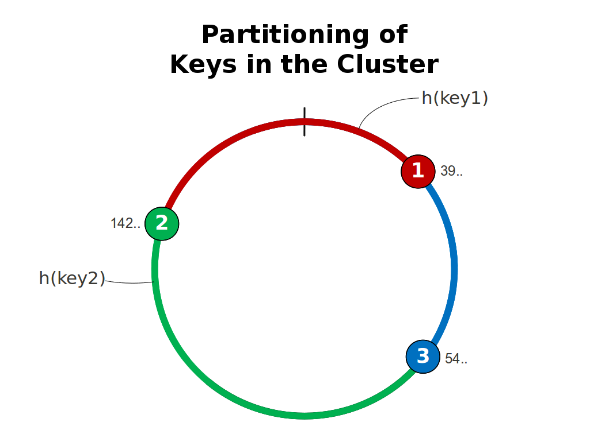

**NOTE:** This assignment is two weeks long, there will  be no new assignment next week. We recommend not rushing this exercise  and solving it in several steps as you see fit.

To get started, [download the kvstore.zip](https://moocs.scala-lang.org/~dockermoocs/handouts/scala-3/kvstore.zip) handout archive file and extract it somewhere on your machine.

# Introduction

A key-value store is a very simple form of a database. Its entries  are key-value pairs, the key part acting as a unique identifier, and the  value being  arbitrary data. In recent years, distributed versions of key-value  stores have become very popular. Your task in this assignment is to  implement a distributed, replicated storage of key-value pairs. Each  node (the replicas) in this distributed system will be represented by  one actor. You will also have to define some helper actors.

In the simplified version that we will examine, your system will  include a primary node (the primary replica), which will be responsible  for replicating all changes to a set of secondary nodes (the secondary  replicas). The primary and the secondary replica nodes will form a  distributed database, where potential replica nodes might join and leave  at arbitrary times.

The primary replica will be the only one accepting modification  events (insertions and removals) and replicate its current state to the  secondaries. Both the primary and the secondary replicas will accept  lookup (read) events, although the secondary nodes will be allowed to  give results that are "out-of-date" since it takes time for the replicas  to keep up with the changes on the primary replica.

Compared to a full real-world solution several restricting  assumptions are made about the system to make the problem easier to  solve:

- Updates are only possible on a dedicated node, the primary replica.
- The primary (leader) node does not fail during the uptime of the system.
- Membership is handled reliably by a provided subsystem (see section "The Arbiter").
- The update rate is low, meaning that no incoming requests need to be rejected due to system overload.
- In case of rejecting an update  the store is left in a possibly inconsistent state which may require a  subsequent succeeding write to the same key to repair it.
- Clients are expected to not reuse request IDs before the request has been fully processed and responded to.

For a more detailed discussion of these restrictions and on how  lifting them would affect the solution please refer to the last section  below.

**This is a complex assignment. Please read the whole description before attempting to solve the exercise.** In the last section  you will find a step-by-step list of which subtasks you need to solve  in order to have a complete solution. If you are unable to arrive at a  full solution due to time constraints, don’t despair, for you will have learnt a lot along the way.

# Overview of the system components

The key-value store and its environment consists of the following components:

- **The clustered key-value store:** A set of nodes that store key value pairs in a distributed fashion, cooperating to maintain a certain set of guarantees (specified in section *“System Behavior - Consistency guarantees”*). This cluster of nodes consists of replicas and the provided Arbiter and Persistence modules: 
- **Clients:** Entities that communicate with one of the replicas to update or read key-value pairs.

You are encouraged to use additional actors in your solution as you see fit.

## Clients and The KV Protocol

Clients are external entities contacting the replica set (your  cluster) for reading and writing key-value pairs. It is your  responsibility to maintain the consistency guarantees for clients that  are described in the next section. Each node participating in the  key-value store (primary and secondaries) provides an interface for  clients. This interface is a set of messages and corresponding answers  that together form the KV Protocol.

The KV Protocol itself contains two subsets of operations:

1. Update operations (insertion and removal).
2. Lookup operation.

Clients contacting the primary node directly can use all operations  on the key-value store, while clients contacting the secondaries can  only use lookups.

The two sets of operations in detail are:

### Update Commands

- Insert(key, value, id) - This message instructs the primary to insert the (key, value) pair into the storage and replicate it to the secondaries: id is a client-chosen unique identifier for this request.
- Remove(key, id) - This message instructs the primary to  remove the key (and its corresponding value) from the storage and then  remove it from the secondaries.
- A successful Insert or Remove results in a reply to the client (precisely: to the sender of the update command) in the form of an OperationAck(id) message where the id field matches the corresponding id field of the operation that has been acknowledged.
- A failed Insert or Remove command results in an OperationFailed(id) reply.  A failure is defined as the inability to confirm the operation within 1  second. See the sections on replication and persistence below for more  details.

### Lookup

- Get(key, id) - Instructs the replica to look up the  "current" (what current means is described in detail in the next  section) value assigned with the key in the storage and reply with the  stored value.
- A Get operation results in a GetResult(key, valueOption, id) message to be sent back to the sender of the lookup request where the id field matches the value in the id field of the corresponding Get message. The valueOption field should contain None if the key is not present in the replica or Some(value) if a value is currently assigned to the given key in that replica.

**All replies sent by the Replica shall have that Replica as their sender.**

# System Behavior - Consistency guarantees

Let's assume the scenario that one client issues the following commands to the primary replica (starting from empty storage), **waiting for successful acknowledgement of each operation before proceeding with the next** (see further below for the case of not awaiting confirmation):

```scala
```

## Ordering guarantees for clients contacting the primary replica

A second client reading directly from the primary is not allowed to see:

- key1 containing b and then containing a *(since a was written before b for key1)*
- key2 containing 2 and then containing 1 *(since 1 was written before 2 for key2)*

In other words, this second client sees the updates in order (although it might miss some updates, so it might see the value 2 for key2 immediately without seeing the intermediate value 1).

In contrast, the second client may observe

- key1 containing b and then key2 containing 1
- key2 containing 2 and then key1 containing a

This means that the ordering guarantee only applies between reads and write *to the same key*,  not across keys. The store may choose to provide stronger semantics to  respect ordering across different keys, but clients will not be able to  rely on this; the reason is that lifting the restriction of having only  one non-failing primary replica would require breaking these stronger  guarantees.

## Ordering guarantees for clients contacting a secondary replica

For a second client reading from one of the secondary replicas  (during a conversation, the replica does not change) the exact same  requirements apply as if that client was reading from the primary, with  the following addition:

it must be guaranteed that a client reading from a secondary replica  will eventually see the following (at some point in the future):

- key1 containing b
- key2 containing 2

## Ordering guarantees for clients contacting different replicas

If a second client asks different replicas for the same key, it may  observe different values during the time window when an update is  disseminated. The client asking for key1 might see

- answer b from one replica
- and subsequently answer a from a different replica

As per the rule stated in the previous section, and assuming that the  client keeps asking repeatedly, eventually all reads will result in the  value b if no other updates are done on key1.

*Eventual consistency* means that given enough time, all replicas settle on the same view. This also means that when you design your system **clients contacting multiple replicas at the same time are not required to see any particular ordering.** You do not need to design your solution for such scenarios and the grading system will not test these either.

Durability guarantees of updates for clients contacting the primary replica

The previous two sections prescribed possible transitions that the  clients are allowed to experience on key updates. In this section, we  will see what guarantees acknowledgement messages must obey (on the primary replica).

Whenever the primary replica receives an update operation (either Insert or Remove) it **must** reply with an OperationAck(id) or OperationFailed(id) message,  to be sent at most 1 second after the update command was processed (the  ActorSystem’s timer resolution is deemed to be sufficiently precise for  this).

A positive OperationAck reply must be sent as soon as

- the change in question has been handed down to the Persistence module (provided) **and** a corresponding acknowledgement has been received from it *(the  persistence module is "flaky"—it fails randomly from time to time—and  it is your task to keep it alive while retrying unacknowledged  persistence operations until they succeed, see the persistence section  for details)*
- replication of the change in question has been initiated **and** all of the secondary replicas have acknowledged the replication of the update.

If replicas leave the cluster, which is signalled by sending a new Replicas  message to the primary, then outstanding acknowledgements of these  replicas must be waived. This can lead to the generation of an OperationAck triggered indirectly by the Replicas message.

A negative OperationFailed reply must be sent if the conditions for sending an OperationAck are not met within the 1 second maximum response time.

## Consistency in the case of failed replication or persistence

Assuming in the above scenario that the last write fails (i.e. an OperationFailed  is returned), replication to some replicas may have been successful  while it failed on others. Therefore in this case the property that  eventually all replicas converge on the same value for key2 is not provided by this simplified key–value store. In order to restore consistency a later write to key2  would have to succeed. Lifting this restriction is an interesting  exercise on its own, but it is outside of the scope of this course.

One consequence of this restriction is that each replica uses this  freedom to immediately hand out the updated value to subsequently  reading clients, even before the the new value has been persisted locally, and no rollback is attempted in case of failure.

## Which value to expect while an update is outstanding?

Sending an update request for a key followed by a Get request for the same key without waiting for the acknowledgement  of the update is allowed to return either the old or the new value (or a  third value if another client concurrently updates the same key). An  example, assuming only this one client at this time:

```scala
```

The replies for the last two requests may arrive in any order, and the reply for the Get request may either contain "a" or "b".

# The Arbiter

The Arbiter is an external subsystem that will be provided for use. The Arbiter follows a simple protocol:

- New replicas must first send a Join message to the Arbiter signaling that they are ready to be used.
- The Join message will be answered by either a JoinedPrimary or JoinedSecondary message indicating the role of the new node; the answer will be sent to the sender of the Join message. The first node to join will get the primary role, other subsequent nodes are assigned the secondary role.
- The arbiter will send a Replicas message to the primary replica whenever it receives the Join message; for this reason the sender of the Join message  must be the replica Actor itself. This message contains the set of  available replica nodes including the primary and all the secondaries.
- All messages sent by the Arbiter will have the Arbiter as their sender.

# The Replicas

You have to provide an Actor representing a node of the system. Its declaration is:

```scala
```

Please note that in this exercise the nodes (i.e. actors) are  executed within the same JVM, but the problems and their solutions apply  equally when distributing the system across multiple network hosts.

When your actor starts, it must send a Join message to the Arbiter and then choose between primary or secondary behavior according to the reply of the Arbiter to the Join message (a JoinedPrimary or JoinedSecondary message).

The primary replica must provide the following features:

- The primary must accept update and lookup operations from clients following the Key-Value protocol like Insert, Remove or Get as it is described in the *“Clients and The KV Protocol”* section, respecting the consistency guarantees described in *“Guarantees for clients contacting the primary replica”*.
- The primary must replicate changes to the secondary replicas of the  system. It must also react to changes in membership (whenever it gets a Replicas message from the Arbiter) and start replicating to newly joined nodes, and stop replication to nodes that have left; the latter implies terminating the corresponding Replicator actor. More details can be found in the section *“Replication Protocol”*.

The secondary replicas must provide the following features:

- The secondary nodes must accept the lookup operation (Get) from clients following the Key-Value protocol while respecting the guarantees described in *“Guarantees for clients contacting the secondary replica”*.
- The replica nodes must accept replication events, updating their current state (see *“Replication Protocol”*).

### The Replication Protocol

Apart from providing the KV  protocol for external clients, you must implement another protocol  involving the primary and secondary replicas and some newly introduced  helper nodes. The KV store will use this protocol to synchronize its state between nodes.

When a new replica joins the system, the primary receives a new Replicas message and must allocate a new actor of type Replicator for the new replica; when a replica leaves the system its corresponding Replicator must be terminated. The role of this Replicator actor is to accept **update events**, and propagate the changes to its corresponding replica (i.e. there is exactly one Replicator per secondary replica). **Also, notice that at creation time of the Replicator, the primary must forward update events for every key-value pair it currently holds to this Replicator.**

Your task for this protocol will be to provide an Actor representing a Replicator. Its declaration is:

```scala
```

The protocol includes two pairs of messages. The first one is used by the replica actor which requests replication of an update:

- Replicate(key, valueOption, id) is sent to the Replicator to initiate the replication of the given update to the key; in case of an Insert operation the valueOption will be Some(value) while in case of a Remove operation it will be None. The sender of the Replicate message shall be the Replica itself.
- Replicated(key, id) is sent as a reply to the corresponding Replicate message once replication of that update has been successfully completed (see SnapshotAck). The sender of the Replicated message shall be the Replicator.

The second pair is used by the replicator when communicating with its partner replica:

- Snapshot(key, valueOption, seq) is sent by the Replicator to the appropriate secondary replica to indicate a new state of the given key. valueOption has the same meaning as for Replicate messages. The sender of the Snapshot message shall be the Replicator. The Snapshot message provides a sequence number (seq) to enforce ordering between the updates. Updates for a given secondary replica must be processed in contiguous ascending sequence number order; this ensures that updates for every single key are applied in the correct order. Each Replicator uses its own number sequence starting at zero. When a snapshot arrives at a Replica with a sequence number which is greater than the currently expected number, then that snapshot must be ignored (meaning no state change and no reaction). When a snapshot arrives at a Replica with a sequence number which is smaller than the currently expected number, then that snapshot must be ignored and immediately acknowledged as described below. The sender reference when sending the Snapshot message must be the Replicator actor (not the primary replica actor or any other). 
- SnapshotAck(key, seq) is the reply sent by the secondary replica to the Replicator as soon as the update is persisted locally by the secondary replica. The replica might never send this reply in case it is unable to persist the update. The sender of the SnapshotAck message shall be the secondary Replica. The acknowledgement is sent immediately for requests whose sequence number is less than the next expected number. The expected number is set to the greater of the previously expected number and the sequence number just acknowledged, incremented by one

You should note that the Replicator may handle multiple snapshots of a  given key in parallel (i.e. their replication has been initiated but  not yet completed). It is allowed—but not required— to batch changes  before sending them to the secondary replica, provided that each  replication request is acknowledged properly and in the right sequence  when complete. An example:

```scala
```

might have reached the Replicator before it got around to send a Snapshot message for a_key to its replica. These two messages could then result in only the following replication message

```scala
```

skipping the state where a_key contains the value value1.

Since the replication protocol is meant to symbolize remote replication you must consider the case that either a Snapshot message or its corresponding SnapshotAck message is lost on the way. Therefore the Replicator  must make sure to periodically retransmit all unacknowledged changes.  For grading purposes it is assumed that this happens roughly every 100  milliseconds. To allow for batching (see above) we will assume that a  lost Snapshot message will lead to a resend at most 200 milliseconds after the Replicate request was received (again, the ActorSystem’s scheduler service is considered precise enough for this purpose).

### Persistence

Each replica will have to submit incoming updates to the local Persistence  actor and wait for its acknowledgement before confirming the update to  the requester. In case of the primary, the requester is a client which  sent an Insert or Remove request and the confirmation is an OperationAck, whereas in the case of a secondary the requester is a Replicator sending a Snapshot and expecting a SnapshotAck back.

The used message types are:

- Persist(key, valueOption, id) is sent to the Persistence actor to request the given state to be persisted (with the same field description as for the Replicate message above).
- Persisted(key, id) is sent by the Persistence actor as reply in case the corresponding request was successful; no reply is sent otherwise. The reply is sent to the sender of the Persist message. Note, however, that the sender of the Persisted message might not be the Persistence actor (in some tests, the Persisted message will be sent by a wrapper actor).

The provided implementation of this persistence service is a mock in the true sense,  since it is rather unreliable: every now and then it will fail with an  exception and not acknowledge the current request. It is the job of the Replica actor to create and appropriately supervise the Persistence actor; for the purpose of this exercise  any strategy will work, which means that you can experiment with  different designs based on resuming, restarting or stopping and  recreating the Persistence actor. To this end your Replica does not receive an ActorRef but a Props for this actor, implying that the Replica has to initially create it as well.

For grading purposes it is expected that Persist is retried before the 1 second response timeout in case persistence failed. The id used in retried Persist messages must match the one which was used in the first request for this particular update.

# Your Task

Since this assignment is a longer one, we have prepared the test suite in a way that supports the solution step by step. In the following you can find a suggestion for how to proceed with the solution, but you can of course choose any path leading up to twenty points that you like.

1. Implement the primary replica role so that it correctly responds to the KV protocol messages without considering persistence or replication.
2. Implement the secondary replica role so that it correctly responds to the read-only part of the KV protocol and accepts the replication protocol, without considering persistence.
3. Implement the replicator so that it correctly mediates between replication requests, snapshots and acknowledgements.
4. Implement the use of persistence at the secondary replicas.
5. Implement the use of persistence and replication at the primary replica.
6. Implement the sending of the initial state replication to newly joined replicas.

### Hints, Tips

The logic for collecting acknowledgements of persistence and replication can be made such that it is usable both in primary and secondary replicas.

You should write (versions of) tests which exercise the behavior under unreliable persistence (i.e. when using a Persistence actor created with flaky = true) or unreliable communication between primary and secondaries. The latter can be done by having the Arbiter  wrap the secondary nodes’ ActorRefs in small actors which normally  forward messages but sometimes forget to do so. The grading process  involves such a test suite as well.

Resending snapshots from the Replicator without  pause is not the intended solution—the resend rate needs to be kept  reasonable. This fact is exploited implicitly by the test suite in step  3.

### The Effect of the Restrictions

This section is meant to offer further insights for those who want to  take the assignment as a starting point for continuing their own  studies beyond what the course provides. It is not necessary to read  this section in order to complete the assignment.

**Updates are only accepted by a distinguished primary replica**

Accepting writes only on one node at any given time simplifies  conflict resolution, because request arrival order at that node can be  used to serialize updates to a given key. The downside of this is that  this node clearly limits the amount of requests that can be handled per second, it is a single point of bottleneck.

In order to scale the possible update rate beyond what a single node  can digest it would also be possible to divide the key space into shards  and distribute them across the members, making each member a primary  for a certain portion of the key space. The clients would then need to  either be told which one the right node is for updating a certain key,  or every node could include a ConsistentHashingRouter which dispatches  incoming requests to the right node on the client’s behalf (see the  diagram below). Moving the primary role for a shard from one member to  another would then be necessary to rebalance the allocation when nodes  join or leave the cluster.





The service which determines the placement of shards does not need to be a single point of bottleneck,  as we can see the distribution of shards by using consistent hashing  can be done without going through a central point. The only thing that  needs special care is the hand-off period when shards move between  nodes.

**The primary node does not fail**

A real system would have to tolerate a failure of the primary node,  which otherwise would be a single point of failure, making the system  not resilient. In order to support this, the primary role must be  transferred by the arbiter to another node, which transitions from  secondary to primary and starts accepting updates. During this transition  updates will be left without a reply, but since confirmations are only  sent out after all replicas have acknowledged an update, the new primary  node will be able to continue where the old one left off.

One problem are unconfirmed or even rejected updates which have in  fact been accepted by all secondary replicas. The store will in this  case be internally consistent, but its contents possibly does not match  what the client assumes if it received an OperationFailed  message. Having received that message signals a possibly inconsistent  state due to other reasons as well, and it could be an option to require  the client to attempt to repair it by sending another write to the same  key if needed.

**Membership is handled reliably by a provided subsystem**

A service which reliably handles membership is available in the form  of the Akka Cluster module. The arbiter of this assignment can be a [ClusterSingleton](http://doc.akka.io/docs/akka/2.2.3/scala/cluster-usage.html#Cluster_Singleton_Pattern)  to which replicas register and which uses DeathWatch to monitor them,  or the cluster membership list could be used directly, determining the  primary role by sorting the member addresses and using the first one.

**The update rate is low**

Without this restriction the resend mechanism for example in the Replicator would have to manage the size of the buffer in which snapshots are kept while awaiting their acknowledgement. This means that the replication mechanism could either lose updates or the Replica would need to start rejecting requests with OperationFailed as soon as a limit on the number of outstanding requests is exceeded.

Especially when considering the next restriction, latency of confirmations is a performance sensitive  topic. One further possible optimization is to distribute the burden of  ensuring consistency between the primary and secondary nodes by  requiring that only a certain number of secondaries have sent their  confirmation before acknowledging an update. In order to restore  consistency in case of a replication failure (e.g. if the primary stops  working for whatever reason) the secondaries have to ask their peers for  the key and a reply is only sent once enough have replied with the same  value. If the number of write confirmations is W and the count of  agreeing reads is denoted R, then the condition for consistency is  R+W>N, where N is the total number of replicas. This equation must be  interpreted with some care because N can change during a replication or read process.

**Disregarding inconsistencies after OperationFailed**

This is the toughest restriction to lift because it touches on the  fundamental choice of which flavor of weak consistency eventually shall  be reached. The restriction allows the system to stay responsive in case  of failure (by providing an OperationFailed reply), but making that reply mean that the update will eventually disappear from all nodes is not possible in general.

Assuming that the primary does not fail for a sufficiently long time  period after the operation failure, the first step would be to ensure  that for a given key only up to one update can be “in flight”  at any given time. If the primary determines that this update has  failed, it will then replicate the previous state for that key to all  replicas, awaiting confirmation without a timeout. This favors  consistency over availability, since it makes the service of updating that key unavailable while the system is experiencing a malfunction.

**Clients are expected not to reuse request IDs**

This restriction makes your solution simpler and it also removes the  need for some grading tests which would have been hard to formulate in a  way which does not assume too much about your solution. In a real system you might even find this restriction as specified operational requirement.