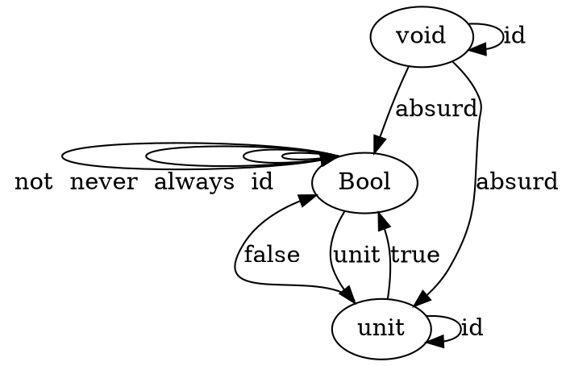

# Category Theory for Programmers Challenges

## 2. Types and Functions

### 1. Define a higher-order function (or a function object) memoize in your favorite language. This function takes a pure function f as an argument and returns a function that behaves almost exactly like f, except that it only calls the original function once for every argument, stores the result internally, and subsequently returns this stored result every time it’s called with the same argument. You can tell the memoized function from the original by watching its performance. For instance, try to memoize a function that takes a long time to evaluate. You’ll have to wait for the result the first time you call it, but on subsequent calls, with the same argument, you should get the result immediately.

Go does not have generics, so I have to choose between reflection and code generation.
In this case I chose code generation, using a code generation [goderive](https://github.com/awalterschulze/goderive) that I have created earlier this year.
If you call a function [deriveMem(f)](https://godoc.org/github.com/awalterschulze/goderive/plugin/mem) it will generate the memoize function for you.
This function will return the input function, but with memoized results.

Here is an example: https://github.com/awalterschulze/goderive/tree/master/example/plugin/mem

### 2. Try to memoize a function from your standard library that you normally use to produce random numbers. Does it work?

```go
package main

import "math/rand"

func random() int64 {
    return rand.Int63()
}

var memoizedRandom = deriveMem(random)
```

It always returns the same result, so No.

### 3. Most random number generators can be initialized with a seed. Implement a function that takes a seed, calls the random number generator with that seed, and returns the result. Memoize that function. Does it work?

```go
package main

import "math/rand"

func randWithSeed(seed int64) int64 {
    return rand.New(rand.NewSource(seed)).Int63()
}

var memoizedRandWithSeed = deriveMem(randWithSeed)
```

Well this will always return the same random number for the same seed.
Technically this works, but I do not think that this is something we would want to use.

I would maybe think we can reuse the same random number generator given the same seed, 
but since Go is not a pure language this means that the random number has state 
and returning the same random number generator will result in using a random number generator
which has been used and modified by a differ caller of the same memoized function.

### 4. Which of these C++ functions are pure? Try to memoize them and observe what happens when you call them multiple times: memoized and not.

#### 4.1
```
int fact(int n) {
    int i;
    int result = 1;
    for (i = 2; i <= n; ++i)
        result *= i;
    return result;
}
```

Although this function is manipulating the result variable, this variable is local and recreated on each call,
so this is a pure function and can easily be memoized.
We can also rewrite this function to be recursive and memoize the recursive calls.

#### 4.2 

```
std::getchar()
```

This function is not pure and will result in always returning the first character that was ever retrieved with getchar.

#### 4.3 

```
bool f() { 
    std::cout << "Hello!" << std::endl;
    return true; 
}
```

This function is not pure, since it outputs "Hello".
The memoized version of this function will print out "Hello" only once and always return true.

#### 4.4

```
int f(int x)
{
    static int y = 0;
    y += x;
    return y;
}
```

I am not that familiar with C++ ,
but it seems that a static variable declared in a function preserves its value when called again.
It seems equivalent to this go code.

```go
var y int = 0

func f(x int) int {
    y += x
    return y
}
```

This is not pure and the memoized version of this function, 
will return the addition of unique `x` values that have been passed as input arguments.

### 5. How many different functions are there from Bool to Bool? Can you implement them all?

Four: 2 possible inputs ^ 2 possible outputs

```go
func id(b bool) bool {
    return b
}
```

```go
func always(bool) bool {
    return true
}
```

```go
func never(bool) bool {
    return false
}
```

```go
func not(b bool) bool {
    return !b
}
```

This assumes we are not taking bottom into account.

### 6. Draw a picture of a category whose only objects are the types Void, () (unit), and Bool; with arrows corresponding to all possible functions between these types. Label the arrows with the names of the functions.




