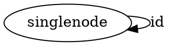
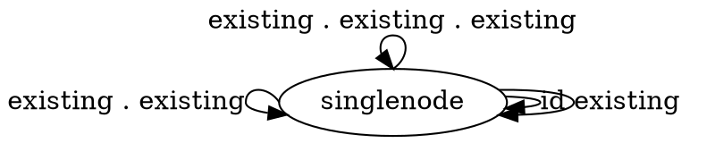
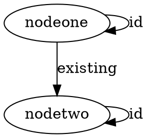
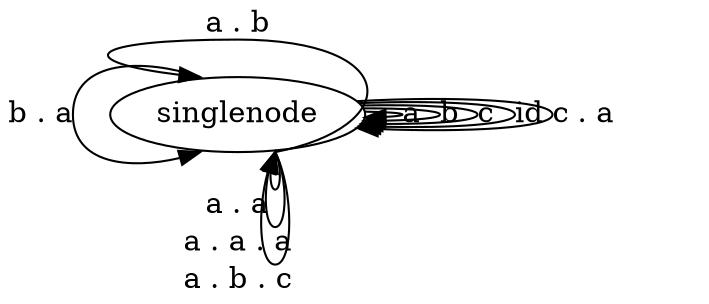
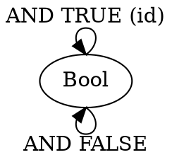
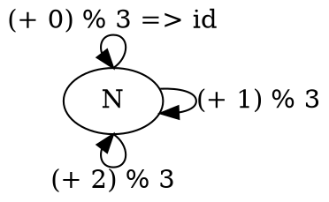

# Category Theory for Programmers Challenges

## 3. Categories Great and Small

### 3.1. Generate a free category from:

#### 3.1.1. A graph with one node and no edges

Each node needs an edge to itself.




#### 3.1.2. A graph with one node and one (directed) edge (hint: this edge can be composed with itself)

Each node needs an edge to itself that is the id edge.
Since the edge can be composed with itself, we could have infinitely many composed morphisms.




#### 3.1.3. A graph with two nodes and a single arrow between them

Each node needs an id edge to itself.




#### 3.1.4. A graph with a single node and 26 arrows marked with the letters of the alphabet: a, b, c ... z.

Each node needs an id edge to itself.
I left out d .. z otherwise the picture becomes too large, but this will still have infinite arrows.




### 3.2. What kind of order is this?

#### 3.2.1. A set of sets with the inclusion relation: A is included in B if every element of A is also an element of B.

Our morphisms are subset relations. Every set includes itself, A ⊆ A. Inclusion is also composable.
A ⊆ B and B ⊆ C implies A ⊆ C.  This means that we at least have a preorder.
If A ⊆ B and B ⊆ A then A = B, which means that we at least have a partial order.
Not all objects are a subset of each other though. For example {1} and {2,3} are not subsets of each other.
This means we don't have a total order and only a partial order.

#### 3.2.2. C++ types with the following subtyping relation: T1 is a subtype of T2 if a pointer to T1 can be passed to a function that expects a pointer to T2 without triggering a compilation error.

Our morphisms are subtypes. Every type includes itself as a subtype. Subtypes are also composable.
This means that we at least have a preorder.
I am not sure, since I am not familiar with C++, but I assume that if A can be passed to a function expecting a B and B can be passed to a function expecting an A then A = B, which means that we at least have a partial order.
Not all types are subtypes of each other.  So we don't have a total order, only a partial order.

### 3.3. Considering that Bool is a set of two values True and False, show that it forms two (set-theoretical) monoids with respect to, respectively, operator && (AND) and || (OR).

A monoid is a binary relation that needs to be associative and have a special element that behaves like unit.
Boolean operators AND and OR are both associative:

```
  a && (b && c) = (a && b) && c
  a || (b || c) = (a || b) || c
```

AND has the special element TRUE:

```
  a && true = a
  true && a = a
```

OR has the special element FALSE:

```
  a || false = a
  false || a = a
```

### 3.4. Represent the Bool monoid with the AND operator as a category: List the morphisms and their rules of composition.



```
id = (AND True)
id . (AND False) = (AND False)
(AND False) . (AND False) = (AND False)
(AND False) . id = (AND False)
id . id = id
```


### 3.5. Represent addition modulo 3 as a monoid category.



