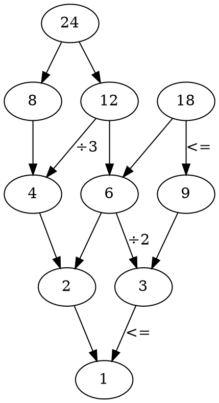
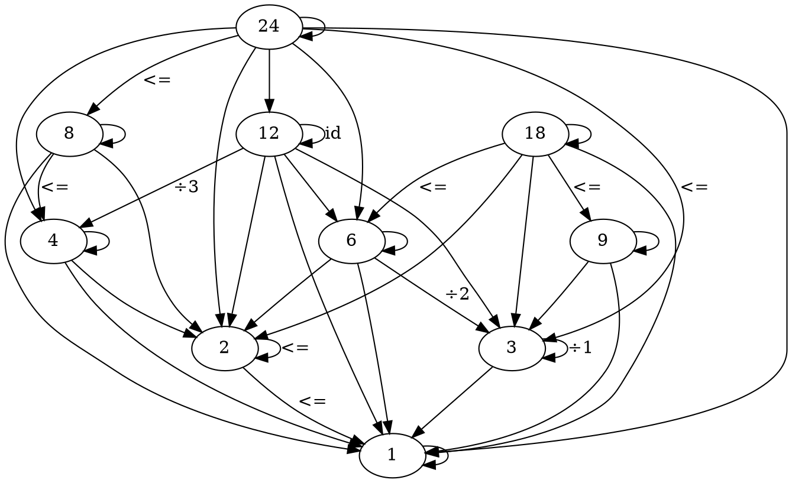
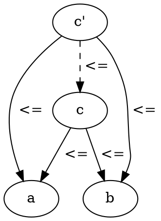
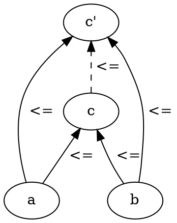
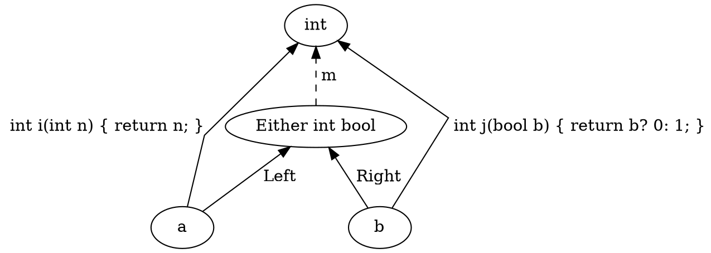
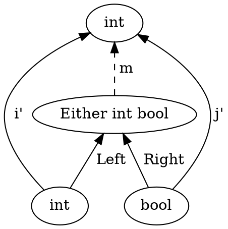
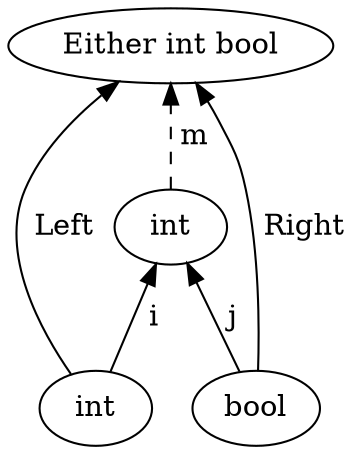
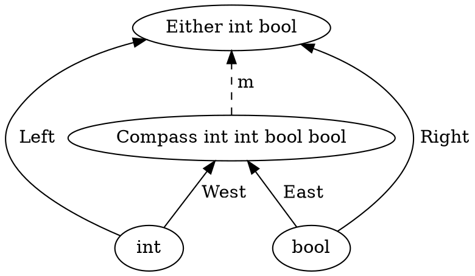

# Category Theory for Programmers Challenges

## 5. Products and Coproducts

### 5.1. Show that the terminal object is unique up to unique isomorphism.

Reversing the arrows gives you a theorem for free, 
so we can take the proof of initial object and simply rewrite in reverse:

Let's suppose that we have two terminal objects t<sub>1</sub> and t<sub>2</sub>.
Since t<sub>1</sub> is terminal, there is a unique morphism `f` from t<sub>2</sub> to t<sub>1</sub>.
By the same token, since t<sub>2</sub> is terminal, there is a unique morphism `g` from t<sub>1</sub> to t<sub>2</sub>.
The composition `g` . `f` must be morphism from t<sub>1</sub> to t<sub>1</sub>.
But t<sub>1</sub> is terminal so there can only be one morphism going from t<sub>1</sub> to t<sub>1</sub>.
Since we are in a category, we know that there is an identity morphism from t<sub>1</sub> to t<sub>1</sub>, and since there is room for only one, that must be it.  Therefore `g` . `f` must be equal to identity.  Similarly `f` . `g` must be equal to identity, because there can be only one morphism from t<sub>2</sub> back to t<sub>2</sub>.  This proves that `f` and `g` must be the inverse of each other.  Therefore any two terminal objects are isomorphic.
That implies that the initial object is unique up to unique isomorphism.

### 5.2. What is a product of two objects in a poset? Hint: Use the universal construction.

The chapter describes a category of sets, but in this question we have a poset category, where objects are elements of the poset and morphisms are relations.

A poset is a partially ordered set.
This is a set of objects that is partially ordered.
A partial order has two rules:

  - `a <= b & b <= c       =>       a <= c`
  - `a <= b & b <= a       =>       a == b`

But not every two objects need to be related, 
because it is not a total order.

Examples include: A set of sets, subtypes and non negative integers ordered by divisibility.

Here is an example the poset of a non negative integers ordered by divisibility:




Note: all the edges have not been labeled and this is not enough edges to be a category.

Lets add the edges to create a category:




Note: all the edges have not been labeled.

The definition of a product as found in the chapter:

> A product of two objects a and b is the object c equipped with two projections such that for any other object c’ equipped with two projections there is a unique morphism m from c’ to c that factorizes those projections.

If a and b are objects in the poset and there is a object c with two relations:

```
p :: a <= c
q :: b <= c
```

such that for any other object c' equipped with two relations:

```
p' :: a <= c'
q' :: b <= c'
```

there is a unique relation from c' to c that factorizes those relations:

A preorder says that:
```
a <= b & b <= c       =>       a <= c
```

factorization is:
```
p' = p . m
q' = q . m
```

so for relations that would be:
```
p' => p & m
q' => q & m
```

and if we then substitute we get:
```
a <= c' => a <= c & c <= c'
b <= c'=> b <= c & c <= c'
```

which means `m` is:
```
c <= c'
```




This means that the product of a poset is the smallest number that is bigger than or equal to both `a` and `b`.
If the poset is the non negative integers ordered by divisibility then the product of a poset is the product or least common multiple value `c = lcm(a,b)`, 
because `c` has to be the smallest number `c <= c'` that is bigger than or equal to and can divided by both `a` and `b`.

For example in our picture the product of:

  - `8` and `12` is `24` 
  - `18` and `8` is nothing 
  - `8` and `4` is `8`
  - `3` and `2` is `6`

I found [Wikiversity's Introduction to Category Theory - Products and Coproducts of Sets - Divisibility poset](https://en.wikiversity.org/wiki/Introduction_to_Category_Theory/Products_and_Coproducts_of_Sets#Divisibility_poset) useful in answering this question.

### 5.3. What is a coproduct of two objects in a poset?

For a coproduct we reverse all the arrows:



```
c <= a & c <= b & c' <= c
```

So `c` is the biggest number that is smaller or equal to `a` and `b`.
This means the coproduct of a poset is the largest object that is smaller or equal to both of its two constituents.


In the poset category of a non negative integers ordered by divisibility, the coproduct is the greatest common denominator.

For example in our picture the coproduct of:

  - `8` and `12` is `4` 
  - `18` and `8` is `2`
  - `8` and `4` is `4`
  - `3` and `2` is `1`

### 5.4. Implement the equivalent of Haskell `Either` as a generic type in your favorite language (other than Haskell).

Go does not have generics and there are many ways to do this incorrectly.
The conventional hack typically followed in Go is to have a tuple with one value null and the other value non null.
This is at least the pattern that is followed for errors and values, which is the most popular either type in Go at least.

In other cases I would recommend a `struct` with two fields and to follow the convention of one being null and the other being non null again and to also have a Case method, which can be used to pattern match and apply a function to the either of the values.

```go
type EitherAorB struct {
  Left *A
  Right *B
}

func NewLeft(a *A) EitherAorB {
  return EitherAorB{Left: a}
}

func NewRight(b *B) EitherAorB {
  return EitherAorB(Right: b)
}

func (e *EitherAorB) Case(f func(a *A) C, g func(b *B) C) C {
  if e.Left != nil {
    return f(e.Left)
  }
  return g(e.Right)
}
```

### 5.5. Show that `Either` is a "better" coproduct than `int` equipped with two injections:

```
int i(int n) { return n; }
int j(bool b) { return b? 0: 1; }
```

> Hint: Define a function

```
int m(Either const & e);
```

> that factorizes i and j.




We can show that we can map `Either` to `int`.

We can define `m` as:

> disclaimer I am not a C++ programmer

```cpp
int m(Either const & e) {
  if (e.tag == isLeft) {
    return e.left;
  }
  return e.right?: 0; 1;
}
```

Here we can see that `m` factorizes the two projections `i` and `j`:

```
i' = m . i
int i(int n) { return n; } = m . Left
n = m (Left n)

j' = m . j
int j(bool b) { return b? 0: 1; } = m . Right
0 = m (Right true)
1 = m (Right false)
```

### 5.6. Continuing the previous problem: How would you argue that int with the two injections `i` and `j` cannot be "better" than `Either`?




The other way around does not work, we cannot have a mapping from `int` to `Either` that will factorize `i` and `j`.




```
i' = m . i
Left = m . int i(int n) { return n; }
Left = m . id
Left = m

j' = m . j
Right = m . int j(bool b) { return b? 0: 1; }
Right = \b -> m (j b)
Right true = m (j true)
Right true = m 0
Right false = m (j false)
Right false = m 1
```

This means that `m 0` must be equal to `Left 0` and `Right true` and also
`m 1` must be equal to `Left 1` and `Right false`, which is impossible.

```cpp
Either m(int i) {
  if i == 0 {
    return Right(true) || Left(0);
  }
  if i == 1 {
    return Right(false) || Left(1);
  }
  return Left(i);
}
```

### 5.7. Still continuing: What about these injections?

```
int i(int n) { 
    if (n < 0) return n; 
    return n + 2;
}
int j(bool b) { return b? 0: 1; }
```

Lets first try to try find a mapping from `Either` to `int`:


```
i' = m . i
int i(int n) { if (n < 0) return n; return n + 2; } = m . Left
n < 0 => id = m . Left
n >= 0 => (+2) = m . Left

j' = m . j
int j(bool b) { return b? 0: 1; } = m . Right
0 = m (Right true)
1 = m (Right false)
```

That implies that `m` is the following function:

```haskell
m (Left n) = if n < 0 then n else n+2
m (Right true) = 0
m (Right false) = 1
```

Now lets try to factorize the other way around from `int` to `Either`:


```
i' = m . i
Left = m . int i(int n) { if (n < 0) return n; return n + 2; }
n < 0 => Left = m . id = m
n >= 0 => Left = m . \n -> n + 2

j' = m . j
Right = m . int j(bool b) { return b? 0: 1; }
Right = \b -> m (j b)
Right true = m (j true)
Right true = m 0
Right false = m (j false)
Right false = m 1
```

 - `m 0` = `Right true`
 - `m 1` = `Right false`
 - `m 2` = `Left 0`
 - `m 3` = `Left 1`
 - `m 4` = `Left 3`
 - `m (maxint + 1)` = `Left (maxint - 1)`
 - `m (maxint + 2)` = `Left maxint`

This looks fine, except for the case where `a` is the maximum value an `int` can have.
This would cause the function `i` to return an overflowed integer value.

This means that `Either` is a better candidate than `int` with the current injections `i` and `j`.

### 5.8. Come up with an inferior candidate for a coproduct of `int` and `bool` that cannot be better than `Either` because it allows multiple acceptable morphisms from it to `Either`.

Lets try a compass with four possible values, North, West, East and South `Compass int int bool bool` as a candidate for the coproduct.




```haskell
m1 :: Compass int int bool bool -> Either int bool
m1 (West i) = Left i
m1 (East b) = Right b
m1 (North i) = Left i
m1 (South b) = Right b

m2 :: Compass int int bool bool -> Either int bool
m2 (West i) = Left i
m2 (East b) = Right b
m2 (North i) = Right (i % 2)
m2 (South b) = Left (if b then 0 else 1) 
```
