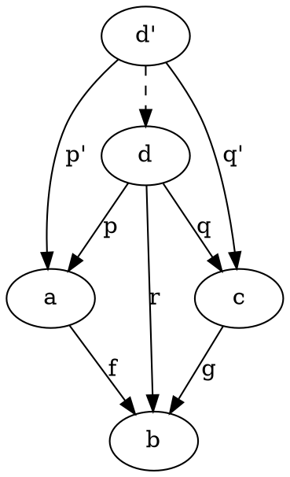
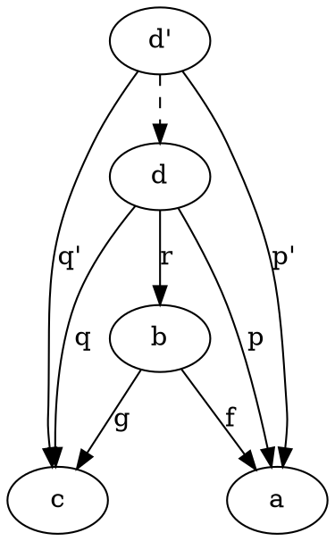
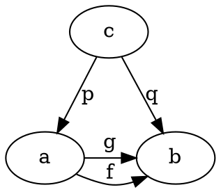
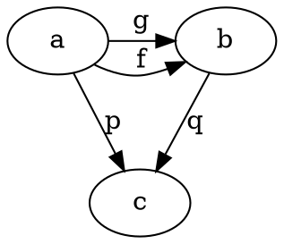

# Category Theory for Programmers Challenges

## 12. Limit and Colimits [TODO]

### Background

#### Naturality Condition

If we have two functors `F` and `G` then:

```
f :: a -> b
F f :: F a -> F b
G f :: G a -> G b
```

The two natural transformations would be:

```
alpha_a :: F a -> G a
alpha_b :: F b -> G b
```

The naturalarity condition states that:

```
G f . alpha_a = alpha_b . F f
```

#### Pullback

A pullback can be seen as coming from a category with three objects, with the following morphisms:

```
a -> b <- c
```

The two morphisms are:

```
f :: a -> b
g :: c -> b
```

A cone built on top this diagram consists of an apex `d`:




#### Pushout

A pushout can be seen as coming from a category with three objects, with the following morphisms:

```
a <- b -> c
```

The two morphisms are:

```
f :: b -> a
g :: b -> c
```

A cone built on top this diagram consists of an apex `d`:




#### Equalizer




### 12.1. How would you describe a pushout in the category of C++ classes?

Let us use the pushout described in the background section.

Lets say the objects represent C++ classes and the morphisms represent inheritence, as in:

-  `b` inherits from `a` and `c`,
-  `d` inherits from `a`, `b` and `c`,

**TODO: I am still very unsure**

If you are a subclass of `a` and `c`, it does not make you a subclass of `b`?
I think `d` might be equal to `b` in the limit?

### 12.2. Show that the limit of the identity functor `Id :: C -> C` is the initial object.

The initial object has exactly one morphism towards every object.

The limit of a functor is never taken in the chapter, only the limit of a diagram, usually this involves two categories `I` and `C`.
In this case we only have `C` and our functor `D` is replaced with `Id`.
All the mappings and objects from `I` (now `C`) are mapped into `C` using `Id`.
All the objects from `I` (now `C`) are mapped into `C` as `c`, using the constant functor, while all morphisms are mapped to identity.
Next a cone is created with `c` as the apex and a morphism from `c` towards every object, which is exactly the definition of the initial object.

### 12.3. Subsets of a given set form a category. A morphism in that category is defined to be an arrow connecting two sets if the first is the subset of the second. What is a pullback of two sets in such a category? What’s a pushout? What are the initial and terminal objects?

Here is a valid arrow in the subset category:

`{a,c} -> {a,b,c}`

The initial object has exactly one morphism towards every object.
This means that it is a subset of each object, which makes it the empty set.

The terminal object has exactly one morphism from every object.
This means that it is a superset of all subsets in this category, including itself.

**TODO: Russell's Paradox?**

### 12.4. Can you guess what a coequalizer is?

See the background section for the picture of the equalizer.

We can use an equalizer to show that:

```
f . p = g . p
```

This shows that for the subset of results that are in `a` after `p` has been applied to `c`, `f` and `g` are equal.

Here is a picture of a co-equalizer:




This shows that:

```
p = q . g
p = q . f
=>
q . g = q . f
```

This means that `g` could map to one set from `a` to `b` and `f` could possibly map another disjoint or overlapping set from `a` to `b`, 
but for those two different sets `q` maps to the same `c`.

For example:

```
f :: Int -> Double
f = toDouble . (* -1)
g :: Int -> Double
g = toDouble

q :: Double -> Uint
q = abs . toInt
```

**TODO**

### 12.5. Show that, in a category with a terminal object, a pullback towards the terminal object is a product.

This would mean that `b` is the terminal object in the pullback picture.

This means that:

```
b = ()
g . q = f . p
p = p' . h
    where h :: d' -> d
```

**TODO**

### 12.6. Similarly, show that a pushout from an initial object (if one exists) is the coproduct.

**TODO**
