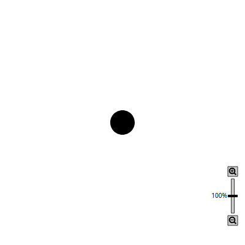
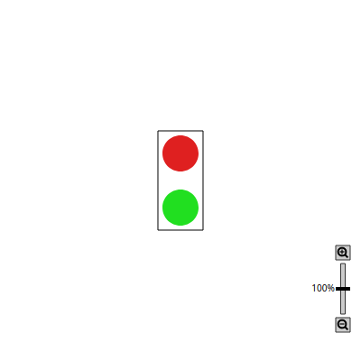
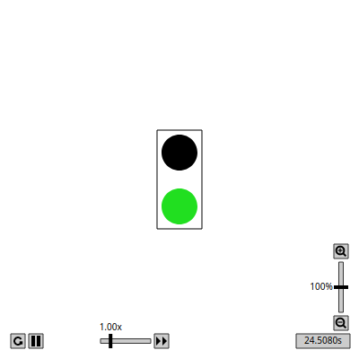
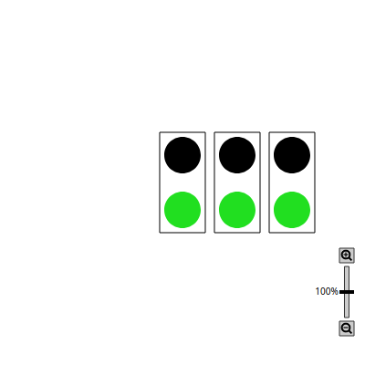

[CIS 194](https://www.seas.upenn.edu/~cis194/fall16/index.html) | [Policies](https://www.seas.upenn.edu/~cis194/fall16/policies.html) | [Resources](https://www.seas.upenn.edu/~cis194/fall16/resources.html) | [Final Project](https://www.seas.upenn.edu/~cis194/fall16/final.html)

​    Haskell Basics: Functions and Pictures    


The Haskell Logo

# Prelude

## What is Haskell?

Haskell is a *lazy, functional* programming language created  in the late 1980’s by a committee of academics. There were a plethora of lazy functional languages around, everyone had their favorite, and it  was hard to communicate ideas. So a bunch of people got together and  designed a new language, taking some of the best ideas from existing  languages (and a few new ideas of their own). Haskell was born.

So what is Haskell like? Haskell is:

### Functional


Function composition

There is no precise, accepted meaning for the term “functional”. But when we say that Haskell is a *functional* language, we usually have in mind two things:

- Functions are *first-class*, that is, functions are values which can be used in exactly the same ways as any other sort of value.
- The meaning of Haskell programs is centered around *evaluating expressions* rather than *executing instructions*.

Taken together, these result in an entirely different way of thinking about programming. Much of our time this semester will be spent  exploring this way of thinking.

### Pure


Not this kind of purity

Haskell expressions are always *referentially transparent*, that is:

- No mutation! Everything (variables, data structures…) is *immutable*.
- Expressions never have “side effects” (like updating global variables or printing to the screen).
- Calling the same function with the same arguments results in the same output every time. Programs are *deterministic*.

This may sound crazy at this point. How is it even possible to get  anything done without mutation or side effects? Well, it certainly  requires a shift in thinking (if you’re used to an imperative or  object-oriented paradigm). But once you’ve made the shift, there are a  number of wonderful benefits:

- *Equational reasoning and refactoring*: In Haskell one can always “replace equals by equals”, just like you learned in algebra class.
- *Parallelism*: Evaluating expressions in parallel is easy when they are guaranteed not to affect one another.
- *Fewer headaches*: Simply put, unrestricted effects and  action-at-a-distance makes for programs that are hard to debug,  maintain, and reason about.

### Lazy


Not this kind of laziness

In Haskell, expressions are *not evaluated until their results are actually needed*. This is a simple decision with far-reaching consequences, which we will explore throughout the semester. Some of the consequences include:

- It is easy to define a new *control structure* just by defining a function.
- It is possible to define and work with *infinite data structures*.
- It enables a more compositional programming style (see *wholemeal programming* below).
- One major downside, however, is that reasoning about time and space usage becomes much more complicated!

### Statically typed


Not this kind of static

Every Haskell expression has a type, and types are all checked at *compile-time*. Programs with type errors will not even compile, much less run.

## Themes

Throughout this course, we will focus on three main themes.

### Types

Static type systems can seem annoying. In fact, in languages like C++ and Java, they *are* annoying. But this isn’t because static type systems *per se* are annoying; it’s because C++ and Java’s type systems are  insufficiently expressive! This semester we’ll take a close look at  Haskell’s type system, which

- *Helps clarify thinking and express program structure*

  The first step in writing a Haskell program is usually to *write down all the types*. Because Haskell’s type system is so expressive, this is a non-trivial  design step and is an immense help in clarifying one’s thinking about  the program.

- *Serves as a form of documentation*

  Given an expressive type system, just looking at a function’s type  tells you a lot about what the function might do and how it can be used, even before you have read a single word of written documentation.

  And it goes the other way: If you are using existing code, such as a  library, and you are searching for a specific functionality, you often  anticipate the type of the function you need, and you can find it based  on that.

- *Turns run-time errors into compile-time errors*

  It’s much better to be able to fix errors up front than to just test a lot and hope for the best. “If it compiles, it must be correct” is  mostly facetious (it’s still quite possible to have errors in logic even in a type-correct program), but you will have this experience much more likely in Haskell than in other languages.

### Abstraction

“Don’t Repeat Yourself” is a mantra often heard in the world of  programming. Also known as the “Abstraction Principle”, the idea is that nothing should be duplicated: every idea, algorithm, and piece of data  should occur exactly once in your code. Taking similar pieces of code  and factoring out their commonality is known as the process of *abstraction*.

Haskell is very good at abstraction: features like parametric  polymorphism, higher-order functions, and type classes all aid in the  fight against repetition. Our journey through Haskell this semester will in large part be a journey from the specific to the abstract.

### Wholemeal programming

Another theme we will explore is *wholemeal programming*. A quote from Ralf Hinze:

> “Functional languages excel at wholemeal programming, a term coined  by Geraint Jones. Wholemeal programming means to think big: work with an entire list, rather than a sequence of elements; develop a solution  space, rather than an individual solution; imagine a graph, rather than a single path. The wholemeal approach often offers new insights or  provides new perspectives on a given problem. It is nicely complemented  by the idea of projective programming: first solve a more general  problem, then extract the interesting bits and pieces by transforming  the general program into more specialised ones.”

For example, consider this pseudocode in a C/Java-ish sort of language:

```c
int acc = 0;
for ( int i = 0; i < lst.length; i++ ) {
  acc = acc + 3 * lst[i];
}
```

This code suffers from what Richard Bird refers to as “indexitis”: it has to worry about the low-level details of iterating over an array by  keeping track of a current index. It also mixes together what can more  usefully be thought of as two separate operations: multiplying every  item in a list by 3, and summing the results.

In Haskell, we can just write

```haskell
sum (map (3*) lst)
```

This semester we’ll explore the shift in thinking represented by this way of programming, and examine how and why Haskell makes it possible.


## Programming environment

In this class, we start working within a programming environment called CodeWorld, which you can access at http://code.world/haskell (the `/haskell` is important). This has the advantages that

- we can start right ahead, and take care of local installation later
- with the integrated support for displaying graphical output, we can have nice, visual, examples and initial tasks.

We will switch to compiling programs locally later during the course. If you want to work locally already now, there are instructions on the  course website.

# Basic Haskell

So let us see some Haskell code. On CodeWorld, we generally start with this code ([open on CodeWorld](https://code.world/haskell#PvoZv8n9Mtp5kOMGDszKEcQ)):

```haskell
{-# LANGUAGE OverloadedStrings #-}
import CodeWorld

ourPicture :: Picture
ourPicture = blank

main :: IO ()
main = drawingOf ourPicture
```

Most of these lines are not interesting initially, and will be  understood fully later on. If we run this, using the green “Run” button, or alternatively pressing *Ctrl-Enter*, we see … nothing.

## Declarations and variables

Not very surprising, since our picture is `blank`. So let us change this line to something that we can see:

```haskell
ourPicture = solidCircle 1
```

We now see a solid black circle of radius 1: [see at CodeWorld](https://code.world/run.html?mode=haskell&hash=PGPxJJHfirP0_D8y8lOrQLw) 



What happens here? This code declares a variable with name `ourPicture` with type `Picture` (“`::`” is pronounced “has type”), and defines its value to be `circle 1`.

Note that *this will be the value of `ourPicture` forever* (at least, in this particular program). The value of `ourPicture` cannot be changed later.

If we would try to write something like

```haskell
ourPicture = solidCircle 1
ourPicture = solidCircle 2
```

then we get an error message complaining about `Multiple declarations of ‘ourPicture’`.

In Haskell, *variables are not mutable boxes*; they are just names for values!

Put another way, `=` does *not* denote “assignment” like it does in many other languages. Instead, `=` denotes *definition*, like it does in mathematics. That is, `ourPicture = solidCircle 1` should not be read as “`ourPicture` gets `solidCircle 1`” or “assign `solidCircle 1` to `ourPicture`”, but as “`ourPicture` is *defined to be* `solidCircle 1`”.

What do you think this code means?

```haskell
y :: Integer
y = y + 1
```

## Picture Types and Functions

In contrast to a classical intro into Haskell, we do not start with  numbers, booleans, tuples, lists and strings, but we start with  pictures. These are of course library-defined (hence the `import CodeWorld`) and not part of “the language”. But that does not make them less  interesting, and in fact, even the basic boolean type is library defined – it just happens to be the standard library.

### Primitive pictures

Every picture is a value of type, well, `Picture`. We have seen two such values so far: `blank` and `solidCircle 1`. There are many more primitive pictures, for rectangles, polygons,  lines, arcs and text. To get an overview, see the Help button on  CodeWorld: From there you can reach the documentation of the `CodeWorld` API.

If we look at the documentation for `solidCircle`, it says

```haskell
solidCircle :: Double -> Picture
```

The arrow (`->`) indicates that `solidCircle` itself is a *function*, turning a value of type `Double` – i.e. a floating point number – into a picture. Now `1` happens to be a real number, therefore `solidCircle 1` is a `Picture`.

You can see that function application in Haskell works without  parentheses, you just write the argument after the function. But if the  argument itself is more complex than just one number of variable name,  you have to put parentheses around it:

```haskell
ourPicture = solidCircle (1+1)
```


### Modifying Pictures

Let us bring some color into the picture. In the documentation, we see this function

```haskell
colored :: Color -> Picture -> Picture
```

There are two arrows! What do we make of that? This means that `colored` is a function expecting two arguments, namely a color and a picture,  and then returns a – presumably colored – picture. There are many colors defined, so we can write

```haskell
ourPicture = colored green (solidCircle 1)
```

As you see, even multiple arguments are just written after the  function, separated by a space, and complex arguments need to be  enclosed in parentheses.

So what is the deal with two two arrows? Why not just `Color Picture -> Picture`? It might seem strage to you now, but there is a very deep and beautiful reason, to which we will get in a few weeks; for now you just have to  take my word for it!

### Composing Pictures

By now we are tired of seeing single circles. We want more! So we  need a way to draw more than one thing. So what we are looking for is a  function that takes two pictures, and combines them to one. You should  agree with me that such a function likely would have type `Picture -> Picture -> Picture`.

And now we are expericing one of the advantages of a good type  system: We can search for a type! Indeed, there is only function in the  documentation that has this type

```haskell
(&) :: Picture -> Picture -> Picture
```

That is a strange name for a function, but it is indeed one name for it, and we could use `(&)` as a normal function, putting the arguments to its right. But, as you migh have guessed, we can use `&` (without the parentheses) as an operator, and put it in between two pictures.

```haskell
ourPicture = colored green (solidCircle 1) & solidCircle 2
```

From the resulting picture we can learn a few things

- The `&` operator combines two pictures, but puts them in the same spot, with the picture given as the left argument on top of the picture given as the right argument.

- The function `colored green` applied only to `(solidCircle 1)`, and *not* to `(solidCircle 1) & solidCircle 2` (otherwise, both circles would be green). From this we deduce an  important fact about Haskell syntax that you should remember well:

  *Function application binds tighter than any binary operators.*

In order to create nicer pictures, we need to be able to place our  pictures somewhere else than just the middle. For this, we use the  function

```haskell
translated :: Double -> Double -> Picture -> Picture
```

which shoves a picture around. So here we go:

```haskell
ourPicture = colored green (translated 0 (-1.5) (solidCircle 1)) & colored red (translated 0 (1.5) (solidCircle 1))
```

Now we are getting somewhere. The parentheses around `-1.5` are necessary as otherwise the compiler would think we want to use the binary subtraction operator.

Our code line got too long, so let us name some of the components and give them their own names, and while we are at it, draw a frame around  our traffic light ([open on CodeWorld](https://code.world/haskell#PghsHgwl_rJUmdcCvOPAR-w)):

```haskell
botCircleGreen = colored green (translated 0 (-1.5) (solidCircle 1))
topCircleRed   = colored red   (translated 0   1.5  (solidCircle 1))
frame = rectangle 2.5 5.5
trafficLight = botCircleGreen & topCircleRed & frame

ourPicture :: Picture
ourPicture = trafficLight
```

[see on CodeWorld](https://code.world/run.html?mode=haskell&hash=PghsHgwl_rJUmdcCvOPAR-w)



## Defining functions

We have seen how to use functions, but we also want define our own.  And in a way, we have been defining functions all the time when we wrote `something = this and that`; this defined a function `something`, which just happend to not take any argument. If we want it to take any arguments, we just write give their names on the left:

```haskell
botCircle c = colored c (translated 0 (-1.5) (solidCircle 1))
topCircle c = colored c (translated 0   1.5  (solidCircle 1))
frame = rectangle 2.5 5.5
trafficLight = botCircle green & topCircle red & frame

ourPicture :: Picture
ourPicture = trafficLight
```

A normal traffic light never shows red and green at the same time. So let us turn `trafficLight` into a function that shows either a green or a red light. So the argument is going to be a boolean value of type `Bool`, which can be either `True` or `False`. And as a matter of fact, we can write define `trafficLight` by handling these two cases:

```haskell
trafficLight True  = botCircle green & topCircle black & frame
trafficLight False = botCircle black & topCircle red   & frame
ourPicture = trafficLight True
```

We could, and we should, also write down the type of `trafficLight`. Not that the compiler needs us to do that – it is smart enough to  figure that out by itself. But it helps us to understand the code  better, to confirm that what we wrote is actually what we intended, and  to narrow down bugs in the code. Conveniently, the compiler tells us  about the correct signture, so we can just copy that:

```haskell
trafficLight :: Bool -> Picture
```

Here we have applied a very important method in programming in  general, and one that is even more powerful in functional programming  (for reasons you will learn to appreciate later): We **abstracted** our code, by making the `topCircle` function *abstract* in the color, and the `trafficLight` function *abstract* in the state it is in.

## Animations

Now the traffic light is green, but we want it to switch to red every now and then. The CodeWorld API not only allows us to draw drawings,  but also to run animations. What is an animation? It is a picture that  changes over time, where time can conveniently be understood as the  number of seconds since the start of the animation.

In imperative language, one would probably have a `getCurrentTime()` function and call that from somewhere in our drawing generating. This  is not possible nor desirable in a pure functional language, as it would be a *hidden side effect*. Instead, the time is provided as a parameter.

So here this codes makes the traffic light switch every three seconds:

```haskell
trafficController :: Double -> Picture
trafficController t
  | round (t/3) `mod` 2 == 0 = trafficLight True
  | otherwise                = trafficLight False

main :: IO ()
main = animationOf trafficController
```

From looking at the code ([open on CodeWorld](https://code.world/haskell#Ph3vruxsOVmcnYG0D2NGG0Q)) we notice

- Instead of `drawingOf` we use `animationOf` in the main entry point of the program. Its parameter is no longer simply a value of type `Picture`, but rather a *function* of type `Double -> Picture`. This function will be given the current time, and return the picture for that time.
- We again define a function by multiple cases, but this time using a *guard* to select the case. When called, the conditions of the guards are tried in that order until one evaluates to `True`. Then this code is taken.
- `otherwise` happens to be a defined to be `True`. It just reads better than writing `True` here.
- There is a function called `round` and `mod`. `round` is used in the normal, infix way, but we turned `mod` into an operator by putting backticks around it (``mod``). You can do that two any function called with two arguments.
- We are now working with numbers here, so let us take a quick detour into Haskell’s numeric types. [see on CodeWorld](https://code.world/run.html?mode=haskell&hash=Ph3vruxsOVmcnYG0D2NGG0Q)



## Numerical Types

There are three number-related types we should know about for now: `Int`, `Integer` and `Double`.

- `Int` are machine-sized integers.

  ```haskell
  i :: Int
  i = -42
  ```

  `Int`s are guaranteed by the Haskell language standard to accommodate values at least up to ±229, but the exact size depends on your architecture. For example, on my 64-bit machine the range is ±263.

- The `Integer` type, on the other hand, is limited only by the amount of memory on your machine.

  ```haskell
  n :: Integer
  n = 1234567890987654321987340982334987349872349874534
  
  reallyBig :: Integer
  reallyBig = 2^(2^(2^(2^2)))
  
  numDigits :: Int
  numDigits = length (show reallyBig)
  ```

  In the code above, `numDigits` is `19729`, so the integer type has no problems handling numbers with thousands of digits.

- For (double-precision) floating-point numbers, there is `Double`:

  ```haskell
  d1, d2 :: Double
  d1 = 4.5387
  d2 = 6.2831e-4
  ```

  There is also a single-precision floating point number type, `Float`, in case you wonder.

Together with these functions, there are a bunch of operations, as you would expect:

- `(+)`, `(-)` and `(*)` work for all numerical types.

  (If you see `Num a =>` in front of a type in the documentation or in the output of http://tryhaskell.org/ or your local interpreter session, just read that as “`a` is one of the numerical types” for now).

- `(/)` only works for `Double`

- For integer division, there is `div` and `mod`.

- The usual functions like `sin`, `cos`, `log`, `sqrt` etc. all exist.

You cannot mix different types in the same operation, e.g. you cannot directly add `d1 + i`. If you want to do that, you have to explicitly convert

- `fromIntegral`: converts from any integral type (`Int` or `Integer`) to any other numeric type.
- `round`, `floor`, `ceiling`: convert floating-point numbers to `Int` or `Integer`.

If you are used to other languages which do implicit conversion of  numeric types, this can all seem rather prudish and annoying at first.  However, I promise you’ll get used to it – and in time you may even come to appreciate it. Implicit numeric conversion encourages sloppy  thinking about numeric code.

In the code above, we also used `(==)`. This compares two  values of the same type for equality. It does work on most types (more  on that later). It even works on floating point numbers, but really, it  should not be used there (why? see [this article](http://docs.oracle.com/cd/E19957-01/806-3568/ncg_goldberg.html)). The test for inequality is `(/=)`.

There is also `(<)`, `(>)`, `(<=)`, `(>=)` for comparisons and `min` and `max` to take the minimum or maximum of two values.

# Recursion

The last topic for today is recursion. Recursion is when a function  calls itself again. Or, more general, if multiple functions call each  other.

Recursion is, like abstraction, a very powerful method in functional  programming and once you are done with this course, thinking about  recursion is going to be the most natural thing in the world.

So lets say we want to put multiple traffic lights next to each other. We could do it this way ([open on CodeWorld](https://code.world/haskell#PNApyEJW7C_zshSxdde3eIw)):

```haskell
lights :: Integer -> Picture
lights 0 = blank
lights n = trafficLight True & translated 3 0 (lights (n-1))

ourPicture = lights 3

main = drawingOf ourPicture
```

[see on CodeWorld](https://code.world/run.html?mode=haskell&hash=PNApyEJW7C_zshSxdde3eIw)




The function `lights` is again defined over multiple  cases, by pattern-matching on the number of lights to draw. If we should draw no light, we do not draw anything. Otherwise, we draw one light,  and the remaining lights shifted to the right.

This is a typical form of recursion: We have a base case, which does  not itself use the recursive function any more, and we have the  recursive cases, which do.

What happens if I try to draw `lights (-1)`? What if I swap the arguments to `(&)`?

Of course, there is a lot of logic involved in `lights`  that that is not specific to traffic lights, so this does call out for  some abstraction. We will abstract out both the picture to draw, and how far we shift to the right in every step ([open on CodeWorld](https://code.world/haskell#Pb3XJ3yim9fyIbLeIoaLMDw)):

```haskell
spread :: Picture -> Double -> Integer -> Picture
spread pic dx 0 = blank
spread pic dx n = pic & translated dx 0 (spread pic dx (n-1))

ourPicture = spread (trafficLight True) 3 4
```

Side remark: With this code, the compiler warns about unused variables `pic` and `dx`. This is a helpful warning, as more often than not if you do not use a  value that you named, then that is a bug. If it is not, like in this  case, replace the binding by `_`, indicating that you do not want to name this parameter.

A recursive function may call itself more than once, and this allows for nice drawings [open on CodeWorld](https://code.world/haskell#Pt35LixP8QB5edtSH06YjAA):

```haskell
tree :: Integer -> Picture
tree 0 = blank
tree n = path [(0,0),(0,1)] & translated 0 1 (
    rotated (pi/10) (tree (n-1)) & rotated (- pi/10) (tree (n-1)))

main = drawingOf (tree 8)
```

We will get to the meaning of the lists with brackets and the pairs with parentheses next lesson, for now just consider this a way of  drawing a line from one point to another.

[see on CodeWorld](https://code.world/run.html?mode=haskell&amp;hash=Pt35LixP8QB5edtSH06YjAA)

(Do you want to see the tree folding and unfolding? Requires only minor changes to the code… check out [this animation](https://code.world/haskell#PrrDoZkX8T-a3E9x0rXVydQ).)

# Code Comments

Not very exciting, but good to know: You can have comments in Haskell code in one of two formats:

```
-- Two hyphens, until the end of the line
{- or enclosed
   in curly brace/hyphen pairs, which may span multiple lines
 -}
```

# A word about error messages

Actually, six:

**Don’t be scared of error messages!**

GHC’s error messages can be rather long and (seemingly) scary.  However, usually they’re long not because they are obscure, but because  they contain a lot of useful information! Here’s an example:

```
Prelude> 'x' ++ "foo"

<interactive>:1:1:
    Couldn't match expected type `[a0]' with actual type `Char'
    In the first argument of `(++)', namely 'x'
    In the expression: 'x' ++ "foo"
    In an equation for `it': it = 'x' ++ "foo"
```

First we are told “Couldn’t match expected type `[a0]` with actual type `Char`”. This means that *something* was expected to have a list type, but actually had type `Char`. What something? The next line tells us: it’s the first argument of `(++)` which is at fault, namely, `'x'`. The next lines go on to give us a bit more context. Now we can see what the problem is: clearly `'x'` has type `Char`, as the first line said. Why would it be expected to have a list type? Well, because it is used as an argument to `(++)`, which takes a list as its first argument.

When you get a huge error message, resist your initial impulse to run away; take a deep breath; and read it carefully. You won’t necessarily  understand the entire thing, but you will probably learn a lot, and you  may just get enough information to figure out what the problem is.

​      Powered      by [shake](http://community.haskell.org/~ndm/shake/),      [hakyll](http://jaspervdj.be/hakyll/index.html),      [pandoc](http://johnmacfarlane.net/pandoc/),      [diagrams](http://projects.haskell.org/diagrams),      and [lhs2TeX](http://www.andres-loeh.de/lhs2tex/).          

  