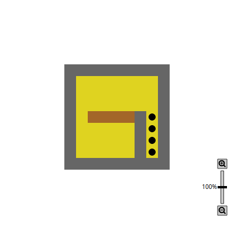

[CIS 194](https://www.seas.upenn.edu/~cis194/fall16/index.html) | [Policies](https://www.seas.upenn.edu/~cis194/fall16/policies.html) | [Resources](https://www.seas.upenn.edu/~cis194/fall16/resources.html) | [Final Project](https://www.seas.upenn.edu/~cis194/fall16/final.html)

# Homework 1: Functions and Pictures

CIS 194: Homework 1
Due Tuesday, September 6

## Preamble

When solving the homework, strive to create not just code that works, but code that is stylish and concise. See the style guide on the  website for some general guidelines. Try to write small functions which  perform just a single task, and then combine those smaller pieces to  create more complex functions. Don’t repeat yourself: write one function for each logical task, and reuse functions as necessary.

Be sure to write functions with exactly the specified name and type  signature for each exercise (to help us test your code). You may create  additional helper functions with whatever names and type signatures you  wish.

In this and the next few homeworks, you will be creating lots of  drawing and animations. The exercises will describe what you have to do, and maybe give an (simple) example, but you are alway welcome to make  it prettier and more shiny. This is all good as long as you do not *simplify* the task this way, or make the code too convoluted. Extra effort in  that direction contributes towards your participation score.

All homework this week can be performed within the web IDE https://code.world/haskell. In fact, it is recommended that you start with https://code.world/haskell#Po6Ok3j0o3TiYqZWUJ-8I-Q.

## Submitting

You will submit all exercises in one file. Every exercise results in one top-level function called `exercise1`, `exercise2` etc. of type `IO ()`. To run a specific exercise, define `main = exercise1`.

Only submit code that compiles. If you cannot get it to compile, ask for help!

On CodeWorld, after you ran a program, you can use the Share button  to get a link to your code. Submit that. If you developed your code  locally, submit the Haskell file.

## Exercise 0: Piazza

Sign up on Piazza at http://piazza.com/upenn/fall2016/cis194. We will be using Piazza for Q&A and online discussions.

## Exercise 1: Traffic lights

In the class, we defined a traffic light animation. Real traffic lights have an amber light in the middle.

Change the code to include the yellow light, and animate a correct sequence of traffic light signalling:

- a long green phase
- a short amber phase
- a long red phase
- a short red and amber phase[1](https://www.seas.upenn.edu/~cis194/fall16/hw/01-intro.html#fn1)
- back to green

The resulting program should be called `exercise1`.

[see on CodeWorld](https://code.world/run.html?mode=haskell&amp;dhash=DkA91kScdnqBMXnuWMWDZTg)

## Exercise 2: Blooming trees

In the class, we defined a tree, but it looks a bit dire. The code was

```haskell
tree :: Integer -> Picture
tree 0 = blank
tree n = path [(0,0),(0,1)] & translated 0 1 (
  rotated (pi/10) (tree (n-1)) & rotated (- pi/10) (tree (n-1)))
```

Make the tree bloom! Create an animation that looks like the dire `tree 8` initially, and then grows blossoms at the end of each twig within 10  seconds. After 10 seconds, the tree should be in full bloom and the  animation should stop.

A bloom could be a yellow circle growing in size, or something more intricate with petals and better colors and whatnot.

In your code, modify `tree` to be *abstact* in the actual shape of the blossoms. This way, the `tree` function itself is independent of time. Do *not* pass the time paramter to the `tree` function!

The resulting program should be called `exercise2`.

[see on CodeWorld](https://code.world/run.html?mode=haskell&amp;dhash=DmGMoeJTPisJo8EfTOZA7Nw)

## Exercise 3: Sokoban tiles

Over the next few homeworks, you will implement a game of Sokoban. The rules are simple (quoted from https://en.wikipedia.org/wiki/Sokoban, which also contains a nice animation that you can look at):

> The game is played on a board of squares, where each square is a  floor or a wall. Some floor squares contain boxes, and some floor  squares are marked as storage locations.
>
> The player is confined to the board, and may move horizontally or  vertically onto empty squares (never through walls or boxes). The player can also move into a box, which pushes it into the square beyond. Boxes may not be pushed into other boxes or walls, and they cannot be pulled. The puzzle is solved when all boxes are at storage locations.

We do some preparations this week. In particular, we need the different squares that may occur:

1. Walls
2. Ground, i.e. empty spaces
3. Ground marked as storage
4. Boxes

After this exercise, we will have the necessary code to draw a sokoban level.

- Create a functions `wall`, `ground`, `storage` and `box` of type `Picture`, which draw the corresponding thing, with a width and height of 1 and positioned at the center of the picture.

  The example picture below is very much on the dull side. Make it  prettier! You can search for screenshots of the real game for  inspiration.

- Create a function `drawTile :: Integer -> Picture` that draws a tile according to the given number[2](https://www.seas.upenn.edu/~cis194/fall16/hw/01-intro.html#fn2), according to the above list. If the argument is not one of these four  numbers, it should not draw anything (but should also not crash).

- A maze can be represented as a function with the type
   `Integer -> Integer -> Integer`, which, given two coordinates, returns the kind of tile to be present there.

  For now, we have one such maze, with the creative name `maze`:

  ```haskell
  maze :: Integer -> Integer -> Integer
  maze x y
    | abs x > 4  || abs y > 4  = 0
    | abs x == 4 || abs y == 4 = 1
    | x ==  2 && y <= 0        = 1
    | x ==  3 && y <= 0        = 3
    | x >= -2 && y == 0        = 4
    | otherwise                = 2
  ```

  Define a picture

  ```haskell
  pictureOfMaze :: Picture
  ```

  which will, for every coordinate (*x*,*y*)

 with *x*,*y*∈−10,…,10, uses the `maze` above to determine what tile to place there, uses `drawTile` to draw that tile, translated into the right spot. Of course, do not hard-code 441 invocations of `drawTile`  into your program! Instead, use recursion to traverse the positions in  the grid. You will likely need one recursive function to draw one row  after another, which in turn calls a second recursive function, which  then draw each element in that row.

- Define `exercise3` to be drawing of `pictureOfMaze`. 



[see on CodeWorld](https://code.world/run.html?mode=haskell&dhash=DOxforVvDsZ0V2pDubEQPwA)

------

1. I know that traffic lights in the US do not have this  phase, but it is the correct sequence for most of Germany, and it works  better for the homework.[↩](https://www.seas.upenn.edu/~cis194/fall16/hw/01-intro.html#fnref1)
2. Using numbers here is not good style, and we will fix that next week.[↩](https://www.seas.upenn.edu/~cis194/fall16/hw/01-intro.html#fnref2)

​      Powered      by [shake](http://community.haskell.org/~ndm/shake/),      [hakyll](http://jaspervdj.be/hakyll/index.html),      [pandoc](http://johnmacfarlane.net/pandoc/),      [diagrams](http://projects.haskell.org/diagrams),      and [lhs2TeX](http://www.andres-loeh.de/lhs2tex/).          

  