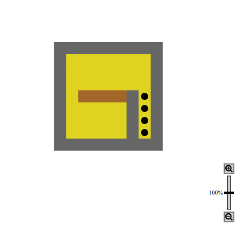

[CIS 194](https://www.seas.upenn.edu/~cis194/fall16/index.html) | [Policies](https://www.seas.upenn.edu/~cis194/fall16/policies.html) | [Resources](https://www.seas.upenn.edu/~cis194/fall16/resources.html) | [Final Project](https://www.seas.upenn.edu/~cis194/fall16/final.html)

Higher order functions and data types

- Higher Order Functions
  - [Partial application](https://www.seas.upenn.edu/~cis194/fall16/lectures/02-ho-datatypes.html#partial-application)
  - [Local definitions](https://www.seas.upenn.edu/~cis194/fall16/lectures/02-ho-datatypes.html#local-definitions)
  - [Captured variables](https://www.seas.upenn.edu/~cis194/fall16/lectures/02-ho-datatypes.html#captured-variables)
  - [A note on indentation](https://www.seas.upenn.edu/~cis194/fall16/lectures/02-ho-datatypes.html#a-note-on-indentation)
  - [Lambda expressions](https://www.seas.upenn.edu/~cis194/fall16/lectures/02-ho-datatypes.html#lambda-expressions)
- Data types
  - [Booleans](https://www.seas.upenn.edu/~cis194/fall16/lectures/02-ho-datatypes.html#booleans)
  - [More data types for Sokoboban](https://www.seas.upenn.edu/~cis194/fall16/lectures/02-ho-datatypes.html#more-data-types-for-sokoboban)
- Pure Interaction
  - [Interaction on CodeWorld](https://www.seas.upenn.edu/~cis194/fall16/lectures/02-ho-datatypes.html#interaction-on-codeworld)
  - [Events](https://www.seas.upenn.edu/~cis194/fall16/lectures/02-ho-datatypes.html#events)
  - [Some terminology](https://www.seas.upenn.edu/~cis194/fall16/lectures/02-ho-datatypes.html#some-terminology)

# Higher Order Functions

The solution for last week’s homework might have been solved with this code, which draws a row and then draws a column:

```haskell
pictureOfMaze :: Picture
pictureOfMaze = drawRows (-10)

drawRows :: Integer -> Picture
drawRows 11 = blank
drawRows r  = drawCols r (-10) & drawRows (r+1)

drawCols :: Integer -> Integer -> Picture
drawCols _ 11 = blank
drawCols r c = drawTileAt r c & drawCols r (c+1)

drawTileAt :: Integer -> Integer -> Picture
drawTileAt = …
```

Clearly there is some repetition going on here, with `drawRows` and `drawCols` doing very similar things. In prose, what they are doing is “21 times, do something similar each time, but varying with the count”. They differ in two aspects:

- The `something` is different: it is calling `drawCols` in the one case, and `drawTileAt` in the other case.
- For `drawCols`, there is an extra argument that is passed around to the “something”.

I promised that Haskell is a language with good abstractions, so it should be possible to abstract over this pattern. So lets give it a try:

```haskell
draw21times something = helper something (-10)

helper something 11 = blank
helper something n  = something & helper something (n+1)

pictureOfMaze = draw21times drawRow
drawRow = draw21times drawCol
drawCol = drawTileAt ? ?
```

Now we are stuck: In the definition of `drawATiles`, we need to know the current row and column number, but we do not have that! If we would write `n` (which maybe a perl programmer from the last century would try here), we would get an error about a variable being not in scope. And even if we somehow could access the `n` there, which one would it be – `draw21times` is run twice here!

So the `helper` needs to pass down the `n` to `something`. And similarly, `drawRow` has to tell `drawCol` what row it should draw:

```haskell
draw21times something = helper something (-10)

helper something 11 = blank
helper something n  = something n & helper something (n+1)

pictureOfMaze = draw21times drawRow
drawRow r = draw21times (drawCol r)
drawCol r c = drawTileAt r c
```

Nice, so this works. But what exactly have we done here? Let us clarify things by adding type signatures, conveniently provided to us by the CodeWorld interface:

For `draw21times` it says

```haskell
draw21times :: forall a. (Eq a, Num a) => (a -> Picture) -> Picture
```

Now that is a mouthful. We’ll skip the details for now, but simply follow the heuristics that `Num a` says that `a` is a numeric type, so we just use `Integer`, and similarly for the other functions:

```haskell
draw21times :: (Integer -> Picture) -> Picture
helper :: (Integer -> Picture) -> Integer -> Picture
drawRow :: Integer -> Picture
drawCol :: Integer -> Integer -> Picture
```

The type signature of `draw21times` again has two arrows, but it does *not* take two arguments! The parenthesis around the first argument are important: This means that there is *one* argument, which happens to be a function, which itself takes *one* argument.

Similarly, the type signature of `helper` says that there are *two* arguments, the first being a function taking *one* argument, and the second being simply an `Integer`.

The types of `drawRow` and `drawCol` are again straight-forward function types. Note that the type of `drawRow` is precisely the type of of the argument to `draw21times` – and therefore we can pass `drawRow` as an argument to `draw21times`.

What you see here is an instance of an **Higher Order Function**, i.e. a function that takes other functions as arguments. It is a central idea in functional programming and one main reason for the great abstraction possibilities in Haskell.

## Partial application

There is something odd about the use of `drawCol` here. It seems that `drawCol` is a function of *two* parameters, but we use it with only one parameter, as an argument to `draw21times`. How can that work?

To understand that, let me write the type signature of `drawCol` differently:

```haskell
drawCol :: Integer -> (Integer -> Picture)
```

This suddenly changes the perspective: Now `drawCol` is a function taking *one* argument, and returning *another* function, which again takes one argument. And this returned function nicely fits the argument type of `draw21times`.

But it really is just a change of perspective. The two types are identical. In this sense, every function in Haskell takes one argument – it is just that some return a function.

You can also understand that from looking at a function call. The expression `f x y` is equivalent to `(f x) y`.

We note that the function type arrow is *right associative* and function application is *left associative*.

## Local definitions

Let us clean up the code a bit. First of all, the definition `drawCol r c = drawTileAt r c` looks quite useless. All it says is that “using `drawCol` is equivalent to using `drawTileAt`”. So let us remove `drawCol`.

The next code smell is the `helper` function. It really is a helper to `draw21times`, so it would be nice to have this function only available within `draw21times`. To do so, we use local definitions. They come in two varieties:

1. As `let`-bindings:

   ```haskell
   draw21times :: (Integer -> Picture) -> Picture
   draw21times something =
     let helper :: (Integer -> Picture) -> Integer -> Picture
         helper something 11 = blank
         helper something n  = something n & helper something (n+1)
     in helper something (-10)
   ```

   A `let`-binding contains definitions for functions and values, quite like top-level definitions. It can contain multiple definitions, and makes them available to both the definitions it contains, as well as to the expression after the `in`. The `let`-construct is a self-contained expression and can be used wherever any other expression is expected.

2. In a `where`-clause:

   ```haskell
   draw21times :: (Integer -> Picture) -> Picture
   draw21times something = helper something (-10)
     where
       helper :: (Integer -> Picture) -> Integer -> Picture
       helper something 11 = blank
       helper something n  = something n & helper something (n+1)
   ```

   This is just a syntactic variation, and equivalent to the code above. One or more definitions can follow the `where`, and are available to those definitions and the body of the function.

It is a matter of style which ones to use. Generally, `where` clauses are prettier, require less indentation and are almost always used for local functions. They also have the advantage of scoping over multiple guards. For local values (e.g. some computation), a `let` clause can also work well. You’ll get the hang of it.

A more common name for such a local definition is simply `go`. It is ok to use such a non-descript name, because its scope is so small and clearly defined. Also, type signatures for such local definitions are often omitted.

## Captured variables

Making `go` a local function and moving it into `draw21times` has another advantage: It can reference the parameters of `draw21times`. Currently, `go` goes through quite some lengths to pass the `something` parameter around. But that is no longer necesary: It can simply refer to `something` as it is bound by `draw21times`:

```haskell
draw21times :: (Integer -> Picture) -> Picture
draw21times something = go (-10)
  where
    go 11 = blank
    go n  = something n & go (n+1)
```

## A note on indentation

By now you might have noticed that indentation seems to be significant in Haskell – how else would you know where the `where` clause ends. Indeed, like Python, but unlike most other programming languages, Haskell is indentation sensitive. This has two advantages:

- There is need for delimiters like curly braces etc, which makes the code cleaner and easier to read.
- It ensures that the programmer writes properly indented code.

The indentation rules are somewhat technical, so I will *not* explain them here. Instead, I appeal to intuition: From the examples given in class and the exercises, you will soon get an intuition about how that works, and that will be sufficient. In fact, I myself cannot give you the exact rules, but I have not had a problem with indentation since many years.

If it does not work: Experiment. If you are stuck: Ask (e.g. on Piazza).

If you really want to know the rules start with the [chapter on indentation](https://en.wikibooks.org/wiki/Haskell/Indentation) in the Wikibook on Haskell.

## Lambda expressions

We have now seen already three way of defining a function: Global, in a `let` or in an `where` clause. The form of the definition has always been the same, though, and all of them required giving a name to the thing.

Giving a name is not always desired. Naming things is hard! Therefore, at least for very small functions that are used only once, it is desireable to just define them on the spot where they are used.

Consider the `drawRow` function: All it does is to call `draw21times` with `drawTileAt` as its argument. That is hardly worth giving a name, writing a type signature and so on.

So instead of using `drawRow`, we can define this functionality right on the spot in `pictureOfMaze`:

```haskell
pictureOfMaze = draw21times (\r -> draw21times (drawTileAt r))
```

The `backslash` is a poor rendering of the greek letter λ (lambda), and indicates that this defines an anonymous, local function, which, when called, takes one parameter `r`, and returns the stuff after the right arrow, i.e. `draw21times (drawTileAt r)`.

We could use it twice to make it a bit clearer what this code does, by naming the variables for the row and the column appropriately, and also showing the symmetry:

```haskell
pictureOfMaze = draw21times (\r -> draw21times (\c -> drawTileAt r c))
```

Higher order functions, local functions and lambda expressions allow for very concise, but yet readable code. Use it!

You can see the [final code on CodeWorld](https://code.world/haskell#PeAw6a9gel9QEvOyFRS8sZA).

# Data types

On to the next topic, and again we will motivate and introduce it by addressing some wart in the code from last weeks homework.

The functions `drawTile` and `maze` designate the different types of tiles by a number. That calls for trouble: It is easy to mix them up, extending the list of tiles is error-prone, as you might forget to extend the code somewhere else that handles the numbers.

The problem is that `Integers` are not a a suitable type to represent types: There are too many of them, and their meaning is implicit.

So we want a type that is tight, i.e. large enough to encompass all tiles we want to represent, but no more, and explicit, i.e. the meaning of a value of such a type is clear.

So we simply introduce such a type:

```haskell
data Tile = Wall | Ground | Storage | Box | Blank
```

The keyword is `data`, followed by the name of the new type, followed by an equals sign, followed by a list of *constructors* of this type, separated by bars. Type and constructor names always start with a capital letter, and they each have their own namespace (so you can use the same name for a type and a constructor).

The new type `Tile` now consists of exactly these five constructors as values, no more and no less. So the type is tight. And further more, every value is self-explanatory.

We can return them in `maze`, and pattern match in `drawTile`, just like with numbers ([open on CodeWorld](https://code.world/haskell#P-M5f3eyKkHqrbfW2KObbKQ)):

```haskell
drawTile :: Tile -> Picture
drawTile Wall    = wall
drawTile Ground  = ground
drawTile Storage = storage
drawTile Box     = box
drawTile Blank   = blank

maze :: Integer -> Integer -> Tile
maze x y
  | abs x > 4  || abs y > 4  = Blank
  | abs x == 4 || abs y == 4 = Wall
  | x ==  2 && y <= 0        = Wall
  | x ==  3 && y <= 0        = Storage
  | x >= -2 && y == 0        = Box
  | otherwise                = Ground
```

Note how suddenly the type signature of `drawTile` and especially of `maze` has become much more helpful!

## Booleans

You have actually used such a datatype before, in last week’s class: We were using the type `Bool`, with its values `True` and `False`. And it may come as a surprise to you that this type is defined using the very same mechanism that you just learend:

```haskell
data Bool = False | True
```

It is a sign of good programming language design if many concepts can be implemented using the language itself, instead of having to be built in.

The same then holds for operators like `(||)` and `(&&)` – there is nothing special about them, and you could have definded them yourself. (Try to come up with their definition, and then compare it against the real one!)

The type is still somewhat priviliged though, because guards, like the one in `maze`, need to be expressions of type `Bool`. But that’s just a use of the type, not the definition of the type.

## More data types for Sokoban

Let us work towards making our animation interactive. To start with, we might want to move the maze around, using the keyboard, in case it is larger than our screen (or just as a preparation for moving the player around).

To that end, let us first talk about the types involved. It makes sense to have one type that describes the possible ways to interact with the system. For now, the only interaction is moving the view into one of the four directions, so we can define a data type for that:

```haskell
data Direction = R | U | L | D
```

We also need to keep track of the current position, after a few key presses. Now, there are infinitely many possible positions, so a simple enumeration does not cut it. We could describe the position with two integer numbers, so we need a type that stores two such numbers. We can do that also using the `data` keyword, and giving the *parameters* to the constructor:

```haskell
data Coord = C Integer Integer
```

Here I define the type `Coord`. There is a single constructor to created this type, called `C`, which takes two `Integer`s and turns them into one `Coord`.

Just like above, the constructors are value we can use in expressions, we can do this with `C`, which is a function of type `Integer -> Integer -> Coord`.

If you like math-talk: The type `Coord` is now isomorphic to the product type of `Integer` with `Integer`, and `C` is an isomorphism between them. If follows that constructors are always injective, and if that does not mean anything to you right now, you can ignore this.

Here is an example use of `C` as a function:

```haskell
initialCoord :: Coord
initialCoord = C 0 0
```

So it is straight forward to create a `Coord` (just use the constructor as a function). How do we use a `Coord`? This works by pattern matching. We will need a function that translates a picture to have its origin at a given coord. Let us write it, first thinking about the type and then the code:

```haskell
atCoord :: Coord -> Picture -> Picture
atCoord (C x y) pic = translated (fromIntegral x) (fromIntegral y) pic
```

So when we pattern match against a constructor with parameters, we simply give names to the parameters. We have to put parentheses around this, to distinguish it from multiple function parameters – this applies consistently in pattern just as well as in expressions.

(The `fromIntegral` is needed to convert the `Integer` to a `Double`. Why did we not put `Double` in the type of `Coord` in the first place? Because `Integer` is more honest: If we just use the keyboard, there will never be non-integral coordinates there.)

The next function that we will want to write is one that calculates a new coordinate, based on the current coordinate and a direction.

```haskell
adjacentCoord :: Direction -> Coord -> Coord
adjacentCoord R (C x y) = C (x+1) y
adjacentCoord U (C x y) = C  x   (y+1)
adjacentCoord L (C x y) = C (x-1) y
adjacentCoord D (C x y) = C  x   (y-1)
```

That was a lot of coding without seeing anything. Let us try it out ([also on CodeWorld](https://code.world/haskell#PAp1po1qT2i8Dmim1XCGfWw)):

```haskell
someCoord :: Coord
someCoord = adjacentCoord U (adjacentCoord U (adjacentCoord L initialCoord))

main = drawingOf (atCoord someCoord pictureOfMaze)
```



[see on CodeWorld](https://code.world/run.html?mode=haskell&amp;hash=PAp1po1qT2i8Dmim1XCGfWw)

# Pure Interaction

Time to put these thing to good use. The goal is as follows: The maze should be centered when we start the program. Then we can use the arrow keys to move it around. We have already implemented most functionality for that, but you might wonder: How can we have interaction in a world without side-effects? How can we remember the current state in a world without mutable variables?

Well, we solved such a riddle before, when we implemented an animation, by modelling our thoughts in terms of pure functions, and then having some “machinery” that executes our pure functions, yielding the desired effect. We can do it again.

An interactive program changes state whenever a new input event happens. If we want to separate the logic of the state change from the logic of remembering the current state, the former becomes a pure function again, namely one that, given the input event and the current state, calculates the new state. Additionally, we need to specify the initial state, and then of course how to visualize the state.

## Interaction on CodeWorld

This functionality is provided in CodeWorld by the following function, which has quite a large type signature:

```haskell
interactionOf :: world ->
                (Double -> world -> world) ->
                (Event -> world -> world) ->
                (world -> Picture) ->
                IO ()
```

Its type signature mentions the type `world`. This is not a specific type, but rather a type variable. We’ll get to that later; all we need to know for now is that this type can be any type we want it to be. This type contains the state of the program. In our case, it is simply a `Coord`.

The function `interactionOf` takes four arguments:

1. An initial state.
2. A function modifying the state if a certain amount of time (given as a the first argument) has passed.
3. A function modifying the state if a certain input even thas happened.
4. A function to draw a picture according to the current state.

Let us try to use this function, in a simple way ([open on CodeWorld](https://code.world/haskell#PpjfIR2NrgPeBJQKfg_63Kg)):

```haskell
main = interactionOf initialCoord handleTime handleEvent drawState

handleTime :: Double -> Coord -> Coord
handleTime _ c = c

handleEvent :: Event -> Coord -> Coord
handleEvent e c = adjacentCoord U c

drawState :: Coord -> Picture
drawState c = atCoord c pictureOfMaze
```

[see on CodeWorld](https://code.world/run.html?mode=haskell&amp;hash=PpjfIR2NrgPeBJQKfg_63Kg)

That does … something. But as soon as we move the mouse over the picture, it disappears. Which makes sense, as mouse movements are also events.

## Events

So we need to look at the `Event` type. According to the documentation, it is a data type. We know data types!

```haskell
data Event = KeyPress Text
           | KeyRelease Text
           | MousePress MouseButton Point
           | MouseRelease MouseButton Point
           | MouseMovement Point
```

There are five constructors, for different kind of events. We care about `KeyPress` events. This constructor has an argument, which is a `Text`. We have not seen this type before, but we can guess what it means. So let us handle this ([open on CodeWorld](https://code.world/haskell#Px4XRGfE1Aw0GCEDKSDVAAw)):

```haskell
handleEvent :: Event -> Coord -> Coord
handleEvent (KeyPress key) c
    | key == "Right" = adjacentCoord R c
    | key == "Up"    = adjacentCoord U c
    | key == "Left"  = adjacentCoord L c
    | key == "Down"  = adjacentCoord D c
handleEvent _ c      = c
```

(From now on, make sure you have `{-# LANGUAGE OverloadedStrings #-}` on top of the file, or you will get strange error messages.)

[see on CodeWorld](https://code.world/run.html?mode=haskell&amp;hash=Px4XRGfE1Aw0GCEDKSDVAAw)

And there we go, we can move the maze around! (You might have to click on the embedded picture before it reacts to your key presses.)

## Some terminology

- A data type where none of the constructors has parameters is called an *enumeration type*.
- A data type with exactly one constructor is called a *product type*.
- A data type with multiple constructors is called a *sum type*.
- A data type with no constructors is an *empty type*. Yes, that is a thing. Yes, this is sometimes useful.

With that knowledge (and some cleverness) you should already be able to write a fully functional Sokoban, although we will use this week’s homework for some more prelimaries, and learn more next week that will help us finish the game.

Powered by [shake](http://community.haskell.org/~ndm/shake/), [hakyll](http://jaspervdj.be/hakyll/index.html), [pandoc](http://johnmacfarlane.net/pandoc/), [diagrams](http://projects.haskell.org/diagrams), and [lhs2TeX](http://www.andres-loeh.de/lhs2tex/).