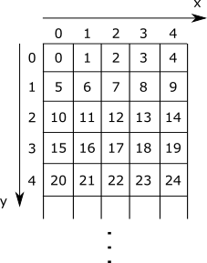
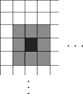
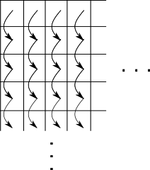

# Parallel Box Blur Filter

You will find the starting files [here](https://moocs.scala-lang.org/~dockermoocs/handouts/scala-3/scalashop.zip).

In this assignment, we will implement a box blur filter, used in applications like Adobe® PhotoShop® to blur images. For the purposes of this assignment, a filter is an algorithm that takes an input image and transforms it in some way into an output image. The box blur filter outputs an image in which every pixel has an average value of the surrounding pixels from the original image. The box blur filter is an example of an *embarrassingly parallel* problem -- no or very little effort is required to separate it into parallel tasks. Every pixel of the output image can be computed independently of the other pixels, and in parallel.

We will proceed in four steps. First, we will implement the kernel of the box blur filter, a method used to compute a single pixel of the output image. Then we will implement two versions of the parallel box blur, and measure the performance difference. Finally, we will try out our parallel box blur implementations on real images, using ScalaShop -- the image manipulation tool that would impress even the Adobe® folks.

By the time you are finished with this assignment, you will:

- understand how the box blur filter works
- be able to recognize embarrassingly parallel problems
- know how to measure the performance of a parallel algorithm
- see how to agglomerate parallel computations into batches
- better understand how memory access patterns affect performance of parallel algorithms

## Preliminaries

Before we begin, we need to cover some basic data types and helper methods. These utilities have already been implemented in the package object for this exercise. First, we will use the **RGBA** type to refer to the value of an image pixel. We will limit ourselves to 32-bit pixel depth images, so we define **RGBA** to be equal to the 32-bit integer type:

```scala
type RGBA = Int
```

Why do we call this type **RGBA**? This is because each pixel value is composed from 4 components - red, green, blue and alpha, where alpha denotes the amount of transparency in the respective pixel. These components are referred to as *channels*. The value of each channel is at least 0 and at most 255.

We can extract the red, green, blue and alpha channel using the following utility methods, which use bit masking and bit shifting:

```scala
def red(c: RGBA): Int = (0xff000000 & c) >>> 24
def green(c: RGBA): Int = (0x00ff0000 & c) >>> 16
def blue(c: RGBA): Int = (0x0000ff00 & c) >>> 8
def alpha(c: RGBA): Int = (0x000000ff & c) >>> 0
```

Similarly, given the values of the four channels, we can obtain the pixel value like this:

```scala
def rgba(r: Int, g: Int, b: Int, a: Int): RGBA =
  (r << 24) | (g << 16) | (b << 8) | (a << 0)
```

Now that we know how to manipulate individual pixels, we can define our image type **Img**:

```scala
class Img(val width: Int, val height: Int, private val data: Array[RGBA]):
  def this(w: Int, h: Int) = this(w, h new Array[RGBA](w * h))
  def apply(x: Int, y: Int): RGBA = data(y * width + x)
  def update(x: Int, y: Int, c: RGBA): Unit = data(y * width + x) = c
```

The image is a two-dimensional entity -- to refer to a pixel in an image, we need to specify an **x** and **y** component. On the other hand, the underlying memory model is one-dimensional -- a single offset value specifies the position in the array. When we store the image into memory, we need to map between the two-dimensional image model and the one-dimensional memory model. We will do this by storing consecutive rows of the image one after another, as illustrated in the following figure:




Thus, the offset of a pixel at coordinates **x** and **y**, is equal to **y \* width + x**, where **width** is the number of pixels in a single row. Although there are other mappings used in practice, we will restrict to this simple mapping throughout the exercise.

To ensure that the value of the **x** and **y** coordinates are confined to the dimensions of the image, namely width and height, occasionally we have to call the **clamp** method:

```scala
def clamp(v: Int, min: Int, max: Int): Int
```

Finally, we will use the **task** construct to start parallel computations. Every **task** construct invocation returns an object on which we can call the **join** method. Calling the join method blocks the execution of the program until the parallel computation ends. Below, we calculate the expression **1 + 1** in parallel to the main program:

```scala
val computation = task {
  val result = 1 + 1
  println("Done!")
  result
}
println("About to wait for some heavy calculation...")
computation.join()
```

We now have everything we need to start implementing the parallel box filter.

## The Box Blur Filter Kernel

In the first part of the assignment, we will implement the box blur filter kernel method. A kernel is a method that computes the resulting value of a single pixel. The kernel method is typically computationally cheap and is not worth parallelizing its implementation. However, as we will later see, we can apply the same kernel method to different pixels in parallel.



The **boxBlurKernel** method takes the source image **src**, coordinates **x** and **y** of the pixel, and the **radius** of the blur. It returns the resulting average value of the surrounding pixels. We compute the average value by separating the pixel into four channels, computing the average of each of the channels, and using the four average values to produce the final pixel value. In the previous figure, the **radius** parameter is equal to 1 and the average is computed from 9 pixels.

You can find its signature in the package object of this assignment:

```scala
def boxBlurKernel(src: Img, x: Int, y: Int, radius: Int): RGBA
```

Implement the **boxBlurKernel** method. Use two nested **while**-loops. Make sure that the pixels at the image edges are affected only by the pixels inside the image (hint: use the **clamp** method from the package object).

## Vertical Stripping Box Blur

We can now implement the parallel box blur filter. Note that the **boxBlurKernel** method is relatively inexpensive. Executing **boxBlurKernel** might be much faster than starting a parallel computation, so having a separate parallel computation for the value of each pixel would be far too expensive. For this reason, we want to batch together many **boxBlurKernel** calls, and have a smaller number of parallel tasks. This is sometimes referred to as *agglomeration*, and is present in many parallel algorithm implementations.

There are many different ways we can do agglomeration for the parallel box blur. One is to divide the image into a fixed number of equally wide vertical strips. For each strip, we start a parallel task, and wait for their completion. Within each strip, we traverse the pixels going from the top to the bottom of the image, as illustrated in the following figure:



We start by implementing the sequential **blur** method in the **VerticalBoxBlur.scala** source file, which takes the source image **src**, the destination image **dst**, the starting (included) and ending (excluded) **x** coordinates (i.e, column indices) of the strip, called **from** and **end**, and the blur **radius**. The **blur** method blurs the pixels from the **src** image and writes them to the **dst** image:

```scala
def blur(src: Img, dst: Img, from: Int, end: Int, radius: Int): Unit
```

The implementation of **blur** should rely on the previously defined **boxBlurKernel**.

Then, implement the **parBlur** method, which divides the image into **numTasks** vertical strips and runs each task in parallel:

```scala
def parBlur(src: Img, dst: Img, numTasks: Int, radius: Int): Unit
```

Use Scala ranges to create a list of splitting points (hint: use the **by** method on ranges). Then use collection combinators on the list of splitting points to create a list of start and end tuples, one for each strip (hint: use the **zip** and **tail** methods). Finally, use the **task** construct to start a parallel task for each strip, and then call **join** on each task to wait for its completion.

Run the **VerticalBoxBlur** program with the following sbt command:

```scala
> runMain scalashop.VerticalBoxBlurRunner
```

Change the number of tasks and the radius parameter. How does the performance change?

## Horizontal Stripping Box Blur

In this part of the exercise we will pick an alternative agglomeration for the box blur algorithm. Instead of dividing the image into vertical strips, we will divide it into horizontal strips in a similar way:


We implement the two methods, **blur** and **parBlur** in a similar way as before:

```scala
def blur(src: Img, dst: Img, from: Int, end: Int, radius: Int): Unit
def parBlur(src: Img, dst: Img, numTasks: Int, radius: Int): Unit
```

Note that the arguments **from** (included) and **end** (excluded) this time denote the the values of the **y** coordinate (i.e, row indices), and that we traverse the pixels left-to-right within each strip.

You can now run the **HorizontalBoxBlur** program with

```scala
> runMain scalashop.HorizontalBoxBlurRunner
```

If you implemented the two blur versions correctly, you should observe that the horizontal stripping is slightly faster. This is because the pixel traversal order visits the pixels which are closer together in memory (remember the mapping between the pixel coordinates and the memory addresses). As a result, each core can reuse some of the pixels that it fetched from the memory during the previous invocation of **boxBlurKernel**. The processor cores spend less time fetching pixels from memory, and lower the pressure on the memory bus.

## ScalaShop

Now we have everything we need to start ScalaShop:

```scala
> runMain scalashop.ScalaShop
```

Change the blur implementation, parallelism level and blur radius, and study the effect your changes have on performance.

- Which of the two blur implementations is faster?
- For which values of the **radius** parameter is the difference most significant? Why?
- What if we split the image into rectangles? Will this be faster?

*"Adobe" and "Photoshop" are either registered trademarks or trademarks of Adobe Systems Incorporated in the United States and/or other countries.*