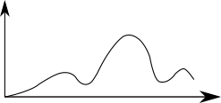
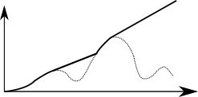
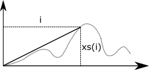
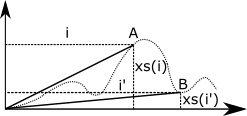

# Reductions and Prefix Sums

You will find the starting files [here](https://moocs.scala-lang.org/~dockermoocs/handouts/scala-3/reductions.zip).

In this assignment, you will implement several variants of reduction and prefix sum algorithms. Each of the three parts of the assignment will exercise a different aspect of parallel programming:

- choosing the right parallelization threshold
- identifying the correct reduction operator
- identifying the correct prefix sum operator

We will use the **parallel** construct, defined in the package **common**, as in the lecture to start parallel computations. Every **parallel** construct invocation takes two tasks as input and outputs the corresponding results as a tuple of two elements. It is not allowed to use the **task** construct in this assignment.

## Parallel Counting Change

If you took the course Functional Programming in Scala, you surely recall the assignment in which you had to count the number of ways in which you can make the change for a given amount of money. The text of that assignment was as follows:

*Write a recursive function that counts how many different ways you can make change for an amount, given a list of coin denominations. For example, there are 3 ways to give change for 4 if you have coins with denomination 1 and 2: 1+1+1+1, 1+1+2, 2+2.*

In this assignment, you will repeat the same task, but this time, your implementation will be parallel. Start with the sequential version of this problem once more -- the **countChange** function takes the amount of money and the list of different coin denominations. It returns the total number of different ways you can give change:

```scala
def countChange(money: Int, coins: List[Int]): Int
```

Note that the solution to this problem is recursive. In every recursive call, we either decide to continue subtracting the next coin in the **coins** list from the **money** amount, or we decide to drop the coin from the list of coins. For example, if we have 4 CHF, and coin denominations of 1 and 2, the call graph, in which every node depicts one invocation of the **countChange** method, is as follows:

```scala
                                 4,[1, 2]
                   3,[1, 2]          +            4,[2]
           2,[1, 2]    +     3,[2]          2,[2]   +   4,[]
      1,[1, 2] + 2,[2]   1,[2] + 3,[]    0,[2] + 2,[]    0
0,[1, 2] + 1,[2]   1       0      0       1       0
    1        0
```

We can take advantage of this recursive structure by evaluating different subtrees in parallel. This is the next part of the assignment -- implement the method **parCountChange** that counts the amount of change in parallel:

```scala
def parCountChange(money: Int, coins: List[Int], threshold: Threshold): Int
```

As we learned in the lectures, the **parCountChange** should not spawn parallel computations after reaching the leaf in the call graph -- the synchronization costs of doing this are way too high. Instead, we need to *agglomerate* parts of the computation. We do this by calling the sequential **countChange** method when we decide that the amount of work is lower than a certain value, called the *threshold*. To separate the concern of deciding on the threshold value from the implementation of our parallel algorithm, we implement the threshold functionality in a separate function, described by the **Threshold** type alias:

```scala
type Threshold = (Int, List[Int]) => Boolean
```

When a **threshold** function returns **true** for a given amount of money and the given list of coins, the sequential **countChange** implementation must be called.

Implement **parCountChange**!

Now that we have the **parCountChange** method, we ask ourselves what is the right implementation of the **threshold** function? Recall the examples from the lectures, such as summing the array values and computing the norm, where this was easy -- we exactly knew the amount of work required to traverse a subrange of the array, so **threshold** could return **true** when the length of the subrange was smaller than a certain value.

Sadly, the total amount of work for a given **parCountChange** invocation is hard to evaluate from the remaining amount of money and a list of coins. In fact, the amount of work directly corresponds to the count that **parCountChange** returns, which is the value that we are trying to compute. Counting change is a canonical example of a task-parallel problem in which the partitioning the workload across processors is *solution-driven* -- to know how to optimally partition the work, we would first need to solve the problem itself.

For this reason, many parallel algorithms in practice rely on heuristics to assess the amount of work in a subtask. We will implement several such heuristics in this exercise, and assess the effect on performance. First, implement the **moneyThreshold** method, which creates a threshold function that returns true when the amount of money is less than or equal to **2 / 3** of the starting amount:

```scala
def moneyThreshold(startingMoney: Int): Threshold
```

*Remember that* ***a / b*** *will return the integer division of* ***a*** *and* ***b*** *when both operands are* ***Ints****. To avoid this problem, be sure to always do the multiplication of* ***startingMoney*** *by 2 before doing the division by 3.*

Now run the **ParallelCountChange** application and observe the speedup:

```scala
> runMain reductions.ParallelCountChangeRunner
```

The previous heuristic did not take into account how many coins were left on the coins list, so try two other heuristics. Implement the method **totalCoinsThreshold**, which returns a threshold function that returns true when the number of coins is less than or equal to the **2 / 3** of the initial number of coins:

```scala
def totalCoinsThreshold(totalCoins: Int): Threshold
```

*Again, be careful about the order of operations.*

Then, implement the method **combinedThreshold**, which returns a threshold function that returns **true** when the amount of money multiplied with the number of remaining coins is less than or equal to the starting money multiplied with the initial number of coins divided by **2**:

```scala
def combinedThreshold(startingMoney: Int, allCoins: List[Int]): Threshold
```

Which of the three threshold heuristics gives the best speedup? Can you think of a heuristic that improves performance even more?

## Parallel Parentheses Balancing

In this part of the assignment, we recall the Parenthesis Balancing assignment that might be familiar to you from the Functional Programming in Scala course. Here, the task is to, given an array of characters, decide if the parentheses in the array are balanced.

Let us recall a few examples of strings in which parentheses are correctly balanced:

```scala
(if (zero? x) max (/ 1 x))
I told him (that it's not (yet) done). (But he wasn't listening)
```

Similarly, the parentheses in the following strings are not balanced:

```scala
(o_()
:-)
())(
```

Implement a sequential function **balance**, which returns **true** iff the parentheses in the array are balanced:

```scala
def balance(chars: Array[Char]): Boolean
```

Next, you will implement a parallel version of this method. By now, you're already an expert at implementing the structure of a reduction algorithm, so you should have no problem there. The tricky part in parallel parentheses balancing is choosing the reduction operator -- you probably implemented **balance** by keeping an integer accumulator, incrementing it for left parentheses and decrementing it for the right ones, taking care that this accumulator does not drop below zero. Parallel parentheses balancing will require a bit more ingenuity on your part, so we will give you a hint -- you will need two integer values for the accumulator.

Implement the **parBalance** method, which checks if the parentheses in the input array are balanced using two helper methods **reduce** and **traverse**. These methods implement the parallel reduction and the sequential traversal part, respectively:

```scala
def parBalance(chars: Array[Char], threshold: Int): Boolean =
  def traverse(from: Int, until: Int, _???_: Int, _???_: Int): ???

  def reduce(from: Int, until: Int): ??? = ???

  reduce(0, chars.length) == ???
```

In this case, we again use the fixed threshold parameter, as we did in the lectures. Sections with size smaller or equal to the threshold should be processed sequentially. For maximum performance, use a **while** loop in the **traverse** method, or make **traverse** tail-recursive -- do not use a **Range**.

Now, run the **ParallelParenthesesBalancing** application:

```scala
> runMain reductions.ParallelParenthesesBalancingRunner
```

How large was your speedup?

If you are looking for additional challenges, prove that your reduction operator is associative!

## Line of Sight

In the last part of the exercise, you will be implementing an entirely new parallel algorithm -- you will apply the prefix sum algorithm to computing the line-of-sight in two-dimensional terrain.

Imagine that you are standing at the zero of a coordinate system. The curve to your right describes the terrain that you are facing. This is shown in the following figure:



The task of the line-of-sight algorithm is to compute the visibility of each point of the terrain, as shown in the following figure, where the visible area is above of the full line, and the obscured terrain is shown with a dotted line.




What is the necessary and sufficient condition for a point on the terrain to be visibile from the zero of the coordinate system, where you are standing? Imagine that the terrain heights are represented with an array of numbers. We can compute (the tangent of) the viewing angle of each point on the terrain by dividing the height of the terrain **xs(i)** with the distance from the viewing point **i**, as shown in the following figure:




It turns out that if the viewing angle of some point B is **lower** than the viewing angle of an earlier point A, then the point B is not visible, as shown in the following figure:




This simple realization allows us to easily compute the line-of-sight on the terrain -- if you were a sequential programmer, you would traverse the array of height values from the beginning to the end, and write the maximum angle seen so far into the output array.

Implement the sequential **lineOfSight** method, which, for each height entry in the **input** array (except for input(0) which is the location of the observer and is always zero), writes the maximum angle until that point into the **output** array (output(0) should be 0):

```scala
def lineOfSight(input: Array[Float], output: Array[Float]): Unit
```

We keep things simple -- instead of outputting an array of booleans denoting the visibilities, we only output the angles.

*Note that what we call an angle in this assignment is actually the tangent of the angle. Indeed,* ***xs(i)*** *is the opposing side of the angle and* ***i*** *the adjacent side. The ratio* ***xs(i) / i*** *that you compute is in fact the tangent of the angle! Since the tangent of an angle is strictly increasing between 0° and 90°, it is a perfectly good replacement for the actual angle in our use case. Keep this in mind and make sure that you do not apply any trigonometic functions on the tangent!*

When we see a sequential algorithm that produces a sequence of values by traversing the input from left to right, this is an indication that the algorithm might have a parallel prefix sum variant. So let's try to implement one!

Recall what you learned in the lectures -- the first phase of the parallel prefix sum algorithm is the ***upsweep*** phase. Here, the algorithm constructs the reduction tree by traversing parts of the input array in parallel. Implement the method **upsweepSequential**, which returns the maximum angle in a given part of the array, and the method **upsweep**, which returns the reduction tree over parts of the input array. If the length of the given part of the input array is less than or equal to threshold, then **upsweep** calls **upsweepSequential**. Note that the part of the input array that needs to traversed is represented using indices 'from' (inclusive) and 'until' (or 'end') (exclusive).

```scala
def upsweepSequential(input: Array[Float], from: Int, until: Int): Float

def upsweep(input: Array[Float], from: Int, end: Int, threshold: Int): Tree
```

The **Tree** data type is either a **Leaf** or an inner **Node**, and it contains the maximum angle in the corresponding part of the array. Note that when the number of elements in a part of the input array, which is **(end - from)**, is smaller or equal to the threshold, the sequential **upsweepSequential** has to be invoked, and you should return a **Leaf**. Otherwise, you should process the part of the input array in parallel, and return a **Node**. Make sure that the work is evenly distributed between the parallel computations.

The second phase is called *downsweep* -- here, the algorithm uses the tree to push the maximum angle in the corresponding *prefix* of the array to the leaves of the tree, and outputs the values. Implement the methods **downsweep** which processes parts of the tree in parallel, and the method **downsweepSequential**, which traverses the parts of the array corresponding to leaves of the tree and writes the final angles into the **output** array:

```scala
def downsweep(input: Array[Float], output: Array[Float],
  startingAngle: Float, tree: Tree): Unit

def downsweepSequential(input: Array[Float], output: Array[Float],
  startingAngle: Float, from: Int, until: Int): Unit
```

Finally, implement **parLineOfSight** using the **upsweep** and **downsweep** methods:

```scala
def parLineOfSight(input: Array[Float], output: Array[Float],
  threshold: Int): Unit
```

Now, run the **LineOfSight** application and observe the relative speedups:

```scala
> runMain reductions.LineOfSightRunner
```

How large is the speedup compared to the number of cores in your processor? Can you explain your results?