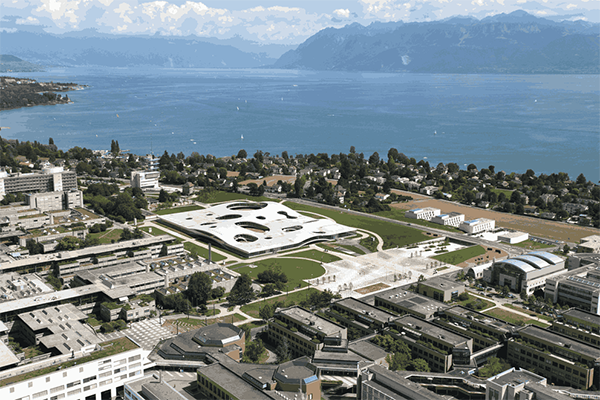

# K-Means

You can find the starting files for this assignment [here](https://moocs.scala-lang.org/~dockermoocs/handouts/scala-3/kmeans.zip).

In this assignment, you will implement the K-means algorithm for cluster detection, which is used to partition *n* vectors into *k* clusters. Here, vectors are separated into clusters based on their mutual similarity -- vectors that are closer to each other in space are more likely to end up in the same cluster, and the distant vectors are likely to be in different clusters. K-means has many applications: it is used in data mining, image filtering and signal processing.

Here is a simple example -- let's say that we have a set of vectors in 2D space, as shown in the following figure:


As a human, you can visually distinguish the three clusters of points in the image:


When the number of clusters, dimensions and vectors grows, it becomes difficult and even impossible to manually determine the clusters. K-means is a simple algorithm that takes a set of vectors (called *points*) and outputs as set of clusters as follows:

1. Pick **k** points called *means*. This is called *initialization*.
2. Associate each input point with the *mean* that is closest to it. We obtain **k** *clusters* of points, and we refer to this process as *classifying* the points.
3. Update each mean to have the average value of the corresponding cluster.
4. If the **k** means have significantly changed, go back to step 2. If they did not, we say that the algorithm *converged*.
5. The **k** means represent different clusters -- every point is in the cluster corresponding to the closest mean.

Above, two steps need additional discussion. First, how do we pick the initial **k** means? The initialization step can be done in many different ways -- we will just randomly pick some of the input vectors. Second, how do we know that the algorithm converged? We will check that, for each mean, the square distance between the old value of the mean and the new value of the mean is less than or equal to some value **eta**.

For a better illustration, here are a few steps of the K-means algorithm. Initially, we pick a random set of means, shown with "X" in the figure:


Then, we classify the points according to the closest mean ("X"). The means divide the space into regions, where each point is closer to the corresponding mean than any other mean -- in the figure, the dotted line depicts the borders of different regions:


All the points in the same region form one cluster. After having classified the points, we can update the mean values to the average of all the points in the cluster:


Each of the means was significantly updated. This is a good indication that the algorithm did not yet converge, so we repeat the steps again -- we first classify all the points:


And then we update the means again:


One of the means did not change at all in the last step. Still, other means have changed so we continue this process until the change in the position of each point drops below the **eta** value.

At each iteration of K-means, we can associate multiple points to clusters, and compute the average of the **k** clusters, in parallel. Note that the association of a point to its cluster is independent of the other points in the input, and similarly, the computation of the average of a cluster is independent of the other clusters. Once all parallel tasks of the current iteration complete, the algorithm can proceed to the next iteration.

K-means is an example of a *bulk synchronous parallel* algorithm (BSP). BSP algorithms are composed from a sequence of supersteps, each of which contains:

- *parallel computation*, in which processes independently perform local computations and produce some values
- *communication*, in which processes exchange data
- *barrier synchronisation*, during which processes wait until every process finishes

Data-parallel programming models are typically a good fit for BSP algorithms, as each bulk synchronous phase can correspond to some number of data-parallel operations.

## Classifying the points

In the first part of this assignment, you will classify the input points according to the square distance to the means. Input points are described with the following **Point** data-type:

```scala
class Point(val x: Double, val y: Double, val z: Double)
```

You will start by implementing the **classify** method:

```scala
def classify(points: Seq[Point], means: Seq[Point]): Map[Point, Seq[Point]]
def classify(points: ParSeq[Point], means: ParSeq[Point]): ParMap[Point, ParSeq[Point]]
```

There are two overloads of this method. The first one works with sequential collections, whereas the second one works with parallel collections.

These two methods take a sequence of points and a sequence of means, and return a map collection, which maps each mean to the sequence of points in the corresponding cluster.

Note that the generic collection types introduced in the lectures (e.g., **GenSeq**, **GenMap**) do not exist anymore in the last version of the Scala standard library. Consequently, it is not anymore possible to write algorithms that are agnostic about parallelism. However, both parallel and sequential collections have a similar API. This means that once you have implemented one overload of **classify**, the other one can be implemented by copy-pasting the first implementation.

Hint: Use **groupBy** and the **findClosest** method, which is already defined for you. After that, make sure that all the means are in the resulting map, even if their sequences are empty.

## Updating the means

In the second part of this assignment, you will update the means corresponding to different clusters.

Implement the method **update**, which takes the map of classified points produced in the previous step, and the sequence of previous means. The method returns the new sequence of means:

```scala
def update(classified: Map[Point, Seq[Point]], oldMeans: Seq[Point]): Seq[Point]
def update(classified: ParMap[Point, ParSeq[Point]], oldMeans: ParSeq[Point]): ParSeq[Point]
```
Once more, there are two overloads of the method, one working with sequential collections, and the other working with parallel collections.

Take care to preserve order in the resulting sequence -- the mean **i** in the resulting sequence must correspond to the mean **i** from **oldMeans**.

Hint: Make sure you use the **findAverage** method that is predefined for you.

## Detecting convergence

Finally, you will implement convergence detection. The convergence detection method takes a sequence of old means and the sequence of updated means, and returns a boolean indicating if the algorithm converged or not. Given an **eta** parameter, **oldMeans** and **newMeans**, it returns **true** if the algorithm converged, and **false** otherwise:

```scala
def converged(eta: Double, oldMeans: Seq[Point], newMeans: Seq[Point])
def converged(eta: Double, oldMeans: ParSeq[Point], newMeans: ParSeq[Point])
```

The algorithm converged iff the square distance between the old and the new mean is less than or equal to **eta**, for all means.

Note: the means in the two lists are ordered -- the mean at **i** in **oldMeans** is the previous value of the mean at i in **newMeans**.

Implement **converged**!

## Running the algorithm

We now have everything we need to run the K-means algorithm. We only need to combine the previously defined methods in the right way.

The tail-recursive **kMeans** method takes a sequence of points **points**, previously computed sequence of means **means**, and the **eta** value:

```scala
@tailrec final def kMeans(points: Seq[Point], means: Seq[Point], eta: Double): Seq[Point]
@tailrec final def kMeans(points: ParSeq[Point], means: ParSeq[Point], eta: Double): ParSeq[Point]
```

The **kMeans** method should return the sequence of means, each corresponding to a specific cluster.

Hint: **kMeans** implements the steps 2-4 from the K-means pseudocode.

Run the algorithm and report the speedup:

```scala
> runMain kmeans.KMeansRunner
```

## Use cases

And now for the fun part -- the K-means algorithm has a lot of use-cases!

In image processing applications, it can be used to reduce the size of the color palette, thus compressing the image. This is done by turning a [true color image](http://www.wikiwand.com/en/Color_depth), where each pixel is encoded into 32 bits, into [indexed color](http://www.wikiwand.com/en/Indexed_color), where each pixel can be encoded with just a few bits. This is done by using k-means to "cluster" the important colors in the image, thus reducing its palette from 24-bit (2^24 colors) to just 32 indexed colors, chosen from the 24-bit palette. Here, pixels from the image are the input vectors, and their coordinates are the different color channels.

This is the original true color (24-bit) image:


And this is the indexed color (32 colors) version of it:



So, thanks to your k-means implementation, ScalaShop can now compress images! You can start ScalaShop by invoking:

```scala
> run-main kmeans.fun.ScalaShop
```

in **sbt**.

But before you get to the fun part, you'll need to solve a mystery: **why is ScalaShop so slow?** Have a look at the source code, in the **fun** package.

If you can't find it, *scroll down for a hint.*

 

**Hint 1:** look at the top of *fun/IndexedColors.scala* and see the comment.

*Scroll down for another hint.*

 

**Hint 2:** You should be able to make it almost **x** times faster, where **x** is the number of cores in your computer :)

*Scroll down for the final hint.*

 

**Hint 3:** The two collections could use a **.par** call, to make them parallel.

After your changes, ScalaShop should be much faster. So, let's play!

The k-means algorithm is very sensitive to the initial choice of means. There are three choice strategies implemented in ScalaShop:

- **Uniform Choice** is the simplest strategy. It chooses **n** colors uniformly in the entire color space, regardless of the colors used in the image. If the image has a dominant color, the means created by this strategy will likely be very far away from the clusters formed by this dominant color. You can try setting the **Uniform Choice** strategy with 1, 10 and 30 steps. You will notice the initial choice is quite bad, but the quality improves as the k-means algorithm is applied in more steps.
- **Random Sampling** is another simple strategy, but with better results. For the initial means, it randomly samples **n** colors from the image. This yields good results if the image has few dominant colors, but it cannot handle subtle nuances in the image. Again, if you try this strategy with 1, 10 and 30 k-means iteration steps, you will notice improvements as the k-means algorithm is ran more.
- **Uniform Random** is the most complex strategy to pick means, but it also produces the best results. It works by uniformly splitting the color space in sub-spaces. It then counts the number of pixels that have colors belonging to that sub-space. Based on this number, it chooses a proportional number of means in the sub-space, by randomly sampling from the pixels in that sub-space. Therefore, if your image has dominant colors, this strategy will drop a proportional number of means for each dominant color, thus allowing the k-means algorithm to capture fine nuances.

In the EPFL image now available in ScalaShop, the mountains are a good way to see how well each initial choice of means fares. You also have different strategies for deciding convergence:

- **Steps** allows to run a fixed number of steps. After this, the k-means algorithm is stopped.
- **Eta** corresponds to the means stability, as we showed earlier: if the means did not move much since the last iteration, the result is considered stable.
- **Sound-to-noise ratio** is a more refined convergence strategy, which does not settle for stability but tries to minimize the difference between the true color image and the index color one. This strategy goes beyond **Eta**, but high Sound-to-noise ratios will prevent the k-means algorithm from finishing!

With this in mind, enjoy ScalaShop, the ultimate image manipulation tool and the nice, warm, sunny photo of EPFL!