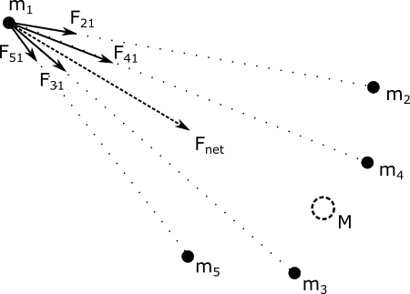
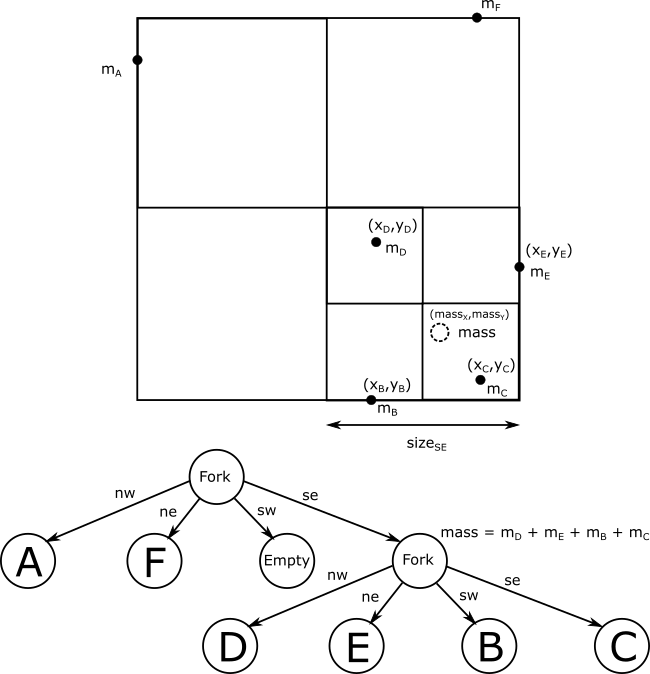
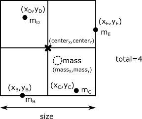

# Barnes-Hut Simulation

### [First, start by downloading the assignment zip file.](https://moocs.scala-lang.org/~dockermoocs/handouts/scala-3/barneshut.zip)

In this assignment, you will implement the parallel Barnes-Hut algorithm for *N-body simulation*. N-body simulation is a simulation of a system of *N* particles that interact with physical forces, such as gravity or electrostatic force. Given initial positions and velocities of all the *particles* (or *bodies*), the N-body simulation computes the new positions and velocities of the particles as the time progresses. It does so by dividing time into discrete short intervals, and computing the positions of the particles after each interval.

Before we study the Barnes-Hut algorithm for the N-body simulation problem, we will focus on a simpler algorithm -- the *direct sum N-body algorithm*. The direct sum algorithm consists of multiple iterations, each of which performs the following steps for each particle:

1. The particle position is updated according to its current velocity (**delta** is a short time period).

```scala
x' = x + v_x * delta
y' = y + v_y * delta
```

2. The net force on the particle is computed by adding the individual forces from all the other particles.

```scala
F_x = F_1x + F_2x + F_3x + ... + F_Nx 
F_y = F_1y + F_2y + F_3y + ... + F_Ny
```

3. The particle velocity is updated according to the net force on that particle.

```scala
v_x' = v_x + F_x / mass * delta 
v_y' = v_y + F_y / mass * delta
```

In this exercise, we will assume that the force between particles is the *gravitational force* from classical mechanics. Let's recall the formula for the gravitational force between two stellar bodies:

```scala
F = G * (m1 * m2) / distance^2
```

Above, **F** is the absolute value of the gravitational force, **m1** and **m2** are the masses of the two bodies, and **r** is the distance between them. **G** is the gravitational constant.

For each particle, the net force is computed by summing the components of individual forces from all other particles, as shown in the following figure:


The direct sum N-body algorithm is very simple, but also inefficient. Since we need to update **N** particles, and compute **N - 1** force contributions for each of those particles, the overall complexity of an iteration step of this algorithm is **O(N^2)**. As the number of particles grows larger, the direct sum N-body algorithm becomes prohibitively expensive.

The Barnes-Hut algorithm is an optimization of the direct sum N-body algorithm, and is based on the following observation:

*If a cluster of bodies is sufficiently distant from a body A, the net force on A from that cluster can be approximated with one big body with the mass of all the bodies in the cluster, positioned at the center of mass of the cluster.*

This is illustrated in the following figure:




To take advantage of this observation, the Barnes-Hut algorithm relies on a *quadtree* -- a data structure that divides the space into cells, and answers queries such as 'What is the total mass and the center of mass of all the particles in this cell?'. The following figure shows an example of a quadtree for 6 bodies:




Above, the total force from the bodies *B*, *C*, *D* and *E* on the body *A* can be approximated by a single body with *mass* equal to the sum of masses *B*, *C*, *D* and *E*, positioned at the center of mass of bodies *B*, *C*, *D* and *E*. The center of mass **(massX, massY)** is computed as follows:

```scala
mass = m_B + m_C + m_D + m_E
massX = (m_B * x_B + m_C * x_C + m_D * x_D + m_E * x_E) / mass
massY = (m_B * y_B + m_C * y_C + m_D * y_D + m_E * y_E) / mass
```

An iteration of the Barnes-Hut algorithm is composed of the following steps:

1. Construct the quadtree for the current arrangement of the bodies.

   i. Determine the *boundaries*, i.e. the square into which all bodies fit.

   ii. Construct a quadtree that covers the boundaries and contains all the bodies.

2. Update the bodies -- for each body:

   i. Update the body position according to its current velocity.

   ii. Using the quadtree, compute the net force on the body by adding the individual forces from all the other bodies.

   iii. Update the velocity according to the net force on that body.

It turns out that, for most spatial distribution of bodies, the expected number of cells that contribute to the net force on a body is **log n**, so the overall complexity of the Barnes-Hut algorithm is **O(n log n)**.

Now that we covered all the necessary theory, let's finally dig into the implementation! You will implement:

- a quadtree and its combiner data structure
- an operation that computes the total force on a body using the quadtree
- a simulation step of the Barnes-Hut algorithm

Since this assignment consists of multiple components, we will follow the principles of *test-driven development* and test each component separately, before moving on to the next component. That way, if anything goes wrong, we will more precisely know where the error is. It is always better to detect errors sooner, rather than later.

## Data Structures

We will start by implementing the necessary data structures: the quadtree, the body data-type and the sector matrix. You will find the stubs in the **package.scala** file of the **barneshut** package.

### Quadtree Data Structure

In this part of the assignment, we implement the quadtree data structure, denoted with the abstract data-type Quad. Every Quad represents a square cell of space, and can be one of the following node types:

- an **Empty** node, which represents an empty quadtree
- a **Leaf** node, which represents one or more bodies
- a **Fork** node, which divides a spatial cell into four quadrants

The definition of **Quad** is as follows:

```scala
sealed abstract class Quad:
  def massX: Float
  def massY: Float
  def mass: Float
  def centerX: Float
  def centerY: Float
  def size: Float
  def total: Int
  def insert(b: Body): Quad
```

Here, **massX** and **massY** represent the center of mass of the bodies in the respective cell, **mass** is the total mass of bodies in that cell, **centerX** and **centerY** are the coordinates of the center of the cell, **size** is the length of the side of the cell, and **total** is the total number of bodies in the cell.

Note that we consider the top left corner to be at coordinate (0, 0). We also consider the x axis to grow to the right and the y axis to the bottom.




The method **insert** creates a new quadtree which additionally contains the body **b**, and covers the same area in space as the original quadtree. Quadtree is an *immutable* data structure -- **insert** does not modify the existing **Quad** object. Note that **Body** has the following signature:

```scala
class Body(val mass: Float, val x: Float, val y: Float, val xspeed: Float, val yspeed: Float)
```

In this part of the exercise, you only need to know about body's position x and y.

Let's start by implementing the simplest **Quad** type -- the empty quadtree:

```scala
case class Empty(centerX: Float, centerY: Float, size: Float) extends Quad
```

The center and the size of the **Empty** quadtree are specified in its constructor. The Empty tree does not contain any bodies, so we specify that its center of mass is equal to its center.

Next, let's implement the **Fork** quadtree:

```scala
case class Fork(nw: Quad, ne: Quad, sw: Quad, se: Quad) extends Quad
```

This node is specified by four child quadtrees **nw**, **ne**, **sw** and **se**, in the northwest, northeast, southwest and southeast quadrant, respectively. 

The northwest is located on the top left, northeast on the top right, southwest on the bottom left and southeast on the bottom right.

The constructor assumes that the children nodes that represent four adjacent cells of the same size and adjacent to each other, as in the earlier figure. The center of the **Fork** quadtree is then specified by, say, the lower right corner of the quadtree **nw**. If the **Fork** quadtree is empty, the center of mass coincides with the center.

Inserting into a **Fork** is recursive -- it updates the respective child and creates a new **Fork**.

Finally, the **Leaf** quadtree represents one or more bodies:

```scala
case class Leaf(centerX: Float, centerY: Float, size: Float, bodies: Seq[Body])
extends Quad
```

If the **size** of a **Leaf** is greater than a predefined constant **minimumSize**, inserting an additonal body into that **Leaf** quadtree creates a **Fork** quadtree with empty children, and adds all the bodies into that **Fork** (including the new body). Otherwise, inserting creates another **Leaf** with all the existing bodies and the new one.

### The Body Data-Type

Next, we can implement the **Body** data-type:

```scala
class Body(val mass: Float, val x: Float, val y: Float, val xspeed: Float, val yspeed: Float):
  def updated(quad: Quad): Body = ???
```

Here, **xspeed** and **yspeed** represent the velocity of the body, **mass** is its mass, and **x** and **y** are the coordinates of the body.

The most interesting method on the **Body** is **updated** -- it takes a quadtree and returns the updated version of the **Body**:

```scala
def updated(quad: Quad): Body
```

This method is already half-completed for you -- you only need to implement its nested method **traverse**, which goes through the quadtree and proceeds casewise:

- empty quadtree does not affect the net force
- each body in a leaf quadtree adds some net force
- a fork quadtree that is sufficiently far away acts as a single point of mass
- a fork quadtree that is not sufficiently far away must be recursively traversed

When are we allowed to approximate a cluster of bodies with a single point? The heuristic that is used is that the size of the cell divided by the distance **dist** between the center of mass and the particle is less than some constant **theta**:

```scala
quad.size / dist < theta
```

Hint: make sure you use the **distance** to compute distance between points, the **theta** value for the condition, and **addForce** to add force contributions!

Before proceeding, make sure to run tests against your **Quad** and **Body** implementations.

### The Sector Matrix

The last data structure that we will implement is the *sector matrix*. In this data structure, we will use the auxiliary class **Boundaries**, which contains the **minX**, **maxX**, **minY** and **maxY** fields for the boundaries of the scene:

```scala
class Boundaries:
  var minX: Float
  var minY: Float
  var maxX: Float
  var maxY: Float
  def size = math.max(maxX - minX, maxY - minY)
```

We will also rely on the **ConcBuffer** data structure, mentioned in the lecture:

```scala
class ConcBuffer[T]
```

The **ConcBuffer** class comes with efficient **+=**, **combine** and **foreach** operations, which add elements into the buffer, combine two buffers and traverse the buffer, respectively. The sector matrix additionally has the **toQuad** method, which returns a quadtree that contains all the elements previously added with the **+=** method. Recall from the lectures that this combination of methods make the **ConcBuffer** a *combiner*.

The **SectorMatrix** is just a square matrix that covers a square region of space specified by the boundaries:

```scala
class SectorMatrix(val boundaries: Boundaries, val sectorPrecision: Int):
  val sectorSize = boundaries.size / sectorPrecision
  val matrix = new Array[ConcBuffer[Body]](sectorPrecision * sectorPrecision)
  for (i <- 0 until matrix.length) matrix(i) = new ConcBuffer
  def apply(x: Int, y: Int) = matrix(y * sectorPrecision + x)
```

The **sectorPrecision** argument denotes the width and height of the matrix, and each entry contains a **ConcBuffer[Body]** object. Effectively, the **SectorMatrix** is a *combiner* -- it partitions the square region of space into **sectorPrecision** times **sectorPrecision** buckets, called *sectors*.


Combiners such as the **SectorMatrix** are used in parallel programming to partition the results into some intermediate form that is more amenable to parallelization. Recall from the lecture that one of the ways to implement a *combiner* is by using a bucket data structure -- we will do exactly that in this part of the exercise! We will add three methods on the **SectorMatrix** that will make it a combiner. We start with the **+=** method:

```scala
def +=(b: Body): SectorMatrix = 
  ???
  this
```

This method should use the body position, **boundaries** and **sectorPrecision** to determine the sector into which the body should go into, and add the body into the corresponding **ConcBuffer** object.

Importantly, if the **Body** lies outside of the **Boundaries**, it should be considered to be located at the closest point within the **Boundaries** for the purpose of finding which **ConcBuffer** should hold the body.

Next, we implement the **combine** method, which takes another **SectorMatrix**, and creates a **SectorMatrix** which contains the elements of both input **SectorMatrix** data structures:

```scala
def combine(that: SectorMatrix): SectorMatrix
```

This method calls **combine** on the pair of **ConcBuffers** in **this** and **that** matrices to produce the **ConcBuffer** for the resulting matrix. You can safely assume that combine will only be called on matrices of same dimensions, boundaries and sector precision.


The nice thing about the sector matrix is that a quadtree can be constructed in parallel for each sector. Those little quadtrees can then be linked together. The **toQuad** method on the **SectorMatrix** does this:

```scala
def toQuad(parallelism: Int): Quad
```

This method is already implemented -- you can examine it if you would like to know how it works.

Congratulations, you just implemented your first combiner! Before proceeding, make sure to run those unit tests.

## Implementing Barnes-Hut

Now that we have all the right data structures ready and polished, implementing Barnes-Hut becomes a piece of cake.

Take a look at the file **Simulator.scala**, which contains the implementation of the Barnes-Hut simulator, and in particular the **step** method. The step method represents one **step** in the simulation:

```scala
def step(bodies: Seq[Body]): (Seq[Body], Quad) = 
  // 1. compute boundaries
  val boundaries = computeBoundaries(bodies)
  
  // 2. compute sector matrix
  val sectorMatrix = computeSectorMatrix(bodies, boundaries)

  // 3. compute quadtree
  val quad = computeQuad(sectorMatrix)
  
  // 4. eliminate outliers
  val filteredBodies = eliminateOutliers(bodies, sectorMatrix, quad)

  // 5. update body velocities and positions
  val newBodies = updateBodies(filteredBodies, quad)

  (newBodies, quad)
```

The pre-existing code in **step** nicely summarizes what this method does.

### Computing the Scene Boundaries

First, we must compute the boundaries of all the bodies in the scene. Since bodies move and the boundaries dynamically change, we must do this in every iteration of the algorithm. The **computeBoundaries** method is already implemented -- it uses the **aggregate** combinator on the sequence of bodies to compute the boundaries:

```scala
def computeBoundaries(bodies: Seq[Body]): Boundaries = 
  val parBodies = bodies.par
  parBodies.tasksupport = taskSupport
  parBodies.aggregate(new Boundaries)(updateBoundaries, mergeBoundaries)
```

How does this work? The **aggregate** method divides the input sequence into a number of chunks. For each of the chunks, it uses the **new Boundaries** expression to create the accumulation value, and then folds the values in that chunk calling **updateBoundaries** on each body, in the same way a **foldLeft** operation would. Finally, **aggregate** combines the results of different chunks using a reduction tree and **mergeBoundaries**.

So, we need the **updateBoundaries** method:

```scala
def updateBoundaries(boundaries: Boundaries, body: Body): Boundaries
```

Given an existing **boundaries** object and a body, the **updateBoundaries** updates the **minX**, **minY**, **maxX** and **maxY** values so that the boundaries include the body.

Next, the **mergeBoundaries** method creates a new **Boundaries** object, which represents the smallest rectangle that contains both the input boundaries:

```scala
def mergeBoundaries(a: Boundaries, b: Boundaries): Boundaries
```

Question: Is **mergeBoundaries** associative? Is it commutative? Does it need to be commutative?

Implement these two methods, and test that they work correctly!

### Building the Quadtree

Next, we need to build a **Quad** tree from the sequence of bodies. We will first implement the **computeSectorMatrix** method to get the **SectorMatrix**:

```scala
def computeSectorMatrix(bodies: Seq[Body], boundaries: Boundaries): SectorMatrix
```

Hint: aggregate the **SectorMatrix** from the sequence of bodies, the same way it was used for boundaries. Use the SECTOR_PRECISION constant when creating a new **SectorMatrix**.

Test that these methods work correctly before proceeding!

### Eliminating Outliers

During the execution of the Barnes-Hut algorithm, some of the bodies tend to move far away from most of the other bodies. There are many ways to deal with such *outliers*, but to keep things simple, we will eliminate bodies that move too fast and too far away.

We will not go into details of how this works, but if you'd like to know more, you can try to understand how the **eliminateOutliers** method works.

### Updating Bodies

The **updateBodies** method uses the quadtree to map each body from the previous iteration of the algorithm to a new iteration:

```scala
def updateBodies(bodies: Seq[Body], quad: Quad): Seq[Body]
```

Recall that we already implemented the **updated** method which updates a single body.

## Running Barnes-Hut

At last, the parallel Barnes-Hut algorithm is implemented. Note that, despite all the work, we kept our Barnes-Hut algorithm implementation simple and avoided the details that a more realistic implementation must address. In particular:

- we represented each body as a single point in space
- we restricted the simulation to two-dimensional space
- we ignored close encounter effects, such as body collision or tearing
- we ignored any relativistic effects, and assume classical mechanics
- we ignored errors induced by floating point computations

You can now run it as follows:

```scala
> runMain barneshut.BarnesHut
```

To visualize the quadtree, press the *Show quad* button, and then hit the *Start/Pause* button.

Play with the parallelism level and the number of bodies, and observe the average speedups in the lower right corner. Then sit back, and enjoy the show!