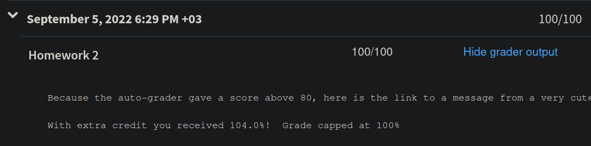

## Hints for `careful_player`

- The wording of the `careful_player` challenge problem requirements is a bit tricky. There are 4 requirements:

1. If held-card value is more than 10 points behind the goal, you must draw. (It is guaranteed to be safe, make sure you understand why.)
2. If your held-card value is 10 points or less behind the goal, then you have a choice on your algorithm as to whether you should draw or not. But you must ensure that you do not exceed the goal. So you can either say "No I won't draw" or you can say "let me sneak a peek into the next card, and if it is safe to draw it then I will" (which is sort of cheating, but valid from the assignment's point of view) or something in-between. These are all valid approaches. But you must make sure that the held-card value never exceeds the goal. And you also must make sure to follow 4 below.
3. If your score is 0, you must not make any more moves.
4. If your score is not 0, but you can reach a zero by discarding a card and then drawing a card, this must be done. In order to achieve this, your algorithm will need to look ahead and see what the next card is.
5. Your code may choose to discard cards if it wants to, or do any other things it wants almost, as long as it satisfies conditions 1-4 above. So say your held-card value is 6 points behind the goal and the next card would be a 2. Then you have some leeway in what to do. You can choose to discard a card, you can choose to just stop, you can choose draw pretending you have looked ahead at that 2. (If the next card was a 5-6 though, note case 4 above.)

- Watch out with nested case expressions -- you may need parentheses.  This does not arise too much because often nested patterns are a better choice, but nested case expressions do still make sense in some situations.  The problem arises in something like this:

```haskell
fun silly xs =
    case xs of
         [] => ""
       | x :: [] => case helper_function x of
                        NONE => ""
                      | SOME i => ""
       | x :: xs' => "" (* Error related to this line. It is a branch of the *inner* case *)
```

So you have an inner case expression, but then there is an extra clause at the end that corresponds to the outer case expression. SML reads that as:

```haskell
fun silly xs =
    case xs of
         [] => ""
       | x :: [] => case helper_function x of
                        NONE => ""
                      | SOME i => ""
                      | x :: xs' => "" -- Error related to this line. It is a branch of the *inner* case
```

which is wrong (it's not what you intended and it doesn't type-check).  You need to wrap the inner case expression in parentheses:

```haskell
fun silly xs =
    case xs of
         [] => ""
       | x :: [] => (case helper_function x of
                        NONE => ""
                      | SOME i => "")
       | x :: xs' => ""
```

## Completely overkill approach to `careful_player`

I'd like to use a [property based testing](https://propertybasedtesting.com/) approach to this challenge, because the problem statement says that running `officiate` with a `move list` should always satisfy 4 properties. Another reason is that, there isn't exactly one "correct answer" for the `move list` we are supposed to generate. As stated above, sometimes we have a choice whether to `Draw` or to `Discard`.

This requires quite a bit of design and modeling. I am familiar with property based testing from Haskell, but we don't have the advantages of property based testing libraries here such as [Quickcheck](https://en.wikipedia.org/wiki/QuickCheck). In addition, this will require many higher-order functions or HOFs (which you haven't learned yet). These HOFs are provided in the `List` section of the [SML library](https://smlfamily.github.io/Basis/list.html) but we are not allowed to use them until next week's assignment (because the auto-grader will complain and deduct points). So we will have to implement them by hand.

### General utility HOFs

These are very nice and useful to have: 

```haskell
-- applies f to each element of list
fun mymap(f: 'a -> 'b)(alist: 'a list): 'b list

-- applies binary operation f to pairs by going through list
fun myfold(f: ('a * 'b) -> 'b)(zero: 'b)(alist: 'a list): 'b

-- returns only elements of list that satisfy predicate
fun myfilter(pred: 'a -> bool)(alist: 'a list): 'a list

-- returns true if at least one element in list satisfies predicate
fun myexists(pred: 'a -> bool)([]: 'a list): bool

-- returns true if all elements in list satisfy predicate
fun myall(pred: 'a -> bool)(lst: 'a list): bool

-- assumes lists have equal length. Returns list of pairs.
fun myzip(alist: 'a list)(blist: 'b list): ('a * 'b) list
```

They are included in the SML Library as `List.map, List.foldl, List.foldr, List.filter, List.exists, List.all, ListPair.zip`. Once you implement `myfold` the others can be implemented in terms of that, although implementing some of them directly without `myfold` can be easier to understand. For this problem we don't care about left folding versus right folding.

Also notice that the input parameters are *curried*: again, something you will learn next week.

### Thinking about a design

The problem says that running `officiate` with the `move list` outputted by `careful_player` should satisfy some properties. But we cannot check this by running `officiate` because it will just run the whole game (all moves) until the game is over. We have to check the properties after each individual move.

Depending on how you implemented `officiate` you probably have a helper function inside it. This function (again depending on how you implemented it) probably acts on each "game state". But it's probably recursive and it doesn't stop until the game is over.

We can try to move that "state helper" outside of `officiate` and modify it. But instead let's make a new function that advances the game state by one move only. First we need a data design to represent the game state.

#### Representing game state and properties

There are 5 aspects of a game's state, including the list of moves. We will be "building up" the `move list` one move at a time, which will then get "consumed" to advance the other aspects of the game. So let's consider the other 4 aspects of the game state: the held cards we have in our hand (which we can discard), the cards of the deck (which we can draw), the goal, and the current score.

This suggests the following data definition:

```haskell
--                  hand        deck    goal   score
type gamestate = card list * card list * int * int
```

Even though the `goal` does not change throughout the game, it's still useful to include it in the state, because some of the properties require us to use the `goal` in some calculations. Also, for any state we could simply calculate the score by using the `score` function, but it's convenient to include it in the `gamestate`.

In addition to a `gamestate`, the 4 properties also need to verify things about the list of moves we will be generating with `careful_player`. This means that a `property` takes a `gamestate` and a `move list` and returns a `bool`:

```haskell
type property = gamestate * move list -> bool
```

#### State transition function

So now we can think about the type signature of our "next state" function that advances the game ONE MOVE ONLY:

```haskell
fun next_state(st: gamestate)(mv: move): gamestate
```

This way, we can verify a property continually throughout the game by taking current game state, advancing by one move, then checking the new game state satisfies the property.

#### Thinking about `careful_player`

First let's attempt to implement `careful_player` and write some pseudo code, in order to discover what kind of helper functions we will need.

```haskell
-- this is not actual code, it is pseudo code
fun careful_player(deck: card list, goal: int): move list =
    -- 3rd property: if score is 0, there are no more moves.
    if score = 0
    then []

    -- 2nd property: always draw if more than 10 away from goal
    else if goal - (sum of held cards) > 10
    then Draw :: (recursive call to careful_player)

    -- 4th property: if possible to reach 0 by discard-draw, then do it.
    else if (it's possible to discard-then-draw to reach 0 score)
    then Discard(something) :: Draw :: (recursive call)

    else []
```

We already notice several issues: the inputs `cards` and `goal` do not provide us enough to verify all properties. We need the list of held cards to check the 2nd and 4th properties. There is also the 1st property (that sum of held cards should not exceed the `goal`) which did not factor into choosing `move`s, but we still need to verify it.

#### Functions we need

We need a helper function for `careful_player` that takes a `gamestate` so that it has all the information needed. We also need a helper function to decide if it's possible to discard-then-draw to reach a score of 0, and a helper that finds the card that needs to be discarded from the hand, and the updated state.

```haskell
fun careful_helper(st: gamestate): move list

fun possible_to_discard_then_draw(st: gamestate): bool

-- assumes possible_to_discard_then_draw(st) returns true
fun discard_then_draw(st: gamestate): gamestate * card
```

So, the pseudo code we wrote before now applies to `careful_helper` instead.

#### One more small detail

As it is said above, when the sum of held cards is 10 points or less away from the goal, we have a choice between drawing and discarding. I will follow the "let's peek ahead and see if it's safe to draw, if it is, then draw" approach.

For example, if I am 9 away from the goal, and the next card in the deck is a `(Hearts, Num 9)` (or something less) then I want to draw.

For this we'll need one more function:

```haskell
fun possible_to_draw(st: gamestate): bool
```

This also goes into `careful_helper` as one of the cases in the long `if/else` branches.

### Testing

So now we come to the weird part of this (for you probably). The idea in property based testing goes like this. 

We have some method of generating hundreds of random inputs. A library like Haskell's `Quickcheck` would do this for us, but we don't have that in SML, so we'll still be writing some data "by hand". 

In our case, this would be randomly generated inputs of a starting deck and starting goal pairs. For example, we would have hundreds of decks like

```haskell
val cards: card list = [(Hearts, Num 2), (Spades, Num 7), (Clubs, Jack), (Diamonds, Ace)]
```

paired up with different `goal` values like `15, 63, 27, ...`

These inputs would be "fed into" the function we want to test, in this case `careful_player`. We get some `move list`s as output. Say, something like:

```haskell
[Draw, Draw]
```

Then we run our property tests on a game played with the starting state of:

- empty hand `[]`,
- `cards` as the starting deck,
- The `goal` value as the starting goal,
- `score([], goal)` as the starting score of this state.

The property tests recursively go through every move in a `move list`, verifying that the properties hold at every single move. For example, `prop1` takes the starting `gamestate`

```haskell
-- hand                         deck                                goal  score
(   [], [(Hearts,Num 2),(Spades,Num 7),(Clubs,Jack),(Diamonds,Ace)], 10,    5)
```

and the `move list`

```haskell
[Draw, Draw]
```

as inputs, verifies the property for this state, then applies the first `Draw` move and reaches the next state:

```haskell
([(Hearts, Num 2)], [(Spades, Num 7), (Clubs, Jack), (Diamonds, Ace)], 10, 4)
```

and verifies that the property holds for this state as well, and over and over again until the `move list` is empty.

You see, this way I don't even need to know what the inputs are, and what the correct outputs are supposed to be! As long as the properties are satisfied, I know that `careful_player` is correct. It's like proving the correctness mathematically (or the next best thing to it).

#### An example (spoilers!)

If all of that sounds too abstract, here is one of the properties we need:

```haskell
-- A card is drawn whenever the goal is more than 10 greater
-- than the value of the held cards.
val prop2: property = fn ((hand, _, goal, _), moves) =>
    goal - sum_cards(hand) <= 10 orelse
    case moves of
        [] => false
    |   m :: ms => m = Draw
```

As you can see I am using destructuring on the input.

For a given `gamestate` and a `move list` and a specific property, only the first 1 or 2 moves in the `move list` are relevant. But to verify the property throughout the entire "game play" we have to make each move, get the next state, and re-verify the property with this new state and the new `move list`.

#### How to test a property through ALL the moves in a `move list`

We need a function, that takes a `property`, a `move list` and a starting `gamestate`.

```haskell
fun check_prop(prop: property, moves: move list, st: gamestate): bool
```

If there are no more moves left, it should return `true`. 

If there is at least one move `m`, then `prop` should be `true` with the current state `st` and the current set of `moves`, and...

recursively, `check_prop` should return `true` with the same `prop`, the rest of the `move list`, and the state that we reach after making the move `m`. (Use `next_state`!)

### Implementation details

#### Destructuring

When implementing functions that take a `gamestate` as input, it is very useful to destructure a tuple like so:

```haskell
fun somefun(st: gamestate) =
    let
        val (hand, deck, goal, scor) = st -- destructuring
    in
        someval
    end
```

This way we have easy access to the `gamestate` components.

#### `next_state`

`next_state` is a bit long, but it can be done by carefully reasoning about all the cases of `(hand, deck, mv)`.

#### `possible_to_draw`

`possible_to_draw` is very easy to implement. Peek at the top card of the deck. Add it to the hand, and see if the new hand exceeds the `goal` or not.

#### `possible_to_discard_then_draw`

`possible_to_discard_then_draw` is a bit hard. Pattern match on cases of `(hand, deck)`. Eliminate the possibilities where it's impossible to draw or impossible to discard. Then we need to find all possible states that can be reached from the current state by discarding one of the held cards (use `mymap`). Then we consider the states that can be reached from those by 1 more move of drawing (use `mymap`). Then check if we have a score of 0 in any of those states (use `myexists`).

#### `discard_then_draw`

`discard_then_draw` is slightly more complicated but it follows the same logic as above. Now you need to also keep track of not only the "discard states" but which card was discarded to reach those states. You can assume `possible_to_discard_then_draw` returns `true`, so there is at least one state with score 0 that can be reached. Then use `myfilter` to get those states, and return the first one (along with the discarded card).

#### And the rest

`careful_helper` follows the pseudo code from above.

The properties are fairly easy to express as I outlined some hints below in the type summary.

#### Attention! There is a trap of infinite recursion.

Because the problem statement says "as a detail, you should attempt to draw even if there are no cards left in the deck" when we are more than 10 away from the `goal`, a recursive design for `careful_helper` will keep populating infinitely many `Draw` moves, if we encounter an empty deck with more than 10 points away from goal.

As a result, if the deck is empty, we should only add ONE `Draw` move and avoid the recursive call.

So, in this part of the pseudo code

```haskell
    -- 2nd property: always draw if more than 10 away from goal
    else if goal - (sum of held cards) > 10
    then Draw :: (recursive call to careful_player)
```

we should have another `if/then` under the `then`:

```haskell
    else if goal - (sum of held cards) > 10
    then 
        if cards = [] then
            ???
        else
            ???
```

### Summarizing the type signatures

Definitely way overkill right? :smile:

```haskell
-- applies f to each element of list
fun mymap(f: 'a -> 'b)(alist: 'a list): 'b list

-- applies binary operation f to pairs by going through list
fun myfold(f: ('a * 'b) -> 'b)(zero: 'b)(alist: 'a list): 'b

-- returns only elements of list that satisfy predicate
fun myfilter(pred: 'a -> bool)(alist: 'a list): 'a list

-- returns true if at least one element in list satisfies predicate
fun myexists(pred: 'a -> bool)([]: 'a list): bool

-- returns true if all elements in list satisfy predicate
fun myall(pred: 'a -> bool)(lst: 'a list): bool

-- assumes lists have equal length. Returns list of pairs.
fun myzip(alist: 'a list)(blist: 'b list): ('a * 'b) list


--                  hand        deck    goal   score
type gamestate = card list * card list * int * int


-- Returns the next state after making a move. Uses remove_card.
-- Checks if the move is possible. If not, returns input state.
-- Checks if the move puts hand total above goal. If so, returns input state.
fun next_state(st: gamestate)(mv: move): gamestate

-- Assumes hand is at most 10 away from goal.
-- Returns true if it's safe to draw. Easy to implement.
fun possible_to_draw(st: gamestate): bool

-- hard to implement. Uses mymap, myexists, non-recursive.
fun possible_to_discard_then_draw(st: gamestate): bool

-- Assumes possible_to_discard_then_draw(st) returns true.
-- Uses mymap, myfilter. Hard to implement, non-recursive.
-- Duplicates some code from possible_to_discard_then_draw.
fun discard_then_draw(st: gamestate): gamestate * card

-- Recursive. Uses possible_to_draw, possible_to_discard_then_draw,
-- and discard_then_draw
fun careful_helper(st: gamestate): move list

-- Uses careful_helper from a starting state of empty hand, with given deck and goal.
fun careful_player(deck: card list, goal: int): move list = careful_helper(?, ?, ?, ?)


-- Testing
-- used to verify that a property holds for a given gamestate and move list.
type property = gamestate * move list -> bool

-- given a state, returns true if sum of hand does not exceed goal.
val prop1: property = fn ((hand, _, goal, _), _) => ???

-- if hand is more than 10 away from goal, next move must be Draw.
val prop2: property = fn ((hand, _, goal, _), moves) => ???

-- If a score of 0 is reached, there must be no more moves.
val prop3: property = fn ((_, _, _, scor), moves) => ???

-- If it is possible to reach a score of 0 by discarding a card 
-- followed by drawing a card, then this must be done.
val prop4: property = fn (st, moves) => ???

-- all properties that need to be satisfied throughout all the moves.
val properties: property list = [prop1, prop2, prop3, prop4]

-- Verifies that property holds through all of the moves in the move list,
-- starting from the given state. Recursive, uses andalso.
fun check_prop(prop: property, moves: move list, st: gamestate): bool

-- Optional: uses mymap and check_prop to verify all properties through all the moves.
fun check_all_props(moves: move list, st: gamestate): bool = myall ??? properties


-- Data
-- then add some data here! Random starting decks with different goal values...
val cards: card list = [???] -- some randomly generated cards...
val goal: int = ???          -- some randomly generated number
val start: gamestate = ([], cards, goal, goal div 2) -- score is always goal/2 at first
val moves: move list = careful_player(cards, goal)

-- Test!
val all_in_one_test: bool = check_all_props(moves, start)

-- use even more randomly generated inputs! Repeat!
```

### This isn't just nonsense...

I was able to pass the grader and got the 104% max extra credit score with this approach!



### Feeling a bit crazy?

Why not give it a shot to develop a property based testing library for SML? Take a look at Haskell's Quickcheck for ideas. 

Primarily you'll have to figure out how to generate random elements of a given (possibly complicated) type of data. This is done "dependently". For example how would you generate random data for `gamestate`?

```haskell
type gamestate = card list * card list * int * int
```

If you know how to generate random `card list`s and you know how to generate random `int`s, then you can generate random `gamestate`s.

To generate random `card list`s, you would have to know how to generate random `card`s then make a list of random length out of such things.

```haskell
type card = suit * rank
```

To generate random `card`s you would have to know how to generate random `suit`s and know how to generate random `rank`s, and so on...

You get the idea.
