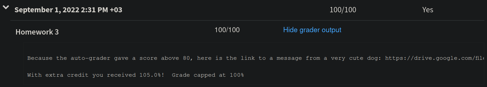

## Notes on the Challenge Problem

Contributed by Edwin Dalorzo

Let's imagine that we have a case expression with different patterns, like

```sml
  case x of p1 | p2 | ... | pn
```

Where `x` is of certain type `t` that we could infer out of the patterns `p1`, `p2`, `...`, `pn`.

In summary, the objective of the challenge exercise is to create an algorithm that (like the SML compiler), is capable of inferring the type `t` of `x` based on the patterns `p1, p2, ..., pn`.

These patterns are provided as the second argument of the challenge exercise function and they represent every one of the branches in a case expression.

If all the patterns in the case expression are compatible with some type t then the answer is `SOME` t, otherwise `NONE`.

We would not need the first argument of the challenge exercise except constructor patterns do not "tell us" what type they are. For instance, consider a case expression like:

```sml
case c of Red => ... | Green => ... | _ => ...
```

We cannot tell what is the type of `Red` or `Green` here. Likewise, in the challenge exercise if we found a constructor like:

```sml
Constructor("Red",UnitP)
```

How could we possibly infer the type of this constructor unless we had some additional information?  And so this explains why we need a first argument of the challenge function containing a type list. It is nothing but our definition of datatypes.

```sml
datatype color = Red | Green | Blue
```

  Would become somewhat like:

```sml
[ (  "Red", "color", UnitT),
  ("Green", "color", UnitT),
  ( "Blue", "color", UnitT) ]
```

Now let's consider several examples:

#### **Example 1**

Suppose we had this function:

```sml
fun b(x) =
   case x of
       (10) => 1
      | a => 3
```

The compiler would determine that `x` has type `int`. How? Easy: one of the patterns is a integer constant. Thus, the other pattern named `a` must be an integer as well. And there you have it, we just inferred the type of `x`.

In our challenge exercise, this pattern would be expressed as

```sml
[ConstP 10, Variable "a"]
```

And our algorithm should say that the answer is `SOME` `IntT` which corresponds with the type the compiler would infer.

#### **Example 2:**

A piece of code like the following would not even compile, because we cannot infer a common type for all patterns. The types in the different patterns are conflicting. We cannot tell if `x` is an int or an option.

```sml
fun b(x) =
   case x of
      (10) => 1
      | SOME x => 3
      | a => 3
```

Thus, consider the following pattern, corresponding with the code above:

```sml
[ConstP 10, Variable "a", ConstructorP("SOME",Variable "x")]
```

This cannot produce a common type and the answer our algorithm yields should be `NONE`, equivalent with the compiler throwing an error due to incapacity to determine a common type.

#### **Example 3:**

Let's do a more complicated example now:

```sml
fun c(x) =
    case x of
        (a,10,_) => 1
      | (b,_,11) => 2
      | _ => 3
```

What is the type of `x`?

Well, we can easily infer it's a tuple of three elements. Based on the patterns, we know the second and third elements of this tuple are integers. The first one, on the other hand, can be "anything".

This would correspond with:

```sml
[TupleP[Variable "a", ConstP 10, Wildcard], TupleP[Variable "b", Wildcard, ConstP 11], Wildcard]
```

And the answer given by our algorithm should be: `SOME TupleT[Anything,IntT,IntT]`.

#### **Example 4:**

Let's use a datatype now.

```sml
datatype color = Red | Green | Blue
```

Then we need to define the first argument of our challenge function as:

```sml
[("Red","color",UnitT),("Green","color",UnitT),("Blue","color",UnitT)]
```

Let's say now that we have a function like this:

```sml
fun f(x) =
   case x of
     Red => 0
     | _ => 1
```

Corresponding with something like:

```sml
[ConstructorP("Red", UnitP), Wildcard]
```

Our algorithm should go over the patterns and say this is of type:

```sml
SOME (Datatype "color")
```

#### **Example 5:**

Let's use now a more complex datatype

```sml
datatype auto =  Sedan of color
               | Truck of int * color
               | SUV
```

This would correspond to a first argument as follows:

```sml
[("Sedan","auto", Datatype "color"),("Truck","auto",TupleT[IntT, Datatype "color"]),("SUV","auto",UnitT)]
```

Let's say now that we had a function like this:

```sml
fun g(x) =
   case x of
        Sedan(a) => 1
      | Truck(b,_) => 2
      | _ => 3
```

What is the type of `x`? Well, we can easily infer they are all of type auto.

So, the following argument:

```sml
[ConstructorP("Sedan", Variable "a"), ConstructorP("Truck", TupleP[Variable "b", Wildcard]), Wildcard]
```

Should yield `SOME (Datatype "auto")`.

#### **Example 6:**

Let's now define a polymorphic type to make this interesting

```sml
datatype 'a list = Empty | List of 'a * 'a list
```

So, we must first define our first argument:

```sml
[("Empty","list",UnitT),("List","list",TupleT[Anything, Datatype "list"])]
```

The trick is to notice that the polymorphic type `'a` corresponds to anything here, and so the type inference becomes a bit trickier later on.

Now if we had this function

```sml
fun j(x) =
   case x of
       Empty => 0
     | List(10,Empty) => 1
     | _ => 3
```

Evidently the patterns are of type list, but not just that, but a list of integers.

So, the following argument corresponding to the patterns in the function:

```sml
[ConstructorP("Empty",UnitP),ConstructorP("List",TupleP[ConstP 10, ConstructorP("Empty",UnitP)]), Wildcard]
```

Should yield: `SOME (Datatype "list")`.

This case is tricky, because `ConstP(10)` needs to correspond with `Anything` in the constructors metadata as you can see above.

#### **Example 7:**

Let's consider this variation of the previous case:

```sml
fun h(x) =
   case x of
      Empty => 0
    | List(k,_) => 1
```

In this case `k` could be anything. So, we represent these branches as:

```sml
[ConstructorP("Empty",UnitP),ConstructorP("List",TupleP[Variable "k", Wildcard])]
```

And the answer should be `Datatype "List"`.

And once more, notice how `Variable "k"` needs to correspond with `Anything` in the datatype definition.

So, in the previous example `ConstP(10)` and now `Variable "x"` can be considered "compatible with" `Anything`.

#### **Example 8:**

Just another example

```sml
fun g(x) =
   case x of
      Empty => 0
    | List(Sedan(c),_) => 1
```

Corresponding with:

```sml
[ConstructorP("Empty",UnitP),ConstructorP("List",TupleP[ConstructorP("Sedan", Variable "c"), Wildcard])]
```

Should evidently yield `SOME (Datatype "list")`.

#### **Example 9:**

Now for the "most lenient" pattern. In the assignment we get two examples.

The first one suggest that we have two patterns of the form:

```sml
TupleP[Variable "x", Variable "y"]
TupleP[Wildcard, Wildcard]
```

This would correspond to something like

```sml
fun m(w) =
    case w of
          (x,y) => 0
        | (_,_) => 1
```

Interestingly this would not compile, since the patterns are redundant, namely, we would always go out through the first branch. But this was simply used with illustration purposes.

We can infer that `w `is a tuple with two elements that can be of anything. So the answer to this type of patterns should be:

```sml
TupleT[Anything, Anything]
```

What is meant by "most lenient" is that the type `TupleT[IntT, IntT]` (for example) is also a fine type for all the patterns, but it is not as "lenient" (does not match as many values as) `TupleT[Anything,Anything]` so `TupleT[IntT, IntT]` is not correct.

#### **Example 10:**

The second example of the "most lenient" requirement is similar but a little more interesting.

The second example suggest a list of patterns like this:

```sml
TupleP[Wildcard, Wildcard]
TupleP[Wildcard, TupleP[Wildcard,Wildcard]]
```

Which would correspond with

```sml
fun m(w) =
    case w of
      (_,(_,_)) => 0
    | (_,_) => 1
```

We can infer that w is a tuple of two elements, the first one can be anything, the second one is evidently a tuple of other two elements, which in turn can be anything.

So, if we had to infer this we had to say the type of this is

```sml
TupleT[Anything, TupleT[Anything, Anything]]
```

Which is the expected answer by the challenge exercise. But yet again, the compiler would not handle this type of expression without errors.

## Strategy for solving the HW3 Challenge Problem

### Wishful thinking: daydreaming about an approach

Imagine we have a list of patterns

```sml
val patterns = [pat1, pat2, ..., patn]
```

We want to find out if these patterns have a common type.

If even just two of these patterns fail to have a common type, then the whole list fails to have a common type.

So let's imagine we have some method of taking two patterns and checking if they can have a common type, and if so, finding that type. Say we do this for `pat1` and `pat2`. Say they have a common type `typ1`.

```sml
[pat1, pat2, pat3, ..., patn]
   \    /
    typ1
```

Now we have to check `pat3` but now we have to compare a type `typ1`and a pattern `pat3`, instead of two patterns. So we would need another method that handles a type and a pattern.

Let's try to change our thinking. What if we first converted the whole list of patterns to their types:

```sml
[pat1, pat2, ..., patn]
   |     |          |
   V     V          V
[typ1, typ2, ..., typn]
```

Now we can have a method that checks if two types have a common type (remember this, count 1), and we can FOLD over the list of types with this binary operation.

Cool! This might work. So we need two things: a function that takes a `pattern` and converts it to its proper, accurate type, and a function that takes two `typ`s and finds their common `typ`, if it exists.

### Converting a `pattern` to a `typ`

Most of the `pattern` kinds are easily converted to `typ`s:

```sml
(* pattern    typ *)
Wildcard => Anything
Variable => Anything
ConstP   => IntT
UnitP    => UnitT
```

But the last two kinds of `pattern`, namely `TupleP` and `ConstructorP` are complicated, because they are recursive and contain `pattern`s in them.

#### Handling `TupleP`

In the case of `TupleP` the argument is a `pattern list`, so we could recursively convert all of the `pattern`s in that list, and add a `TupleT` at the beginning, and we're done:

```sml
TupleP [pat1, pat2, ..., patn] => TupleT [typ1, typ2, ..., typn]
```

#### Handling `ConstructorP`

Finally `ConstructorP` patterns are even more complicated. They need to be "looked up" in the "metadata" that is provided in the first argument of `typecheck_patterns`. For example, for the `pattern`

```sml
ConstructorP("Red", UnitP)
```

we need metadata like

```sml
[("Red", "color", UnitT)]
```

So there are a few instances where this can fail.

1. We look up `"Red"` in the metadata, but we cannot find it! For example:

    ```sml
    pattern: ConstructorP("Red", UnitP)
    metadata: [("Sedan", "color", Datatype "color")]
    ```

2. We look up `"Red"` in the metadata, we find an entry for it, but the third element (the `typ`) does not match the second argument (the `pattern`) of the constructor. For example:

    ```sml
    pattern: ConstructorP("Red", UnitP)
    metadata: [("Red", "color", IntT)]
    ```

    Here the `pattern` argument of the constructor, `UnitP`, has type `UnitT`, which does not have a common `typ` with `IntT`. So we have to recursively convert the `pattern` argument of the constructor, and verify that it has a common `typ` with the third part of the metadata entry (remember this, count 2).

    THIS IS VERY CRUCIAL! Because we just discovered that our conversion function must call our "take two `typ`s and find their common `typ`" function. If we also find out that the "common `typ`" function has to call the conversion function... then we will be forced to use MUTUAL RECURSION. You can use MR in SML like this:

    ```sml
    fun f() =
        let
            fun a() = (* some code involving b() *)
            and b() = (* some code involving a() *)
        in
            a() (* or b(), does not matter *)
        end
    ```

    Notice `b()` does not have the `fun` keyword in front of it. Instead it has the `and` keyword (which is different than `andalso`, the boolean operator). Hopefully we won't need MR.

3. We look up `"Red"` in the metadata, we find it OK, but the `pattern` argument of the constructor is yet another constructor that fails to have a `typ` by itself (due to reasons 1 or 2 above). For example:

    ```sml
    pattern: ConstructorP("Red", ConstructorP("Empty", UnitP))
    metadata: [("Red", "color", Datatype "color")]
    ```

    So we have to make sure the `pattern` argument converts OK. This suggests that our conversion function should return a `typ option`. We'll tackle this later.

### Merging two `typ`s into a common type

There are 5 kinds of `typ`, so there are 25 possible match-ups between two `typ`s. But we can ignore most of them:

```sml
Anything       (* can match all 5 typs *)
UnitT          (* can only match UnitT *)
IntT           (* can only match IntT *)
TupleT[...]    (* can only match TupleT[...] *)
Datatype "..." (* can only match Datatype "..." *)
```

#### Handling `TupleT`

Notice that `TupleT lst1` can match `TupleT lst2` if and only if `lst1` and `lst2` have the same length, and each `typ` in `lst1`, in order, can match the corresponding `typ` in `lst2`, in order:

```sml
TupleT [typ1a, typ2a, ..., typna]
          ^      ^           ^
          |      |           | must have common typ
          V      V           V
TupleT [typ1b, typ2b, ..., typnb]
```

So we can "zip" the two lists, then find the common `typ`s of the pairs `(typ1a, typ1b), ..., (typna, typnb)` recursively. Then the common `typ` of the tuples will be 

```sml
TupleT [commontyp1, commontyp2, ..., commontypn]
```

But first we have to know that these pairs of the zipped lists *do* have common `typ`s! (remember this, count 3) If even one pair fails to have a common `typ` then the whole `TupleT`s fail to have a common `typ`.

#### Handling `Datatype "str"`

Note that two `Datatype`s can match if and only if they have the same string argument, like:

```sml
Datatype "color" <-> Datatype "color"
```

#### Do we use `typ` or `typ option`?

We were thinking of our "merge two types" function as `typ * typ -> typ`. But remember that `typecheck_patterns` is supposed to return a `typ option`, because it's possible for two types not to have a common type, therefore impossible to be merged. (remember this, count 4)

That's OK. We can add a simple helper function that merges two `typ option`s instead, by using our previous `typ` merging function.

### Deciding the signatures

Time to start nailing down the design. Of course we will do this with the type signatures.

Working backwards from the end: remember that `typecheck_patterns` must have type

```sml
typecheck_patterns: (string * string * typ) list * (pattern list) -> typ option
```

We said that we'd have a function with type

```sml
merge: (typ option) * (typ option) -> (typ option)
```

and we would use this to FOLD over the `pattern list`. Wait, what? We can only do that with a `typ option list`.

So we have to take the `pattern list` and convert it to a `typ option list`. For this, we can have a function 

```sml
convert: pattern -> typ option
```

and we can `List.map` this function over the `pattern list`. But... for our conversion we also need the metadata to look up stuff. Since we want to map this function, we'd have to pass the metadata down as an argument. So let's take advantage of currying!

```sml
convert: (string * string * typ) list -> pattern -> typ option
```

For the `merge` function, we can take two `typ option`s, remove the `option` part (throw away the `SOME`), merge the two `typ`s, then wrap it back up with an `option` again. But only if they are both `SOME`, and only if the `typ`s that are inside the `SOME`s are "merge-able" (count 5 !). 

This situation of checking if two `typ`s are merge-able kept coming up 5 times. So it seems convenient (almost necessary) to have a separate function for checking if two `typ`s *can* have a common `typ` at all:

```sml
compatible: typ * typ -> bool
```

After that, *if* two `typ`s are compatible, then we can have a separate function that computes that common type. This will lead to a bit of code duplication, but the overall design is much cleaner by using `compatible` in many different places. Here's the signature of the common type calculator:

```sml
(* assumes the typs are compatible *)
coalesce: typ * typ -> typ
```

#### Summary of the signatures

It looks like we don't have to use mutual recursion after all! So we've got so far:

```sml
(* does not depend on others, is recursive. Just do case (s, t) of... *)
fun compatible(s: typ, t: typ): bool

(* uses compatible in ConstructorP case, is recursive. *)
fun convert(metadata: (string * string * typ) list)(p: pattern): typ option

(* assumes s, t are compatible, is recursive in the TupleT case. *)
fun coalesce(s: typ, t: typ): typ 

(* non-recursive, uses compatible and coalesce. Very simple! *)
fun merge(s: typ option, t: typ option): typ option

(* maps convert over list, then folds with merge. Very simple! *)
fun typecheck_patterns(
  metadata: (string * string * typ) list, patterns: pattern list
): typ option
```

### This works!

I was able to pass the grader and get the 105% max extra credit score with this approach!


